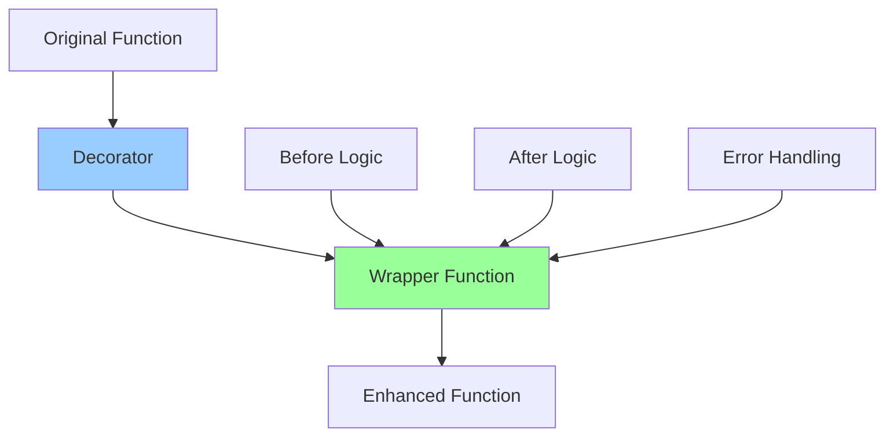

# Python Decorators - Complete Guide

## 🎯 What is a Decorator?

**A function that takes another function and extends its behavior without modifying it**

```python
# Without decorator
def greet():
    return "Hello!"

result = greet()
print(result.upper())

# With decorator
@uppercase
def greet():
    return "Hello!"

result = greet()  # Returns "HELLO!" automatically
```

**Key Idea:** Wrap a function to add functionality

---

## 🏗️ Why Decorators?

### Problems They Solve

**Problem 1: Repetitive Code**
```python
# ❌ BAD - Repeating logging everywhere
def add(a, b):
    print("Calling add")
    result = a + b
    print("Returning", result)
    return result

def multiply(a, b):
    print("Calling multiply")
    result = a * b
    print("Returning", result)
    return result

# ✅ GOOD - Decorator handles logging
@log_function
def add(a, b):
    return a + b

@log_function
def multiply(a, b):
    return a * b
```

**Problem 2: Separation of Concerns**
```python
# Business logic mixed with infrastructure
def transfer_money(from_account, to_account, amount):
    # Authentication check
    if not is_authenticated():
        raise Exception("Not authenticated")
    
    # Authorization check
    if not has_permission(from_account):
        raise Exception("Not authorized")
    
    # Actual business logic (buried!)
    from_account.balance -= amount
    to_account.balance += amount
    
    # Logging
    log(f"Transferred {amount}")

# With decorators - Clean separation!
@authenticate
@authorize
@log_transaction
def transfer_money(from_account, to_account, amount):
    from_account.balance -= amount
    to_account.balance += amount
```

---

## 🔍 How Decorators Work

### Step-by-Step Understanding

**Step 1: Functions are objects**
```python
def greet():
    return "Hello"

# Function is an object
print(type(greet))  # <class 'function'>

# Can assign to variable
say_hello = greet
print(say_hello())  # "Hello"
```

**Step 2: Functions can return functions**
```python
def outer():
    def inner():
        return "Hello from inner"
    return inner

# Get the inner function
func = outer()
print(func())  # "Hello from inner"
```

**Step 3: Functions can take functions**
```python
def decorator(func):
    def wrapper():
        print("Before function")
        result = func()
        print("After function")
        return result
    return wrapper

def greet():
    return "Hello"

# Manual decoration
greet = decorator(greet)
greet()
# Output:
# Before function
# Hello
# After function
```

**Step 4: The @ syntax is shorthand**
```python
# These are equivalent:

# Long way
def greet():
    return "Hello"
greet = decorator(greet)

# Short way (syntactic sugar)
@decorator
def greet():
    return "Hello"
```

---

## 📝 Basic Decorator Pattern

### Template
```python
def decorator_name(func):
    def wrapper(*args, **kwargs):
        # Code before function call
        result = func(*args, **kwargs)
        # Code after function call
        return result
    return wrapper

@decorator_name
def my_function():
    pass
```

### Simple Example: Logging
```python
def log_function(func):
    def wrapper(*args, **kwargs):
        print(f"Calling {func.__name__}")
        result = func(*args, **kwargs)
        print(f"Finished {func.__name__}")
        return result
    return wrapper

@log_function
def add(a, b):
    return a + b

print(add(5, 3))
# Output:
# Calling add
# Finished add
# 8
```

---

## 🎨 Practical Examples

### 1. Timing Decorator
```python
import time

def timing_decorator(func):
    def wrapper(*args, **kwargs):
        start = time.time()
        result = func(*args, **kwargs)
        end = time.time()
        print(f"{func.__name__} took {end - start:.4f} seconds")
        return result
    return wrapper

@timing_decorator
def slow_function():
    time.sleep(1)
    return "Done"

slow_function()
# Output: slow_function took 1.0001 seconds
```

### 2. Validation Decorator
```python
def validate_positive(func):
    def wrapper(x):
        if x <= 0:
            raise ValueError("Number must be positive")
        return func(x)
    return wrapper

@validate_positive
def square_root(x):
    return x ** 0.5

print(square_root(16))  # 4.0
print(square_root(-4))  # ValueError: Number must be positive
```

### 3. Memoization (Caching)
```python
def memoize(func):
    cache = {}
    def wrapper(*args):
        if args not in cache:
            cache[args] = func(*args)
            print(f"Computing {args}")
        else:
            print(f"Using cache for {args}")
        return cache[args]
    return wrapper

@memoize
def fibonacci(n):
    if n <= 1:
        return n
    return fibonacci(n-1) + fibonacci(n-2)

print(fibonacci(5))
# Computing (1,)
# Computing (0,)
# Computing (2,)
# Computing (3,)
# Using cache for (2,)
# Computing (4,)
# Using cache for (3,)
# Computing (5,)
# Output: 5
```

### 4. Retry Decorator
```python
import time

def retry(max_attempts=3):
    def decorator(func):
        def wrapper(*args, **kwargs):
            for attempt in range(max_attempts):
                try:
                    return func(*args, **kwargs)
                except Exception as e:
                    print(f"Attempt {attempt + 1} failed: {e}")
                    if attempt == max_attempts - 1:
                        raise
                    time.sleep(1)
        return wrapper
    return decorator

@retry(max_attempts=3)
def unstable_api_call():
    import random
    if random.random() < 0.7:
        raise Exception("API Error")
    return "Success"
```

### 5. Authentication Decorator
```python
def require_auth(func):
    def wrapper(*args, **kwargs):
        # Check if user is logged in
        if not is_logged_in():
            raise Exception("Authentication required")
        return func(*args, **kwargs)
    return wrapper

@require_auth
def view_profile():
    return "User profile data"

@require_auth
def edit_settings():
    return "Settings updated"
```

### 6. Rate Limiting
```python
import time

def rate_limit(max_calls=3, period=60):
    calls = []
    
    def decorator(func):
        def wrapper(*args, **kwargs):
            now = time.time()
            # Remove old calls
            calls[:] = [c for c in calls if c > now - period]
            
            if len(calls) >= max_calls:
                raise Exception("Rate limit exceeded")
            
            calls.append(now)
            return func(*args, **kwargs)
        return wrapper
    return decorator

@rate_limit(max_calls=3, period=60)
def api_call():
    return "API response"
```

---

## 🎓 Decorators with Arguments

### How It Works
```python
# Decorator without arguments
@decorator
def func():
    pass

# Decorator WITH arguments
@decorator(arg1, arg2)
def func():
    pass
```

**Pattern:**
```python
def decorator_with_args(arg1, arg2):
    def decorator(func):
        def wrapper(*args, **kwargs):
            # Use arg1, arg2 here
            result = func(*args, **kwargs)
            return result
        return wrapper
    return decorator
```

### Example: Repeat N Times
```python
def repeat(times):
    def decorator(func):
        def wrapper(*args, **kwargs):
            for _ in range(times):
                result = func(*args, **kwargs)
            return result
        return wrapper
    return decorator

@repeat(times=3)
def greet(name):
    print(f"Hello, {name}!")

greet("Alice")
# Output:
# Hello, Alice!
# Hello, Alice!
# Hello, Alice!
```

### Example: Prefix/Suffix
```python
def add_tags(prefix="", suffix=""):
    def decorator(func):
        def wrapper(*args, **kwargs):
            result = func(*args, **kwargs)
            return f"{prefix}{result}{suffix}"
        return wrapper
    return decorator

@add_tags(prefix=">>> ", suffix=" <<<")
def get_message():
    return "Hello"

print(get_message())  # >>> Hello <<<
```

---

## 🔗 Stacking Decorators

**Multiple decorators on one function**

```python
def uppercase(func):
    def wrapper(*args, **kwargs):
        result = func(*args, **kwargs)
        return result.upper()
    return wrapper

def exclaim(func):
    def wrapper(*args, **kwargs):
        result = func(*args, **kwargs)
        return f"{result}!"
    return wrapper

@exclaim
@uppercase
def greet():
    return "hello"

print(greet())  # HELLO!

# Execution order (bottom to top):
# 1. greet() returns "hello"
# 2. uppercase makes it "HELLO"
# 3. exclaim makes it "HELLO!"
```

**Visual:**
```
@decorator1    ┐
@decorator2    │ Applied bottom-to-top
@decorator3    │ (closest to function first)
def func():    ┘
```

---

## 🛠️ Class-Based Decorators

**Using classes instead of functions**

```python
class CountCalls:
    def __init__(self, func):
        self.func = func
        self.count = 0
    
    def __call__(self, *args, **kwargs):
        self.count += 1
        print(f"Call {self.count} of {self.func.__name__}")
        return self.func(*args, **kwargs)

@CountCalls
def say_hello():
    print("Hello!")

say_hello()  # Call 1 of say_hello
say_hello()  # Call 2 of say_hello
say_hello()  # Call 3 of say_hello
```

---

## ⚠️ Common Pitfalls

### Pitfall 1: Losing Function Metadata
```python
def decorator(func):
    def wrapper(*args, **kwargs):
        return func(*args, **kwargs)
    return wrapper

@decorator
def greet():
    """Says hello"""
    pass

print(greet.__name__)  # wrapper (not 'greet'!)
print(greet.__doc__)   # None (lost docstring!)

# ✅ FIX: Use functools.wraps
from functools import wraps

def decorator(func):
    @wraps(func)  # Preserves metadata
    def wrapper(*args, **kwargs):
        return func(*args, **kwargs)
    return wrapper

@decorator
def greet():
    """Says hello"""
    pass

print(greet.__name__)  # greet ✓
print(greet.__doc__)   # Says hello ✓
```

### Pitfall 2: Forgetting to Return
```python
# ❌ WRONG
def decorator(func):
    def wrapper(*args, **kwargs):
        func(*args, **kwargs)  # Missing return!
    return wrapper

@decorator
def add(a, b):
    return a + b

result = add(2, 3)
print(result)  # None (oops!)

# ✅ RIGHT
def decorator(func):
    def wrapper(*args, **kwargs):
        return func(*args, **kwargs)  # Return the result!
    return wrapper
```

### Pitfall 3: Decorator Order Confusion
```python
@decorator1
@decorator2
def func():
    pass

# Is equivalent to:
func = decorator1(decorator2(func))

# NOT:
# func = decorator2(decorator1(func))

# Remember: Bottom-to-top!
```

---

## 🎯 Real-World Use Cases

### Web Framework (Flask-style)
```python
# Simplified Flask-like routing
routes = {}

def route(path):
    def decorator(func):
        routes[path] = func
        return func
    return decorator

@route("/home")
def home():
    return "Home Page"

@route("/about")
def about():
    return "About Page"

# Routes dictionary now has:
# {"/home": home, "/about": about}
```

### Property Validation
```python
def validate_range(min_val, max_val):
    def decorator(func):
        @wraps(func)
        def wrapper(self, value):
            if not (min_val <= value <= max_val):
                raise ValueError(f"Must be between {min_val} and {max_val}")
            return func(self, value)
        return wrapper
    return decorator

class Temperature:
    def __init__(self):
        self._celsius = 0
    
    @property
    def celsius(self):
        return self._celsius
    
    @celsius.setter
    @validate_range(-273, 1000)
    def celsius(self, value):
        self._celsius = value
```

### Access Control
```python
def require_role(role):
    def decorator(func):
        @wraps(func)
        def wrapper(*args, **kwargs):
            current_user = get_current_user()
            if current_user.role != role:
                raise PermissionError(f"Requires {role} role")
            return func(*args, **kwargs)
        return wrapper
    return decorator

@require_role("admin")
def delete_user(user_id):
    pass

@require_role("moderator")
def ban_user(user_id):
    pass
```

---

## 📊 Decorator Pattern Summary



---

## 🔑 Key Patterns

### 1. Simple Decorator
```python
def decorator(func):
    @wraps(func)
    def wrapper(*args, **kwargs):
        # Before
        result = func(*args, **kwargs)
        # After
        return result
    return wrapper
```

### 2. Decorator with Arguments
```python
def decorator(arg):
    def actual_decorator(func):
        @wraps(func)
        def wrapper(*args, **kwargs):
            # Use arg here
            return func(*args, **kwargs)
        return wrapper
    return actual_decorator
```

### 3. Class-based Decorator
```python
class Decorator:
    def __init__(self, func):
        self.func = func
    
    def __call__(self, *args, **kwargs):
        # Wrapper logic
        return self.func(*args, **kwargs)
```

---

## ✅ Best Practices

1. **Always use `@wraps`** from functools
2. **Use `*args, **kwargs`** for flexibility
3. **Return the result** from wrapper
4. **Document** what decorator does
5. **Keep decorators simple** - one responsibility
6. **Consider** class-based for stateful decorators
7. **Test** decorated and undecorated functions

---

## 🎓 Interview Questions

### Q1: What does @ do?
**A:** Syntactic sugar for applying decorator function

### Q2: Execution order of stacked decorators?
**A:** Bottom-to-top (closest to function first)

### Q3: How to pass arguments to decorator?
**A:** Add extra nesting level (decorator factory)

### Q4: Why use functools.wraps?
**A:** Preserves original function's metadata

### Q5: When to use class vs function decorator?
**A:** Class when you need to maintain state

---

## 💡 Memory Tricks

**Decorator = Gift Wrapper**
- Original function = Gift
- Decorator = Wrapping paper
- Wrapper function = Wrapped gift
- Same gift inside, new appearance outside

**@ Symbol**
- "At this function, apply decorator"
- Think: "Attach" decorator to function

**Stacking Order**
```
@top       ← Last applied
@middle    ← Second
@bottom    ← First applied
def func():
```

---

## 🚀 Practice Exercises

### Exercise 1: Debug Decorator
Create a decorator that prints function arguments and return value
```python
@debug
def add(a, b):
    return a + b

add(3, 5)
# Output:
# Calling add with args=(3, 5) kwargs={}
# Returned: 8
```

### Exercise 2: Cache Decorator
Create a caching decorator for expensive functions
```python
@cache
def fibonacci(n):
    if n <= 1:
        return n
    return fibonacci(n-1) + fibonacci(n-2)
```

### Exercise 3: Slow Down Decorator
Add a delay between function calls
```python
@slow_down(seconds=1)
def process():
    print("Processing...")
```

---

## 🔗 Related Concepts

- **Context Managers** - Similar wrapping concept
- **Higher-Order Functions** - Functions taking/returning functions
- **Closures** - Wrappers capture outer scope
- **Metaclasses** - Class-level decoration

---

## 📚 Common Built-in Decorators

```python
# Property decorator
class MyClass:
    @property
    def value(self):
        return self._value

# Static method
class MyClass:
    @staticmethod
    def utility():
        pass

# Class method
class MyClass:
    @classmethod
    def from_string(cls, s):
        pass

# LRU Cache (functools)
from functools import lru_cache

@lru_cache(maxsize=128)
def expensive_function(n):
    pass
```

---

## 🎯 Quick Reference

| Use Case | Decorator Type | Example |
|----------|---------------|---------|
| Logging | Simple | `@log` |
| Timing | Simple | `@timing` |
| Caching | Stateful | `@cache` |
| Validation | With args | `@validate(min=0)` |
| Access Control | With args | `@require_role("admin")` |
| Retry Logic | With args | `@retry(3)` |

---

## 🔑 Key Takeaways

1. Decorators **wrap** functions to extend behavior
2. **`@` syntax** is shorthand for function application
3. Use **`@wraps`** to preserve metadata
4. **Arguments** require extra nesting level
5. **Stacking** applies bottom-to-top
6. Keep decorators **simple** and focused
7. Great for **cross-cutting concerns** (logging, auth, etc.)