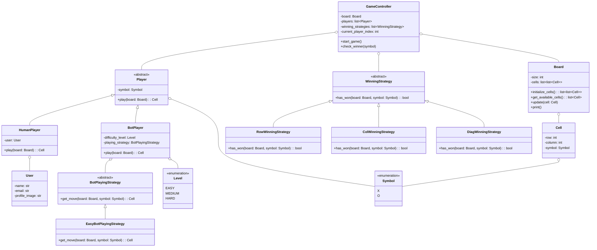
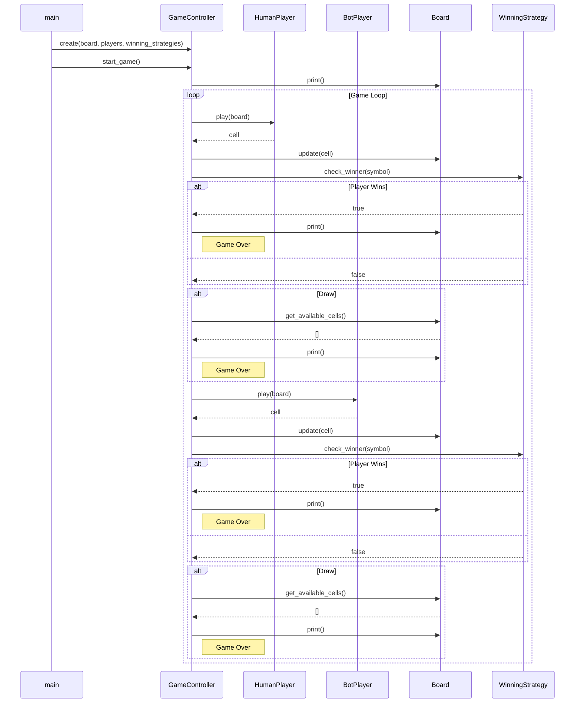

# Tic-Tac-Toe: A Deep Dive into the Code

This document provides a detailed explanation of the Tic-Tac-Toe game's code, designed to help students understand the structure, design patterns, and flow of the application.

## 1. Visualizing the Code: Diagrams

To understand how the different parts of the code interact, let's look at two diagrams: a class diagram and a sequence diagram.

### Class Diagram

The class diagram shows the classes in the system and their relationships.

### Sequence Diagram

The sequence diagram shows the sequence of interactions between the objects in the system during a game.

## 2. Code Structure

The code is organized into several packages within the `src` directory:

-   `controllers`: Contains the game's main logic.
-   `enums`: Contains enumerations for game constants like `Symbol` and `Level`.
-   `exceptions`: Contains custom exception classes.
-   `models`: Contains the data models for the game, such as `Board`, `Player`, and `Cell`.
-   `strategies`: Contains the different strategies for winning and bot playing.

## 3. How the Code Works

### The `main.py` file

This is the entry point of our application. Here, we:

1.  **Create the game objects:** We create instances of the `Board`, `HumanPlayer`, `BotPlayer`, and the winning strategies.
2.  **Hardcoded Values:** Many of the initial settings are hardcoded here:
    -   The board size is set to `3`.
    -   A `HumanPlayer` is created with the name "Sumit Kumar" and the symbol `X`.
    -   A `BotPlayer` is created with the symbol `O` and an `EasyBotPlayingStrategy`.
    -   The list of players is fixed.
    -   The winning strategies are `RowWinningStrategy`, `ColWinningStrategy`, and `DiagWinningStrategy`.
3.  **Start the game:** We create a `GameController` with these objects and call the `start_game()` method.

### The `GameController`

This class is the heart of the game. It manages the game flow:

-   It keeps track of the `board`, the `players`, and the `winning_strategies`.
-   The `start_game()` method contains the main game loop (`while True`).
-   In each iteration of the loop, it:
    1.  Prints the current state of the board.
    2.  Gets the current player.
    3.  Calls the `play()` method of the current player to get their move.
    4.  Updates the board with the new move.
    5.  Checks if the current player has won using the `winning_strategies`.
    6.  Checks if the game is a draw.
    7.  Switches to the next player.

### Taking Input from the User: The `HumanPlayer`

The `HumanPlayer` class is responsible for getting input from the user. It has a `while True` loop to ensure that the user provides valid input.

#### Input Validation

The `play` method in `HumanPlayer` performs several crucial validations:
1.  **Numeric Input:** It ensures that the user enters numbers for the row and column by catching the `ValueError`.
2.  **Bounds Checking:** It checks if the entered coordinates are within the board's boundaries (e.g., 0 to 2 for a 3x3 board).
3.  **Cell Occupancy:** It verifies that the chosen cell is not already occupied by another player's symbol.

#### Exception Handling

To manage invalid inputs gracefully, we use a `try...except` block and a custom exception:
-   **`ValueError`:** This built-in exception is caught if the user enters a non-numeric value for the row or column.
-   **`InvalidMoveError`:** This is a custom exception we created in the `src/exceptions` package. It's raised in two scenarios:
    1.  When the coordinates are out of the board's bounds.
    2.  When the selected cell is already occupied.
    
By catching these exceptions, we can provide clear feedback to the user and prompt them to enter a valid move without crashing the program.

### The Strategy Pattern

We use the **Strategy Pattern** for both winning and bot playing. This is a powerful design pattern that allows us to change the behavior of an object at runtime.

-   **`WinningStrategy`:** We have a `WinningStrategy` interface (an abstract base class) and several concrete implementations (`RowWinningStrategy`, `ColWinningStrategy`, `DiagWinningStrategy`). The `GameController` uses a list of these strategies to check for a winner. This makes it easy to add new winning conditions in the future without changing the `GameController`.

-   **`BotPlayingStrategy`:** Similarly, we have a `BotPlayingStrategy` interface and an `EasyBotPlayingStrategy` implementation. The `BotPlayer` uses a `BotPlayingStrategy` to decide its move. This allows us to easily change the bot's difficulty by simply giving it a different strategy object.

#### Optimizing Winning Strategies: Time Complexity

Checking for a winner after every move is a critical part of the game. Here’s how we can optimize it:

-   **O(n²) - The Naive Approach (Our Current Implementation):** After each move, we scan the entire `n x n` board. Our current `RowWinningStrategy` and `ColWinningStrategy` iterate through all rows and columns, respectively. This is simple to understand but inefficient, especially for larger boards.

-   **O(n) - The Better Approach:** A player can only win on the move they just made. So, we only need to check the specific row, column, and any relevant diagonals corresponding to the last move. This would be a good improvement and would involve changing the `has_won` method to accept the last move's coordinates.

-   **O(1) - The Optimal Approach:** This is the most efficient method. We can use hashmaps or arrays to keep track of the number of symbols in each row, column, and diagonal.
    -   For a `3x3` board, we would have:
        -   A `row_counts` map/array of size 3.
        -   A `col_counts` map/array of size 3.
        -   A counter for each of the two diagonals.
    -   When a player makes a move at `(r, c)`, we increment the counts for `row r`, `column c`, and any relevant diagonals.
    -   If any of these counts reach 3, that player has won.
    -   This check is an O(1) operation, as it involves just a few increments and comparisons, regardless of the board size.

## 4. Potential Enhancements

This project is a great starting point, but there are many ways it could be enhanced:

-   **Configurable Game:**
    -   Allow the user to choose the board size.
    -   Let users choose their symbols (`X` or `O`).
    -   Allow for games with more than two players or different types of players (e.g., two human players).
-   **More Bot Strategies:** Implement `Medium` and `Hard` bot playing strategies. The `Hard` strategy could use an algorithm like Minimax to play optimally.
-   **Implement O(n) or O(1) Winning Strategy:** Refactor the winning strategy to use the O(n) or O(1) approach for better performance.
-   **Game Loop:** Add a loop in `main.py` to allow users to play multiple games without restarting the program.
-   **Refactor `main.py`:** Move the game setup logic from `main.py` into a separate class or function to make it cleaner and more reusable.