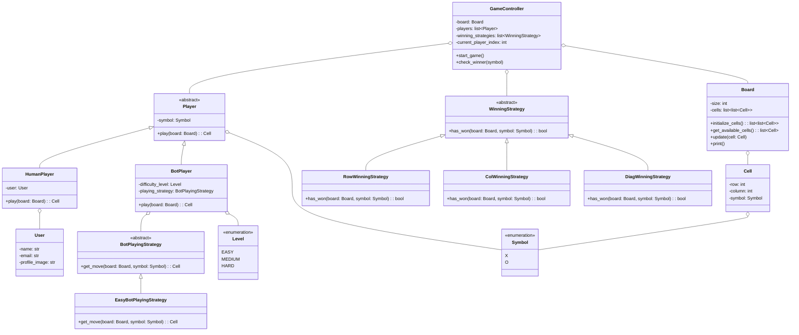

```mermaid
classDiagram
    class GameController {
        -board: Board
        -players: list~Player~
        -winning_strategies: list~WinningStrategy~
        -current_player_index: int
        +start_game()
        +check_winner(symbol)
    }

    class Player {
        <<abstract>>
        -symbol: Symbol
        +play(board: Board): Cell
    }

    class HumanPlayer {
        -user: User
        +play(board: Board): Cell
    }

    class BotPlayer {
        -difficulty_level: Level
        -playing_strategy: BotPlayingStrategy
        +play(board: Board): Cell
    }

    class User {
        -name: str
        -email: str
        -profile_image: str
    }

    class Board {
        -size: int
        -cells: list~list~Cell~~
        +initialize_cells(): list~list~Cell~~
        +get_available_cells(): list~Cell~
        +update(cell: Cell)
        +print()
    }

    class Cell {
        -row: int
        -column: int
        -symbol: Symbol
    }

    class WinningStrategy {
        <<abstract>>
        +has_won(board: Board, symbol: Symbol): bool
    }

    class RowWinningStrategy {
        +has_won(board: Board, symbol: Symbol): bool
    }

    class ColWinningStrategy {
        +has_won(board: Board, symbol: Symbol): bool
    }

    class DiagWinningStrategy {
        +has_won(board: Board, symbol: Symbol): bool
    }

    class BotPlayingStrategy {
        <<abstract>>
        +get_move(board: Board, symbol: Symbol): Cell
    }

    class EasyBotPlayingStrategy {
        +get_move(board: Board, symbol: Symbol): Cell
    }

    class Level {
        <<enumeration>>
        EASY
        MEDIUM
        HARD
    }

    class Symbol {
        <<enumeration>>
        X
        O
    }

    GameController o-- Board
    GameController o-- Player
    GameController o-- WinningStrategy
    Player <|-- HumanPlayer
    Player <|-- BotPlayer
    HumanPlayer o-- User
    BotPlayer o-- Level
    BotPlayer o-- BotPlayingStrategy
    Board o-- Cell
    Cell o-- Symbol
    WinningStrategy <|-- RowWinningStrategy
    WinningStrategy <|-- ColWinningStrategy
    WinningStrategy <|-- DiagWinningStrategy
    BotPlayingStrategy <|-- EasyBotPlayingStrategy
    Player o-- Symbol
```