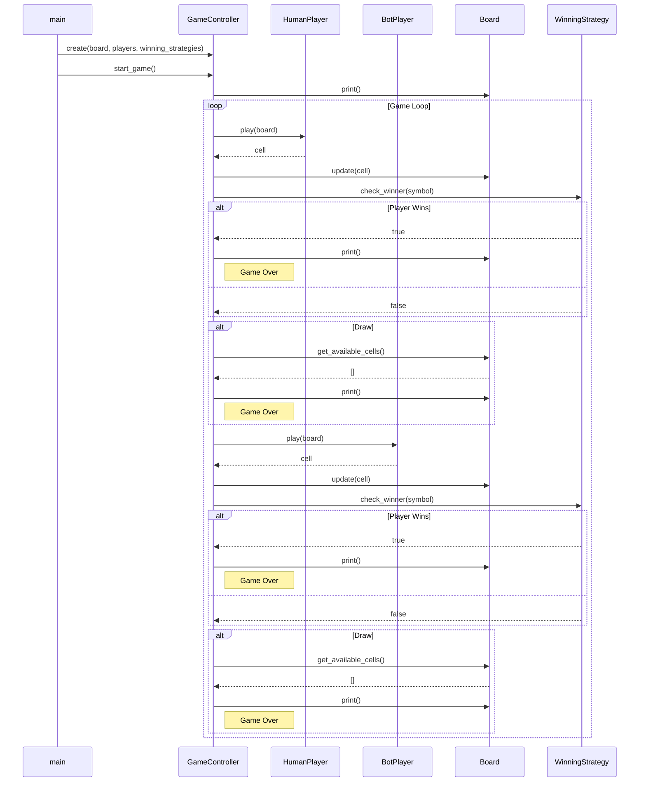

```mermaid
sequenceDiagram
    participant main
    participant GameController
    participant HumanPlayer
    participant BotPlayer
    participant Board
    participant WinningStrategy

    main->>GameController: create(board, players, winning_strategies)
    main->>GameController: start_game()
    GameController->>Board: print()
    loop Game Loop
        GameController->>HumanPlayer: play(board)
        HumanPlayer-->>GameController: cell
        GameController->>Board: update(cell)
        GameController->>WinningStrategy: check_winner(symbol)
        alt Player Wins
            WinningStrategy-->>GameController: true
            GameController->>Board: print()
            note right of GameController: Game Over
        else
            WinningStrategy-->>GameController: false
        end
        alt Draw
             GameController->>Board: get_available_cells()
             Board-->>GameController: []
             GameController->>Board: print()
             note right of GameController: Game Over
        end

        GameController->>BotPlayer: play(board)
        BotPlayer-->>GameController: cell
        GameController->>Board: update(cell)
        GameController->>WinningStrategy: check_winner(symbol)
        alt Player Wins
            WinningStrategy-->>GameController: true
            GameController->>Board: print()
            note right of GameController: Game Over
        else
            WinningStrategy-->>GameController: false
        end
        alt Draw
             GameController->>Board: get_available_cells()
             Board-->>GameController: []
             GameController->>Board: print()
             note right of GameController: Game Over
        end
    end
```