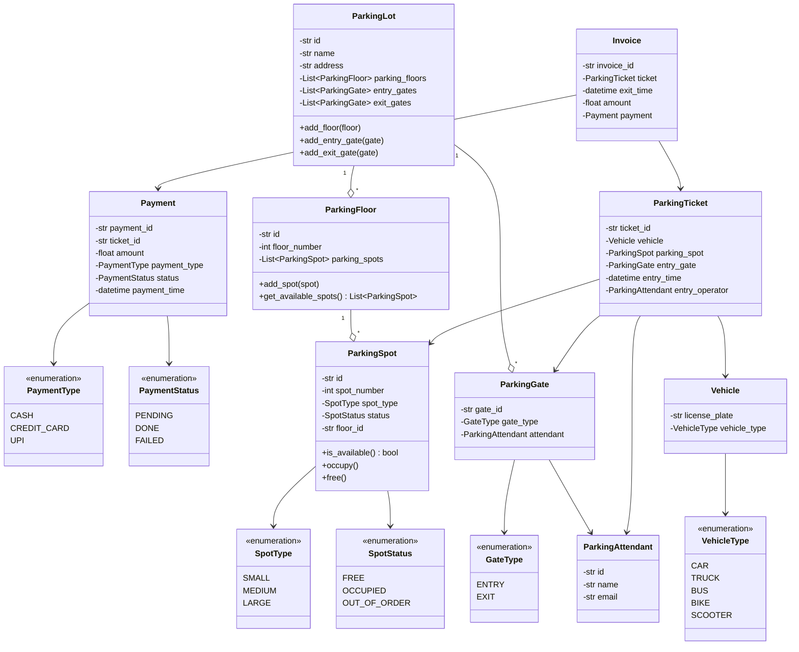
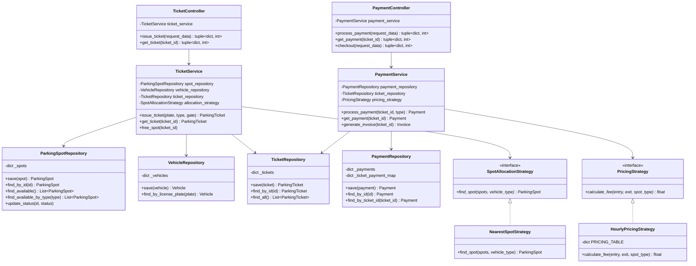

# System Diagrams - Parking Lot

## 1. Complete Class Diagram





---

## 2. Package Diagram

```
┌─────────────────────────────────────────────────────────────┐
│                    PARKING LOT SYSTEM                        │
└─────────────────────────────────────────────────────────────┘

┌─────────────────────────────────────────────────────────────┐
│  controllers/                                                │
│  ├─ TicketController                                        │
│  └─ PaymentController                                       │
│                                                              │
│  Responsibility: Request validation, response formatting    │
└─────────────────────────────────────────────────────────────┘
                            ↓ uses
┌─────────────────────────────────────────────────────────────┐
│  services/                                                   │
│  ├─ TicketService                                           │
│  └─ PaymentService                                          │
│                                                              │
│  Responsibility: Business logic, orchestration              │
└─────────────────────────────────────────────────────────────┘
        ↓ uses                              ↓ uses
┌──────────────────────────┐    ┌──────────────────────────────┐
│  repositories/           │    │  strategies/                 │
│  ├─ ParkingSpotRepo     │    │  ├─ SpotAllocationStrategy  │
│  ├─ VehicleRepo         │    │  ├─ NearestSpotStrategy     │
│  ├─ TicketRepo          │    │  ├─ PricingStrategy         │
│  └─ PaymentRepo         │    │  └─ HourlyPricingStrategy   │
│                          │    │                              │
│  Responsibility:         │    │  Responsibility:             │
│  Data access, CRUD       │    │  Algorithms, policies        │
└──────────────────────────┘    └──────────────────────────────┘
        ↓ uses
┌─────────────────────────────────────────────────────────────┐
│  models/                                                     │
│  ├─ Vehicle                  ├─ ParkingTicket              │
│  ├─ ParkingSpot             ├─ Payment                     │
│  ├─ ParkingFloor            ├─ Invoice                     │
│  ├─ ParkingLot              ├─ ParkingGate                │
│  └─ ParkingAttendant                                       │
│                                                              │
│  Responsibility: Domain entities, business objects          │
└─────────────────────────────────────────────────────────────┘
        ↓ uses
┌─────────────────────────────────────────────────────────────┐
│  enums/                                                      │
│  ├─ VehicleType              ├─ PaymentType                │
│  ├─ SpotType                 ├─ PaymentStatus              │
│  ├─ SpotStatus               └─ GateType                   │
│                                                              │
│  Responsibility: Type definitions, constants                │
└─────────────────────────────────────────────────────────────┘

┌─────────────────────────────────────────────────────────────┐
│  exceptions/                                                 │
│  └─ ParkingLotException (base)                              │
│      ├─ NoSpotAvailableException                           │
│      ├─ TicketNotFoundException                            │
│      ├─ PaymentAlreadyDoneException                        │
│      └─ PaymentNotFoundException                           │
│                                                              │
│  Responsibility: Error handling                             │
└─────────────────────────────────────────────────────────────┘
```

---

## 3. Sequence Diagram - Issue Ticket Flow

```
User/Client → TicketController → TicketService → VehicleRepository
                                                → ParkingSpotRepository
                                                → SpotAllocationStrategy
                                                → TicketRepository

┌──────┐  ┌───────────────┐  ┌──────────────┐  ┌──────────────┐
│Client│  │TicketControlle│  │TicketService │  │VehicleRepo   │
└──┬───┘  └───────┬───────┘  └──────┬───────┘  └──────┬───────┘
   │              │                  │                  │
   │ issue_ticket │                  │                  │
   │  (request)   │                  │                  │
   ├─────────────>│                  │                  │
   │              │                  │                  │
   │              │ Validate input   │                  │
   │              │ (license_plate,  │                  │
   │              │  vehicle_type)   │                  │
   │              │                  │                  │
   │              │ issue_ticket()   │                  │
   │              ├─────────────────>│                  │
   │              │                  │                  │
   │              │                  │ find_by_license  │
   │              │                  ├─────────────────>│
   │              │                  │                  │
   │              │                  │ Vehicle or None  │
   │              │                  │<─────────────────┤
   │              │                  │                  │
   │              │                  │ (if not found)   │
   │              │                  │ save(vehicle)    │
   │              │                  ├─────────────────>│
   │              │                  │                  │

                    ┌───────────────┐  ┌──────────────────┐
                    │ParkingSpotRepo│  │AllocationStrategy│
                    └───────┬───────┘  └────────┬─────────┘
                            │                   │
   │              │         │ find_available()  │
   │              │         │<──────────────────┤
   │              │         │                   │
   │              │         │ List[spots]       │
   │              │         ├──────────────────>│
   │              │         │                   │
   │              │         │ find_spot(spots,  │
   │              │         │  vehicle_type)    │
   │              │         ├──────────────────>│
   │              │         │                   │
   │              │         │ selected_spot     │
   │              │         │<──────────────────┤
   │              │         │                   │
   │              │         │ (if no spot)      │
   │              │         │ raise             │
   │              │         │ NoSpotAvailable   │
   │              │         │                   │
   │              │         │ spot.occupy()     │
   │              │         │ save(spot)        │
   │              │         │                   │

                    ┌──────────────┐
                    │TicketRepo    │
                    └──────┬───────┘
                           │
   │              │        │ save(ticket)
   │              │        │<────────────
   │              │        │
   │              │        │ ticket
   │              │        ├────────────>
   │              │        │
   │              │ ticket │
   │              │<───────┤
   │              │        │
   │ Format       │        │
   │ Response     │        │
   │ (ticket_id,  │        │
   │  entry_time, │        │
   │  spot_info)  │        │
   │              │        │
   │ Response     │        │
   │ (dict, 201)  │        │
   │<─────────────┤        │
   │              │        │
```

---

## 4. Sequence Diagram - Process Payment Flow

```
Client → PaymentController → PaymentService → TicketRepository
                                             → PaymentRepository
                                             → PricingStrategy

┌──────┐  ┌────────────────┐  ┌──────────────┐  ┌─────────────┐
│Client│  │PaymentControlle│  │PaymentService│  │TicketRepo   │
└──┬───┘  └───────┬────────┘  └──────┬───────┘  └──────┬──────┘
   │              │                   │                  │
   │ process_     │                   │                  │
   │ payment      │                   │                  │
   ├─────────────>│                   │                  │
   │              │                   │                  │
   │              │ Validate input    │                  │
   │              │ (ticket_id,       │                  │
   │              │  payment_type)    │                  │
   │              │                   │                  │
   │              │ process_payment() │                  │
   │              ├──────────────────>│                  │
   │              │                   │                  │
   │              │                   │ find_by_id()     │
   │              │                   ├─────────────────>│
   │              │                   │                  │
   │              │                   │ ticket or None   │
   │              │                   │<─────────────────┤
   │              │                   │                  │
   │              │                   │ (if not found)   │
   │              │                   │ raise            │
   │              │                   │ TicketNotFound   │
   │              │                   │                  │

                    ┌──────────────┐  ┌─────────────────┐
                    │PaymentRepo   │  │PricingStrategy  │
                    └──────┬───────┘  └────────┬────────┘
                           │                   │
   │              │        │ find_by_ticket()  │
   │              │        │<──────────────────┤
   │              │        │                   │
   │              │        │ existing_payment  │
   │              │        ├──────────────────>│
   │              │        │                   │
   │              │        │ (if already paid) │
   │              │        │ raise             │
   │              │        │ PaymentAlreadyDone│
   │              │        │                   │
   │              │        │ calculate_fee()   │
   │              │        │ (entry_time,      │
   │              │        │  exit_time,       │
   │              │        │  spot_type)       │
   │              │        ├──────────────────>│
   │              │        │                   │
   │              │        │ amount            │
   │              │        │<──────────────────┤
   │              │        │                   │
   │              │        │ save(payment)     │
   │              │        │                   │
   │              │        │ payment           │
   │              │        ├──────────────────>│
   │              │        │                   │
   │              │ payment│                   │
   │              │<───────┤                   │
   │              │        │                   │
   │ Format       │        │                   │
   │ Response     │        │                   │
   │              │        │                   │
   │ Response     │        │                   │
   │ (dict, 200)  │        │                   │
   │<─────────────┤        │                   │
   │              │        │                   │
```

---

## 5. Request Flow Through Layers

### Example: Issue Ticket for a Car

```
┌─────────────────────────────────────────────────────────────┐
│ STEP 1: Client Request                                       │
│                                                               │
│ Input:                                                        │
│   {                                                           │
│     "license_plate": "KA01AB1234",                          │
│     "vehicle_type": "CAR",                                  │
│     "entry_gate_id": "GATE-1"                               │
│   }                                                           │
└─────────────────────────────────────────────────────────────┘
                            ↓
┌─────────────────────────────────────────────────────────────┐
│ STEP 2: TicketController (controllers/ticket_controller.py) │
│                                                               │
│ Actions:                                                      │
│  1. Validate: license_plate exists? ✓                       │
│  2. Validate: vehicle_type exists? ✓                        │
│  3. Convert: "CAR" string → VehicleType.CAR enum            │
│  4. Create: ParkingGate object with gate_id                 │
│  5. Call: ticket_service.issue_ticket(...)                  │
│                                                               │
│ Error handling:                                               │
│  - Missing field → return (error_dict, 400)                 │
│  - Invalid type → return (error_dict, 400)                  │
└─────────────────────────────────────────────────────────────┘
                            ↓
┌─────────────────────────────────────────────────────────────┐
│ STEP 3: TicketService (services/ticket_service.py)          │
│                                                               │
│ Business Logic:                                               │
│  1. Find vehicle by license_plate                            │
│     - vehicle_repo.find_by_license_plate("KA01AB1234")      │
│     - If not found: Create new Vehicle                       │
│                                                               │
│  2. Get available spots                                       │
│     - spot_repo.find_available()                             │
│     - Returns: [Spot-A1(SMALL), Spot-B1(MEDIUM), ...]       │
│                                                               │
│  3. Find matching spot using strategy                        │
│     - allocation_strategy.find_spot(spots, VehicleType.CAR) │
│     - Strategy logic: CAR needs MEDIUM spot                  │
│     - Returns: Spot-B1                                       │
│                                                               │
│  4. Occupy the spot                                           │
│     - spot.occupy()  # Sets status to OCCUPIED               │
│     - spot_repo.save(spot)                                   │
│                                                               │
│  5. Create ticket                                             │
│     - Generate ticket_id: "TKT-ABC123"                       │
│     - Create ParkingTicket object                            │
│     - ticket_repo.save(ticket)                               │
│                                                               │
│  6. Return ticket                                             │
│                                                               │
│ Error handling:                                               │
│  - No spot found → raise NoSpotAvailableException           │
└─────────────────────────────────────────────────────────────┘
                            ↓
┌─────────────────────────────────────────────────────────────┐
│ STEP 4: Repositories (repositories/*.py)                     │
│                                                               │
│ Data Operations:                                              │
│                                                               │
│  VehicleRepository:                                           │
│    _vehicles = {                                              │
│      "KA01AB1234": Vehicle(plate="KA01AB1234", type=CAR)    │
│    }                                                          │
│                                                               │
│  ParkingSpotRepository:                                       │
│    _spots = {                                                 │
│      "Spot-B1": ParkingSpot(                                 │
│                   id="Spot-B1",                              │
│                   spot_type=MEDIUM,                          │
│                   status=OCCUPIED  ← Updated!                │
│                 )                                             │
│    }                                                          │
│                                                               │
│  TicketRepository:                                            │
│    _tickets = {                                               │
│      "TKT-ABC123": ParkingTicket(                            │
│                      ticket_id="TKT-ABC123",                 │
│                      vehicle=...,                             │
│                      parking_spot=...,                        │
│                      entry_time=...                           │
│                    )                                          │
│    }                                                          │
└─────────────────────────────────────────────────────────────┘
                            ↓
┌─────────────────────────────────────────────────────────────┐
│ STEP 5: Back to TicketController                             │
│                                                               │
│ Format Response:                                              │
│  - Extract data from ticket object                           │
│  - Convert datetime → ISO string                             │
│  - Convert enums → strings (MEDIUM → "MEDIUM")              │
│  - Wrap in standard response format                          │
│  - Set HTTP status code: 201 (Created)                       │
└─────────────────────────────────────────────────────────────┘
                            ↓
┌─────────────────────────────────────────────────────────────┐
│ STEP 6: Response to Client                                   │
│                                                               │
│ Output: (response_dict, status_code)                         │
│                                                               │
│ ({                                                            │
│   "status": "success",                                       │
│   "data": {                                                  │
│     "ticket_id": "TKT-ABC123",                               │
│     "entry_time": "2025-12-06T10:30:00",                    │
│     "parking_spot": {                                        │
│       "spot_id": "B-1",                                      │
│       "spot_number": 3,                                      │
│       "spot_type": "MEDIUM"                                  │
│     },                                                        │
│     "vehicle": {                                             │
│       "license_plate": "KA01AB1234",                        │
│       "vehicle_type": "CAR"                                  │
│     }                                                         │
│   }                                                           │
│ }, 201)                                                       │
└─────────────────────────────────────────────────────────────┘
```

---

## 6. Component Interaction Diagram

```
┌─────────────────────────────────────────────────────────────┐
│                        CLIENT CODE                           │
│                      (main.py / tests)                       │
└─────────────────────────────────────────────────────────────┘
                            ↓
                    calls methods on
                            ↓
┌─────────────────────────────────────────────────────────────┐
│                      CONTROLLERS                             │
│  ┌──────────────────┐         ┌──────────────────┐         │
│  │TicketController  │         │PaymentController │         │
│  │                  │         │                  │         │
│  │ +issue_ticket()  │         │ +process_payment()│         │
│  │ +get_ticket()    │         │ +checkout()      │         │
│  └──────────────────┘         └──────────────────┘         │
│         │                              │                     │
│         │ validates & delegates        │                     │
│         ↓                              ↓                     │
└─────────────────────────────────────────────────────────────┘
                            ↓
┌─────────────────────────────────────────────────────────────┐
│                        SERVICES                              │
│  ┌──────────────────┐         ┌──────────────────┐         │
│  │TicketService     │         │PaymentService    │         │
│  │                  │         │                  │         │
│  │ +issue_ticket()  │         │ +process_payment()│         │
│  │ +get_ticket()    │         │ +get_payment()   │         │
│  │ +free_spot()     │         │ +generate_invoice│         │
│  └──────────────────┘         └──────────────────┘         │
│         │                              │                     │
│         │ uses                         │ uses                │
│         ↓                              ↓                     │
└─────────────────────────────────────────────────────────────┘
           ↓                              ↓
    ┌──────────┐                    ┌──────────┐
    │STRATEGIES│                    │STRATEGIES│
    └──────────┘                    └──────────┘
           ↓                              ↓
┌─────────────────────────────────────────────────────────────┐
│                      REPOSITORIES                            │
│  ┌──────────────┐  ┌──────────────┐  ┌──────────────┐     │
│  │SpotRepo      │  │TicketRepo    │  │PaymentRepo   │     │
│  │              │  │              │  │              │     │
│  │ +save()      │  │ +save()      │  │ +save()      │     │
│  │ +find_*()    │  │ +find_*()    │  │ +find_*()    │     │
│  └──────────────┘  └──────────────┘  └──────────────┘     │
│         │                  │                  │              │
│         │ manages          │ manages          │ manages      │
│         ↓                  ↓                  ↓              │
└─────────────────────────────────────────────────────────────┘
                            ↓
┌─────────────────────────────────────────────────────────────┐
│                    DOMAIN MODELS                             │
│  ┌────────┐  ┌──────────┐  ┌────────┐  ┌────────┐         │
│  │Vehicle │  │Parking   │  │Parking │  │Payment │         │
│  │        │  │Spot      │  │Ticket  │  │        │         │
│  └────────┘  └──────────┘  └────────┘  └────────┘         │
│                                                              │
│  ┌────────┐  ┌──────────┐  ┌────────┐                     │
│  │Parking │  │Invoice   │  │Parking │                     │
│  │Floor   │  │          │  │Gate    │                     │
│  └────────┘  └──────────┘  └────────┘                     │
└─────────────────────────────────────────────────────────────┘
                            ↓
                       references
                            ↓
┌─────────────────────────────────────────────────────────────┐
│                         ENUMS                                │
│  VehicleType | SpotType | SpotStatus | PaymentType | etc.  │
└─────────────────────────────────────────────────────────────┘
```

---

## 7. Data Flow - Complete Parking Cycle

```
ENTRY FLOW
==========
User arrives → Controller validates → Service allocates spot
→ Repository saves ticket → User receives ticket_id

┌──────┐    ┌──────────┐    ┌─────────┐    ┌──────┐
│ User │───>│Controller│───>│ Service │───>│ Repo │
│      │    │ validate │    │allocate │    │ save │
└──────┘    └──────────┘    └─────────┘    └──────┘
   ↑                                            │
   │                                            │
   └────────────── ticket_id ←──────────────────┘


PAYMENT FLOW
============
User pays → Controller validates → Service calculates fee
→ Repository saves payment → User receives payment_id

┌──────┐    ┌──────────┐    ┌─────────┐    ┌──────┐
│ User │───>│Controller│───>│ Service │───>│ Repo │
│      │    │ validate │    │calculate│    │ save │
└──────┘    └──────────┘    └─────────┘    └──────┘
   ↑                             │
   │                             ↓
   │                        ┌─────────┐
   │                        │Pricing  │
   │                        │Strategy │
   │                        └─────────┘
   │                             │
   └───── payment_id ←───────────┘


EXIT FLOW
=========
User exits → Controller checks payment → Service generates invoice
→ Service frees spot → User receives invoice

┌──────┐    ┌──────────┐    ┌─────────┐    ┌──────┐
│ User │───>│Controller│───>│ Service │───>│ Repo │
│      │    │  check   │    │generate │    │update│
└──────┘    └──────────┘    │invoice  │    │ spot │
   ↑                         │free spot│    └──────┘
   │                         └─────────┘
   │                              │
   └────────── invoice ←──────────┘
```

---

## Key Takeaways

1. **Controllers**: Validate input, format output, return (response, status_code)
2. **Services**: Execute business logic, orchestrate repositories and strategies
3. **Repositories**: CRUD operations on domain models
4. **Strategies**: Pluggable algorithms (spot allocation, pricing)
5. **Models**: Domain entities with minimal logic

**Flow**: Controller → Service → Repository → Model
**Data**: Model → Repository → Service → Controller → Client
