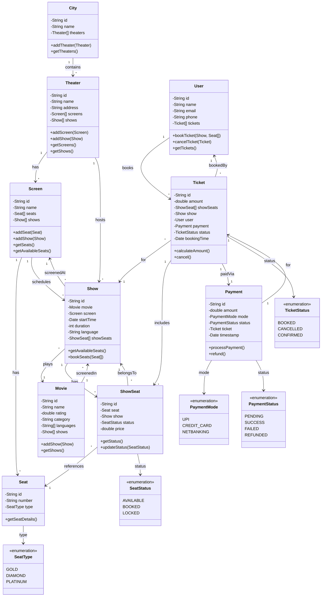

```mermaid
classDiagram
  class City {
    -String id
    -String name
    -Theater[] theaters
    +addTheater(Theater)
    +getTheaters()
  }

  class Theater {
    -String id
    -String name
    -String address
    -Screen[] screens
    -Show[] shows
    +addScreen(Screen)
    +addShow(Show)
    +getScreens()
    +getShows()
  }

  class Screen {
    -String id
    -String name
    -Seat[] seats
    -Show[] shows
    +addSeat(Seat)
    +addShow(Show)
    +getSeats()
    +getAvailableSeats()
  }

  class Seat {
    -String id
    -String number
    -SeatType type
    +getSeatDetails()
  }

  class SeatType {
    <<enumeration>>
    GOLD
    DIAMOND
    PLATINUM
  }

  class Show {
    -String id
    -Movie movie
    -Screen screen
    -Date startTime
    -int duration
    -String language
    -ShowSeat[] showSeats
    +getAvailableSeats()
    +bookSeats(Seat[])
  }

  class Movie {
    -String id
    -String name
    -double rating
    -String category
    -String[] languages
    -Show[] shows
    +addShow(Show)
    +getShows()
  }

  class ShowSeat {
    -String id
    -Seat seat
    -Show show
    -SeatStatus status
    -double price
    +getStatus()
    +updateStatus(SeatStatus)
  }

  class SeatStatus {
    <<enumeration>>
    AVAILABLE
    BOOKED
    LOCKED
  }

  class User {
    -String id
    -String name
    -String email
    -String phone
    -Ticket[] tickets
    +bookTicket(Show, Seat[])
    +cancelTicket(Ticket)
    +getTickets()
  }

  class Ticket {
    -String id
    -double amount
    -ShowSeat[] showSeats
    -Show show
    -User user
    -Payment payment
    -TicketStatus status
    -Date bookingTime
    +calculateAmount()
    +cancel()
  }

  class Payment {
    -String id
    -double amount
    -PaymentMode mode
    -PaymentStatus status
    -Ticket ticket
    -Date timestamp
    +processPayment()
    +refund()
  }

  class PaymentMode {
    <<enumeration>>
    UPI
    CREDIT_CARD
    NETBANKING
  }

  class PaymentStatus {
    <<enumeration>>
    PENDING
    SUCCESS
    FAILED
    REFUNDED
  }

  class TicketStatus {
    <<enumeration>>
    BOOKED
    CANCELLED
    CONFIRMED
  }

  %% Relationships
  City "1" --> "*" Theater : contains
  Theater "1" --> "*" Screen : has
  Theater "1" --> "*" Show : hosts
  Screen "1" --> "*" Seat : has
  Screen "1" --> "*" Show : schedules
  Show "*" --> "1" Movie : plays
  Show "*" --> "1" Screen : screenedAt
  Show "1" --> "*" ShowSeat : has
  ShowSeat "*" --> "1" Seat : references
  ShowSeat "*" --> "1" Show : belongsTo
  ShowSeat --> SeatStatus : status
  Seat --> SeatType : type
  User "1" --> "*" Ticket : books
  Ticket "*" --> "1" Show : for
  Ticket "1" --> "*" ShowSeat : includes
  Ticket "*" --> "1" User : bookedBy
  Ticket "1" --> "1" Payment : paidVia
  Ticket --> TicketStatus : status
  Payment --> PaymentMode : mode
  Payment --> PaymentStatus : status
  Payment "1" --> "1" Ticket : for
  Movie "1" --> "*" Show : screenedIn
```