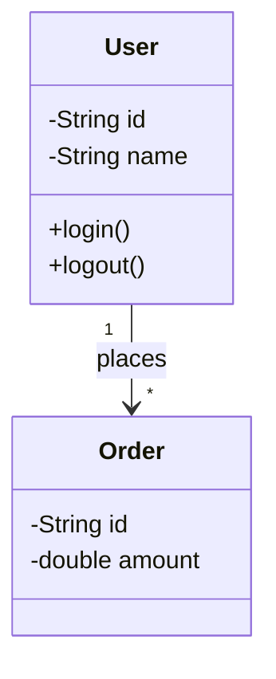
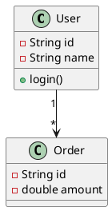

# Class Diagram Tools Guide for Interviews

Quick reference for creating class diagrams during LLD interviews.

## 1. Mermaid (Recommended for GitHub/Markdown)

**Best for:** GitHub repos, markdown files, quick sharing

**Pros:** Version control friendly, renders on GitHub, no external tools needed

**Basic Syntax:**


**Quick Start:**
1. Use triple backticks with `mermaid` keyword
2. Start with `classDiagram`
3. Use `-` for private, `+` for public attributes/methods
4. Add relationships at the end (Optional for today's assignment)

**Links:**
- [Mermaid Live Editor](https://mermaid.live/) - Test your diagrams
- [Mermaid Class Diagram Docs](https://mermaid.js.org/syntax/classDiagram.html)
- GitHub automatically renders mermaid in `.md` files

---

## 2. Excalidraw (Recommended for Interviews)

**Best for:** Live interviews, whiteboarding, visual clarity

**Pros:** Fast, intuitive, looks hand-drawn, easy to share

**Quick Start:**
1. Go to [excalidraw.com](https://excalidraw.com)
2. Use rectangle tool for classes
3. Add text inside rectangles
4. Use arrow tool for relationships
5. Export as PNG/SVG or share link

**Tips for Interviews:**
- Keep it simple and clean
- Use different colors for different types of classes
- Add cardinality labels on relationships (1, *, 1..*)
- Export and share link immediately after interview

**Links:**
- [Excalidraw](https://excalidraw.com) - Free, no sign-up needed
- [Excalidraw Libraries](https://libraries.excalidraw.com/) - Pre-made components

---

## 3. Simple Markdown (Text-based)

**Best for:** Quick notes, email responses, plain text environments

**Format:**
```markdown
## Class: User
- Attributes:
  - id: String
  - name: String
  - email: String
- Methods:
  - login()
  - logout()

## Class: Order
- Attributes:
  - id: String
  - amount: double
- Methods:
  - calculateTotal()

## Relationships:
- User (1) --> (*) Order : "places"
- Order (1) --> (1) Payment : "has"
```

**When to use:** When you can't draw diagrams (phone screen, plain text editor)

---

## 4. Draw.io / diagrams.net

**Best for:** Professional diagrams, detailed designs

**Pros:** Full-featured, exports to many formats, integrates with Google Drive

**Quick Start:**
1. Go to [app.diagrams.net](https://app.diagrams.net/)
2. Choose "Blank Diagram"
3. Use UML shapes from left panel
4. Drag and connect boxes
5. Export as PNG/PDF

**Links:**
- [Draw.io](https://app.diagrams.net/)
- [UML Class Diagram Tutorial](https://drawio-app.com/uml-class-diagrams-in-draw-io/)

---

## 5. PlantUML (Code-based)

**Best for:** Developers who prefer code over GUI

**Syntax:**


**Links:**
- [PlantUML Online Editor](https://www.plantuml.com/plantuml/uml/)
- [PlantUML Class Diagram Guide](https://plantuml.com/class-diagram)

---

## Quick Comparison

| Tool | Speed | Visual Quality | Interview Friendly | GitHub Friendly |
|------|-------|----------------|-------------------|-----------------|
| **Mermaid** | ⚡⚡⚡ | ⭐⭐⭐ | ⭐⭐ | ⭐⭐⭐⭐⭐ |
| **Excalidraw** | ⚡⚡⚡⚡⚡ | ⭐⭐⭐⭐ | ⭐⭐⭐⭐⭐ | ⭐⭐⭐ |
| **Markdown** | ⚡⚡⚡⚡⚡ | ⭐ | ⭐⭐ | ⭐⭐⭐⭐⭐ |
| **Draw.io** | ⚡⚡ | ⭐⭐⭐⭐⭐ | ⭐⭐⭐ | ⭐⭐⭐ |
| **PlantUML** | ⚡⚡⚡ | ⭐⭐⭐ | ⭐⭐ | ⭐⭐⭐⭐ |

---

## Interview Recommendations

### For Live Video Interviews:
1. **Primary:** Excalidraw (fastest, most intuitive)
2. **Backup:** Draw.io (if you need more professional look)

### For Take-home Assignments:
1. **Primary:** Mermaid (version control friendly)
2. **Alternative:** Draw.io → Export as PNG

### For System Design Rounds:
- Use Excalidraw for quick iterations
- Convert to Mermaid or Draw.io for final submission

---

## Essential Class Diagram Elements

### 1. Class Structure:
```
┌─────────────────┐
│   ClassName     │  ← Class name
├─────────────────┤
│ - attribute     │  ← Attributes (- private, + public, # protected)
│ + method()      │  ← Methods
└─────────────────┘
```

### 2. Relationships:
- `-->` : Association (has-a)
- `--|>` : Inheritance (is-a)
- `--*` : Composition (strong ownership)
- `--o` : Aggregation (weak ownership)

### 3. Cardinality:
- `1` : exactly one
- `*` or `0..*` : zero or many
- `1..*` : one or many
- `0..1` : zero or one

---

## For Your BookMyShow Assignment:

**Recommended Approach:**
1. **Sketch first:** Use Excalidraw to brainstorm (5-10 min)
2. **Finalize in Mermaid:** Convert to mermaid markdown for GitHub
3. **Export PNG:** Save Excalidraw version as PNG backup

**What to include:**
- All major classes (User, Theater, Screen, Movie, Show, Ticket, etc.)
- Key attributes and methods
- Relationships with cardinality
- Enums (SeatType, PaymentStatus, etc.)

**What to skip in interviews:**
- Don't overload with too many methods
- Skip getter/setter methods (assumed)
- Focus on relationships over implementation details
