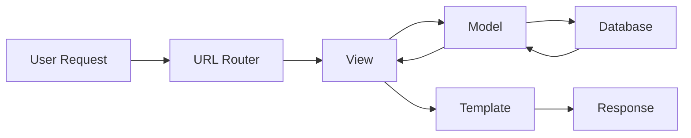

# Django Basics & Project Setup

## What is Django?

Django is a high-level Python web framework that enables rapid development of secure and maintainable websites. It follows the MVT (Model-View-Template) pattern.

**Key Philosophy:** "Don't Repeat Yourself" (DRY) and "Convention over Configuration"

---

## Installation & Setup

### Install Django
```bash
pip install django
django-admin --version
```

### Create a New Project
```bash
django-admin startproject myproject
cd myproject
python manage.py runserver
```

**Project Structure:**
```
myproject/
├── manage.py          # Command-line utility
├── myproject/
│   ├── __init__.py
│   ├── settings.py    # Project settings
│   ├── urls.py        # URL routing
│   ├── asgi.py        # ASGI config
│   └── wsgi.py        # WSGI config
```

### Create an App
```bash
python manage.py startapp myapp
```

**App Structure:**
```
myapp/
├── migrations/        # Database migrations
├── __init__.py
├── admin.py          # Admin interface config
├── apps.py           # App configuration
├── models.py         # Data models
├── tests.py          # Tests
└── views.py          # View logic
```

---

## Django MVT Pattern



**Components:**
- **Model:** Data structure and database interaction
- **View:** Business logic and request handling
- **Template:** HTML presentation layer

---

## settings.py Essentials

### Key Settings
```python
# Debug mode (Turn OFF in production)
DEBUG = True

# Allowed hosts
ALLOWED_HOSTS = ['localhost', '127.0.0.1']

# Installed apps
INSTALLED_APPS = [
    'django.contrib.admin',
    'django.contrib.auth',
    'django.contrib.contenttypes',
    'django.contrib.sessions',
    'django.contrib.messages',
    'django.contrib.staticfiles',
    'myapp',  # Your app
]

# Database configuration
DATABASES = {
    'default': {
        'ENGINE': 'django.db.backends.sqlite3',
        'NAME': BASE_DIR / 'db.sqlite3',
    }
}

# Static files
STATIC_URL = '/static/'
STATIC_ROOT = BASE_DIR / 'staticfiles'

# Media files (user uploads)
MEDIA_URL = '/media/'
MEDIA_ROOT = BASE_DIR / 'media'
```

---

## URL Routing

### Project-level URLs (myproject/urls.py)
```python
from django.contrib import admin
from django.urls import path, include

urlpatterns = [
    path('admin/', admin.site.urls),
    path('api/', include('myapp.urls')),
]
```

### App-level URLs (myapp/urls.py)
```python
from django.urls import path
from . import views

urlpatterns = [
    path('', views.index, name='index'),
    path('users/', views.user_list, name='user-list'),
    path('users/<int:id>/', views.user_detail, name='user-detail'),
]
```

---

## Essential Django Commands

```bash
# Start development server
python manage.py runserver

# Create migrations
python manage.py makemigrations

# Apply migrations
python manage.py migrate

# Create superuser
python manage.py createsuperuser

# Open Django shell
python manage.py shell

# Run tests
python manage.py test

# Collect static files
python manage.py collectstatic
```

---

## Environment Variables Setup

### Install python-decouple
```bash
pip install python-decouple
```

### Create .env file
```
SECRET_KEY=your-secret-key-here
DEBUG=True
DATABASE_URL=sqlite:///db.sqlite3
```

### Use in settings.py
```python
from decouple import config

SECRET_KEY = config('SECRET_KEY')
DEBUG = config('DEBUG', default=False, cast=bool)
```

---

## Quick Tips

- Always use virtual environments (`venv` or `virtualenv`)
- Keep `SECRET_KEY` in environment variables, never in code
- Add `.env` and `db.sqlite3` to `.gitignore`
- Use `requirements.txt` to track dependencies: `pip freeze > requirements.txt`

---

## Resources

- [Official Django Documentation](https://docs.djangoproject.com/)
- [Django Tutorial - Official](https://docs.djangoproject.com/en/stable/intro/tutorial01/)
- [Django Girls Tutorial](https://tutorial.djangogirls.org/)
- [Django for Beginners](https://djangoforbeginners.com/)
