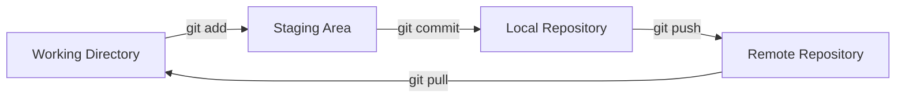

# Git Essentials for Developers

## What is Git?

Git is a distributed version control system for tracking changes in source code. Created by Linus Torvalds in 2005, it's now the industry standard for version control.

---

## Git Workflow



---

## Initial Setup

### Configure Git
```bash
# Set username and email (required for commits)
git config --global user.name "Your Name"
git config --global user.email "your.email@example.com"

# View configuration
git config --list

# Set default branch name to 'main'
git config --global init.defaultBranch main

# Set default editor
git config --global core.editor "code --wait"  # VS Code
```

### Initialize Repository
```bash
# Create new repository
git init

# Clone existing repository
git clone https://github.com/user/repo.git
git clone https://github.com/user/repo.git my-folder  # Custom folder name
```

---

## Basic Commands

### Check Status
```bash
# View status of files
git status

# Short status
git status -s
```

### Add Files to Staging
```bash
# Add specific file
git add filename.py

# Add multiple files
git add file1.py file2.py

# Add all files in current directory
git add .

# Add all Python files
git add *.py

# Add files interactively
git add -p
```

### Commit Changes
```bash
# Commit with message
git commit -m "Add user authentication feature"

# Commit with detailed message
git commit -m "Add user authentication" -m "- Implement login/logout
- Add password hashing
- Create user session management"

# Add and commit in one step
git commit -am "Fix bug in payment module"

# Amend last commit (change message or add forgotten files)
git add forgotten_file.py
git commit --amend --no-edit  # Keep same message
git commit --amend -m "New message"  # Change message
```

### View History
```bash
# View commit history
git log

# Compact log (one line per commit)
git log --oneline

# Last N commits
git log -n 5

# With file changes
git log --stat

# Graphical view
git log --graph --oneline --all

# Search commits
git log --grep="authentication"

# Commits by author
git log --author="Aravinda"

# Commits in date range
git log --since="2024-01-01" --until="2024-12-31"
```

### View Changes
```bash
# View unstaged changes
git diff

# View staged changes
git diff --staged

# View changes in specific file
git diff filename.py

# View changes between branches
git diff main..feature-branch

# View changes between commits
git diff abc123..def456
```

---

## Branching

### Branch Basics
```bash
# List all branches
git branch

# List all branches (including remote)
git branch -a

# Create new branch
git branch feature-login

# Switch to branch
git checkout feature-login

# Create and switch to new branch
git checkout -b feature-payment

# Modern way (Git 2.23+)
git switch feature-login
git switch -c feature-payment  # Create and switch

# Rename branch
git branch -m old-name new-name

# Delete branch
git branch -d feature-login  # Safe delete (only if merged)
git branch -D feature-login  # Force delete
```

### Merging Branches
```bash
# Switch to target branch
git checkout main

# Merge feature branch into current branch
git merge feature-login

# Merge without fast-forward (creates merge commit)
git merge --no-ff feature-login

# Abort merge (if conflicts)
git merge --abort
```

### Handling Merge Conflicts
```bash
# When merge conflict occurs:
# 1. Check conflicted files
git status

# 2. Open files and resolve conflicts manually
# Look for markers: <<<<<<<, =======, >>>>>>>

# 3. After resolving, add files
git add resolved_file.py

# 4. Complete merge
git commit -m "Resolve merge conflicts"
```

---

## Remote Repositories

### Remote Basics
```bash
# View remotes
git remote -v

# Add remote
git remote add origin https://github.com/user/repo.git

# Change remote URL
git remote set-url origin https://github.com/user/new-repo.git

# Remove remote
git remote remove origin

# Rename remote
git remote rename origin upstream
```

### Push & Pull
```bash
# Push to remote
git push origin main

# Push and set upstream
git push -u origin feature-login

# Push all branches
git push --all

# Force push (use carefully!)
git push --force

# Delete remote branch
git push origin --delete feature-old

# Pull from remote
git pull origin main

# Pull with rebase
git pull --rebase origin main

# Fetch without merging
git fetch origin
```

---

## Undoing Changes

### Discard Unstaged Changes
```bash
# Discard changes in specific file
git checkout -- filename.py

# Discard all unstaged changes
git checkout -- .

# Modern way
git restore filename.py
git restore .
```

### Unstage Files
```bash
# Unstage specific file
git reset HEAD filename.py

# Unstage all files
git reset HEAD

# Modern way
git restore --staged filename.py
```

### Undo Commits
```bash
# Undo last commit, keep changes
git reset --soft HEAD~1

# Undo last commit, unstage changes
git reset HEAD~1

# Undo last commit, discard changes (DANGEROUS!)
git reset --hard HEAD~1

# Undo last 3 commits
git reset --soft HEAD~3

# Create new commit that undoes a previous commit
git revert abc123
```

---

## Stashing

Save work in progress without committing.

```bash
# Stash current changes
git stash

# Stash with message
git stash save "Work in progress on login feature"

# List stashes
git stash list

# Apply latest stash
git stash apply

# Apply specific stash
git stash apply stash@{2}

# Apply and remove from stash list
git stash pop

# View stash contents
git stash show
git stash show -p  # With diff

# Drop stash
git stash drop stash@{0}

# Clear all stashes
git stash clear
```

---

## Advanced Commands

### Rebase
Reapply commits on top of another branch (creates linear history).

```bash
# Rebase current branch onto main
git checkout feature-branch
git rebase main

# Interactive rebase (edit, squash, reorder commits)
git rebase -i HEAD~3

# Continue after resolving conflicts
git rebase --continue

# Abort rebase
git rebase --abort
```

### Cherry-Pick
Apply specific commits from another branch.

```bash
# Apply specific commit to current branch
git cherry-pick abc123

# Cherry-pick multiple commits
git cherry-pick abc123 def456

# Cherry-pick without committing
git cherry-pick -n abc123
```

### Git Bisect
Binary search to find which commit introduced a bug.

```bash
# Start bisect
git bisect start

# Mark current commit as bad
git bisect bad

# Mark a known good commit
git bisect good abc123

# Git will checkout middle commit, test it, then:
git bisect good  # If works
git bisect bad   # If broken

# Repeat until bug is found

# End bisect
git bisect reset
```

### Git Blame
See who last modified each line of a file.

```bash
# See line-by-line authorship
git blame filename.py

# Show only lines 10-20
git blame -L 10,20 filename.py

# Ignore whitespace changes
git blame -w filename.py
```

### Git Reflog
View history of HEAD movements (recover lost commits).

```bash
# View reflog
git reflog

# Recover lost commit
git reflog  # Find commit hash
git checkout abc123
git branch recovered-branch  # Save it
```

### Git Tag
Mark specific points in history (releases).

```bash
# List tags
git tag

# Create lightweight tag
git tag v1.0.0

# Create annotated tag (recommended)
git tag -a v1.0.0 -m "Release version 1.0.0"

# Tag specific commit
git tag -a v1.0.0 abc123 -m "Release 1.0.0"

# Push tags to remote
git push origin v1.0.0
git push origin --tags  # Push all tags

# Delete tag
git tag -d v1.0.0
git push origin --delete v1.0.0  # Delete remote tag

# Checkout tag
git checkout v1.0.0
```

### Git Clean
Remove untracked files.

```bash
# See what would be removed
git clean -n

# Remove untracked files
git clean -f

# Remove untracked files and directories
git clean -fd

# Remove ignored files too
git clean -fdx
```

---

## .gitignore

Specify files to ignore.

```bash
# Create .gitignore file
touch .gitignore
```

**Common .gitignore patterns:**
```
# Python
__pycache__/
*.py[cod]
*.so
.Python
env/
venv/
.venv
*.egg-info/
.pytest_cache/

# Django
*.log
db.sqlite3
/media
/static

# Environment variables
.env
.env.local

# IDEs
.vscode/
.idea/
*.swp
*.swo

# OS
.DS_Store
Thumbs.db

# Node
node_modules/
npm-debug.log
```

---

## Git Aliases

Create shortcuts for common commands.

```bash
# Set aliases
git config --global alias.st status
git config --global alias.co checkout
git config --global alias.br branch
git config --global alias.ci commit
git config --global alias.unstage 'reset HEAD --'
git config --global alias.last 'log -1 HEAD'
git config --global alias.lg 'log --oneline --graph --all'

# Usage
git st       # Instead of git status
git co main  # Instead of git checkout main
git lg       # Pretty log
```

---

## Branching Strategies

### Git Flow
```
main (production)
├── develop (integration)
    ├── feature/user-auth
    ├── feature/payment
    └── release/v1.0
    └── hotfix/critical-bug
```

### Trunk-Based Development
```
main (single branch)
├── short-lived feature branches
    └── merged frequently (daily)
```

### GitHub Flow
```
main (production-ready)
├── feature branches
    └── PR → main
```

---

## Best Practices

### Commit Messages
```bash
# Good commit message structure:
# <type>: <subject>
#
# <body>
#
# <footer>

# Examples:
git commit -m "feat: Add user authentication"
git commit -m "fix: Resolve payment processing bug"
git commit -m "docs: Update API documentation"
git commit -m "refactor: Simplify user validation logic"
git commit -m "test: Add tests for login feature"

# Conventional Commits types:
# feat: New feature
# fix: Bug fix
# docs: Documentation
# style: Formatting
# refactor: Code restructuring
# test: Tests
# chore: Maintenance
```

### Do's
- ✅ Commit often with meaningful messages
- ✅ Pull before push
- ✅ Create feature branches
- ✅ Review changes before committing
- ✅ Use `.gitignore` for sensitive/generated files
- ✅ Write descriptive commit messages

### Don'ts
- ❌ Commit sensitive data (passwords, API keys)
- ❌ Commit large binary files
- ❌ Force push to shared branches
- ❌ Commit directly to main/master
- ❌ Use vague messages like "fix" or "update"

---

## Collaboration Workflow

### Fork & Pull Request
```bash
# 1. Fork repository on GitHub

# 2. Clone your fork
git clone https://github.com/your-username/repo.git

# 3. Add upstream remote
git remote add upstream https://github.com/original-owner/repo.git

# 4. Create feature branch
git checkout -b feature-name

# 5. Make changes and commit
git add .
git commit -m "Add feature"

# 6. Keep fork updated
git fetch upstream
git checkout main
git merge upstream/main

# 7. Push to your fork
git push origin feature-name

# 8. Create Pull Request on GitHub
```

---

## Troubleshooting

### Common Issues

**Merge conflicts:**
```bash
# Check conflicted files
git status

# After resolving manually
git add .
git commit
```

**Accidentally committed to wrong branch:**
```bash
# Move commit to new branch
git branch feature-branch
git reset --hard HEAD~1
git checkout feature-branch
```

**Committed sensitive data:**
```bash
# Remove from history (use carefully!)
git filter-branch --force --index-filter \
  "git rm --cached --ignore-unmatch path/to/file" \
  --prune-empty --tag-name-filter cat -- --all
```

**Recover deleted branch:**
```bash
git reflog
git checkout -b recovered-branch abc123
```

---

## Practice Resources

### Interactive Learning
- [Learn Git Branching](https://learngitbranching.js.org/) - Interactive visual tutorial
- [Git Immersion](https://gitimmersion.com/) - Guided tour through Git basics
- [GitHub Learning Lab](https://lab.github.com/) - GitHub-specific training
- [Katacoda Git Scenarios](https://www.katacoda.com/courses/git) - Hands-on scenarios

### Practice Platforms
- [Git Exercises](https://gitexercises.fracz.com/) - Practical exercises
- [Oh My Git!](https://ohmygit.org/) - Game to learn Git
- [Git-it](https://github.com/jlord/git-it-electron) - Desktop app tutorial

### Visualization Tools
- [Visualizing Git](https://git-school.github.io/visualizing-git/) - Visual sandbox
- [Git Graph Extension](https://marketplace.visualstudio.com/items?itemName=mhutchie.git-graph) - VS Code extension

### Cheat Sheets
- [GitHub Git Cheat Sheet](https://education.github.com/git-cheat-sheet-education.pdf)
- [Atlassian Git Cheat Sheet](https://www.atlassian.com/git/tutorials/atlassian-git-cheatsheet)
- [GitLab Git Cheat Sheet](https://about.gitlab.com/images/press/git-cheat-sheet.pdf)

---

## Essential Git Concepts to Master

### Must-Know Commands
1. `git init`, `git clone`
2. `git add`, `git commit`, `git push`, `git pull`
3. `git status`, `git log`, `git diff`
4. `git branch`, `git checkout`, `git merge`
5. `git stash`, `git reset`, `git revert`

### Advanced Must-Knows
1. **Git rebase** - Clean commit history
2. **Git bisect** - Find bugs efficiently
3. **Git reflog** - Recover lost work
4. **Git cherry-pick** - Selective commits
5. **Git hooks** - Automate workflows

### Understanding Internals
- How Git stores data (blobs, trees, commits)
- HEAD, branches, and tags
- Three-tree architecture (working dir, staging, repository)
- Remote tracking branches
- Merge vs Rebase trade-offs

---

## Books & References

- [Pro Git Book](https://git-scm.com/book/en/v2) - Free comprehensive guide
- [Git Documentation](https://git-scm.com/doc) - Official docs
- [Atlassian Git Tutorials](https://www.atlassian.com/git/tutorials)
- [GitHub Docs](https://docs.github.com/en)

---

## Git GUI Tools

- [GitKraken](https://www.gitkraken.com/) - Cross-platform GUI
- [Sourcetree](https://www.sourcetreeapp.com/) - Free Git client
- [GitHub Desktop](https://desktop.github.com/) - Simple GitHub integration
- [Tower](https://www.git-tower.com/) - Professional Git client
- [VS Code Git Integration](https://code.visualstudio.com/docs/editor/versioncontrol) - Built-in
