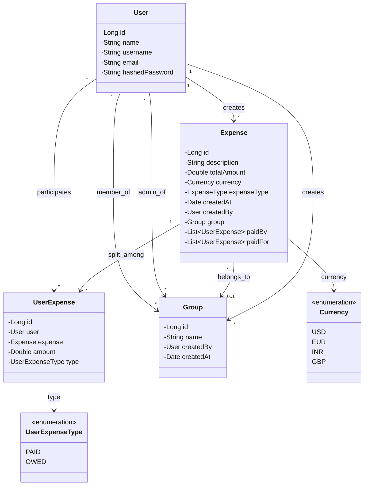
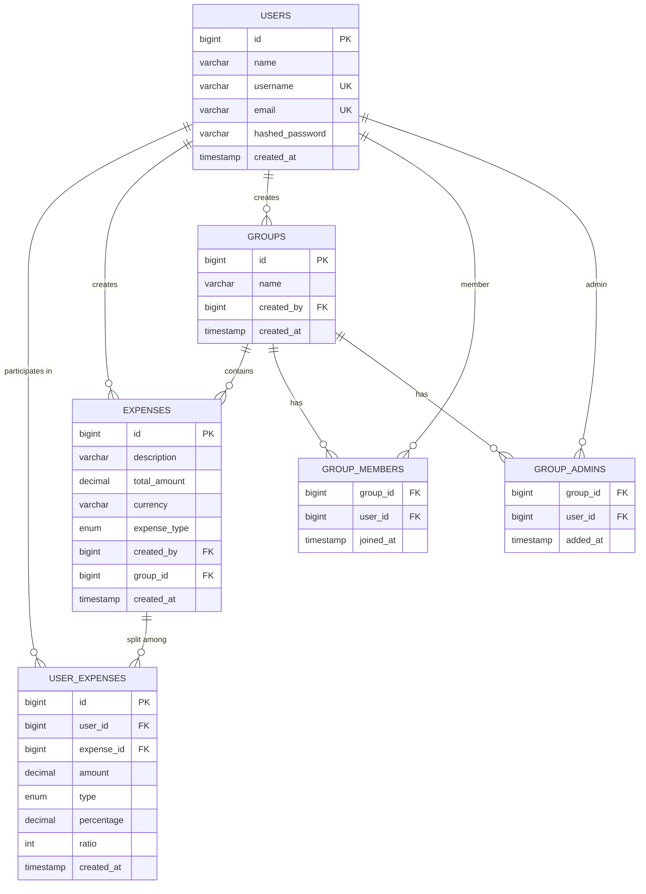

# Design Splitwise

## Context

> Splitwise makes it easy to split bills with friends and family. We organize all your shared expenses and IOUs in one place, so that everyone can see who they owe. Whether you are sharing a ski vacation, splitting rent with roommates, or paying someone back for lunch, Splitwise makes life easier. We store your data in the cloud so that you can access it anywhere: on iPhone, Android, or on your computer.


## Requirements

- Users can register and update their profiles.
- A user's profile should contain at least their name, phone number and password
- Users can participate in expenses with other users
- Users can participate in groups.
- To add an expense, a user must specify either the group, or the other users involved in the expense, along with who paid
  what and who owes what. They must also specify a description for the expense.
- A user can see their total owed amount
- A user can see a history of the expenses they're involved in
- A user can see a history of the expenses made in a group that they're participating in
- Users shouldn't be able to query about groups they are not a member of
- Only the user who has created a group can add/remove members to the group
- Users can request a settle-up. The application should show a list of transactions, which when executed will ensure that
  the user no longer owes or recieves money from any other user. Note that this need not settle-up any other users.
- Users can request a settle-up for any group they're participating in. The application should show a list of transactions,
  which if executed, will ensure that everyone participating in the group is settled up (owes a net of 0 Rs). Note that will
  only deal with the expenses made inside that group. Expenses outside the group need not be settled.
  Good to Have Requirements
- When settling a group, we should try to minimize the number of transactions that the group members should make to
  settle up.

Note: All tests will be performed in one go. The application doesn't need to persist data between runs.

### Input Format

`Register vinsmokesanji 003 namisswwaann`

> u1 is registering with the username "vinsmokesanji", phone "003" and password as "namisswwaann"
-- --
`u1 UpdateProfile robinchwan`

> u1 is updating their profile password to "robinchwan"
-- --
`u1 AddGroup Roommates`

> u1 is creating a group titled "Roommates"
-- --
`u1 AddMember g1 u2`

> u1 is adding u2 as a member of the group "Roommates" (which has the id g1)
-- --
`u1 MyTotal`
> u1 is asking to see the total amount they owe/recieve after everything is settled.
-- --
`u1 History`
> u1 is asking to see their history of transactions (whether added by themselves or someone
else)
-- --
`u1 Groups`
> u1 is asking to see the groups that they're a member of
-- --
`u1 SettleUp`
> u1 is asking to see the list of transactions they should perform to settle up
-- --
`u1 SettleUp g1`
> u1 is asking to see the list of transactions that need to be performed by members of g1 to
completely settle up the group.
-- --
`u1 Expense g1 iPay 1000 Equal Desc Wifi Bill`
> u1 is adding an expense in the group g1.
> u1 paid 1000 Rs
> each user of g1 owes an equal amount (the exact amount will depend on the number of users in group g1. Say g1 has 5
users, then the amount owed by each will be 200Rs).
-- --
`u1 Expense u2 u3 u4 iPay 1000 Equal Desc Last night dinner`
> u1 is adding an expense with users u2, u3 and u4.
> u1 paid 1000 Rs
> each user owes an equal amount - 250Rs.
-- --
`u1 Expense u2 u3 iPay 1000 Percent 20 30 50 Desc House rent`
> u1 is adding an expense with users u2 and u3
> u1 paid 1000 Rs
> u1 owes 20% (200Rs), u2 owes 30% (300Rs) and u3 owes 50% (500Rs).
-- --
`u1 Expense u2 u3 u4 iPay 1000 Ratio 1 2 3 4 Desc Goa trip`
> u1 is adding an expense with users u2, u3 and u4.
> u1 paid 1000 Rs
> u1 owes 100Rs (1 part), u2 owes 200Rs (2 parts), u3 owes 300Rs (3 parts) and u4 owes 400Rs (4
parts).
-- --
`u1 Expense u2 u3 iPay 1000 Exact 100 300 600 Desc Groceries`
> u1 is adding an expense with users u2 and u3.
> u1 paid 1000 Rs
> u1 owes 100Rs, u2 owes 300Rs and u3 owes 600Rs.
-- --
`u1 Expense u2 u3 MultiPay 100 300 200 Equal Desc Lunch at office`
> u1 is adding an expense with users u2 and u3.
> u1 paid 100 Rs, u2 paid 300Rs and u3 paid 200Rs.
> Each user owes an equal amount - 200Rs.
-- --
`u1 Expense u2 u3 MultiPay 500 300 200 Percent 20 30 50 Desc Netflix subscription`
> u1 is adding an expense with users u2 and u3.
> u1 paid 500 Rs, u2 paid 300Rs and u3 paid 200Rs.
> u1 owes 20% (200Rs), u2 owes 30% (300Rs) and u3 owes 50% (500Rs).

## Class diagrams

### Optimized Class Diagram

What will be the major classes and their attributes?

* **User**
  * name
  * username
  * email
  * password

* **Expense**
  * description
  * totalAmount
  * currency *(stored here, not in UserExpense)*
  * expenseType (EQUAL, PERCENT, RATIO, EXACT)
  * createdAt
  * createdBy
  * group (optional)
  * paidBy (List of UserExpense where type=PAID)
  * paidFor (List of UserExpense where type=OWED)

* **UserExpense**
  * user
  * expense
  * amount
  * userExpenseType (PAID, OWED)
  * percentage (optional - for PERCENT split)
  * ratio (optional - for RATIO split)

* **Group**
  * name
  * members
  * admins
  * createdBy
  * createdAt

### Enums
* **ExpenseType**: EQUAL, PERCENT, RATIO, EXACT
* **UserExpenseType**: PAID, OWED
* **Currency**: USD, EUR, INR, GBP, etc.



### Why UserExpense as a Separate Class?

**Original Design (storing maps in Expense):**
```python
class Expense:
    paid_by: Map<User, Double>  # {user1: 500, user2: 500}
    owed_by: Map<User, Double>  # {user1: 250, user2: 250, user3: 500}
```

**Problems:**
1. **Cannot store maps in relational databases** - requires JSON/serialization
2. **No indexing possible** - can't create indexes on map keys/values
3. **Slow queries** - must deserialize entire map to find if user owes money
4. **Violates 1NF** - maps are not atomic values
5. **Inflexible** - hard to add per-user metadata (percentage, ratio, settled status)

**Optimized Design (UserExpense with single amount column):**
```python
class UserExpense:
    user: User
    expense: Expense
    amount: Double  # single column instead of amountPaid/amountOwed
    type: UserExpenseType  # PAID or OWED
    percentage: Double  # for PERCENT splits
    ratio: Integer  # for RATIO splits

class Expense:
    paid_by: List<UserExpense>  # UserExpenses where type = PAID
    paid_for: List<UserExpense>  # UserExpenses where type = OWED
```

**Benefits:**
1. ✅ **Proper normalization** - each relationship is a row
2. ✅ **Fast indexed queries** - `WHERE user_id = X AND type = 'OWED'`
3. ✅ **No null columns** - single amount column used for both paid/owed
4. ✅ **Flexible** - easy to add settled_at, notes, etc.
5. ✅ **Scalable** - efficient joins and aggregations
6. ✅ **Bidirectional navigation** - can access from Expense or UserExpense

**Example:**
Dinner expense where User1 paid 1000 INR, split equally among User1, User2, User3:
```
user_expenses:
| user_id | expense_id | amount | type  |
|---------|------------|--------|-------|
| user1   | exp1       | 1000   | PAID  |
| user1   | exp1       | 333.33 | OWED  |
| user2   | exp1       | 333.33 | OWED  |
| user3   | exp1       | 333.33 | OWED  |
```

### Why Currency in Expense, Not UserExpense?

**Currency is stored in the Expense table because:**
- An expense represents a **single transaction** that occurs in **one currency**
- All participants pay and owe in the **same currency** for that expense
- Avoids **data redundancy** - no need to repeat currency for each UserExpense row
- Prevents **inconsistency** - ensures all users in the same expense use the same currency
- **Simpler validation** - no need to check if all UserExpense rows have matching currencies

**Note on paidBy and paidFor Lists:**
While we've shown `paidBy` and `paidFor` as separate lists in the Expense class for convenient access, a cleaner approach would be to have a single `userExpenses: List<UserExpense>` and filter by type when needed. This avoids redundancy and is more maintainable. The separate lists are derived/computed properties, not stored separately.

## Schema design

### Optimized Schema Diagram

What will be the tables and their columns?

* **USERS**
  * id - BIGINT, PK, AUTO_INCREMENT
  * name - VARCHAR(100), NOT NULL
  * username - VARCHAR(50), UNIQUE, NOT NULL
  * email - VARCHAR(100), UNIQUE, NOT NULL
  * hashed_password - VARCHAR(255), NOT NULL
  * created_at - TIMESTAMP, DEFAULT CURRENT_TIMESTAMP

* **EXPENSES**
  * id - BIGINT, PK, AUTO_INCREMENT
  * description - VARCHAR(255), NOT NULL
  * total_amount - DECIMAL(15,2), NOT NULL
  * currency - VARCHAR(3), NOT NULL (e.g., USD, INR, EUR)
  * expense_type - ENUM('EQUAL', 'PERCENT', 'RATIO', 'EXACT'), NOT NULL
  * created_by - BIGINT, FK → USERS(id), NOT NULL
  * group_id - BIGINT, FK → GROUPS(id), NULLABLE
  * created_at - TIMESTAMP, DEFAULT CURRENT_TIMESTAMP

* **USER_EXPENSES**
  * id - BIGINT, PK, AUTO_INCREMENT
  * user_id - BIGINT, FK → USERS(id), NOT NULL
  * expense_id - BIGINT, FK → EXPENSES(id), NOT NULL
  * amount - DECIMAL(15,2), NOT NULL
  * type - ENUM('PAID', 'OWED'), NOT NULL
  * percentage - DECIMAL(5,2), NULLABLE (for PERCENT type)
  * ratio - INT, NULLABLE (for RATIO type)
  * created_at - TIMESTAMP, DEFAULT CURRENT_TIMESTAMP

* **GROUPS**
  * id - BIGINT, PK, AUTO_INCREMENT
  * name - VARCHAR(100), NOT NULL
  * created_by - BIGINT, FK → USERS(id), NOT NULL
  * created_at - TIMESTAMP, DEFAULT CURRENT_TIMESTAMP

* **GROUP_MEMBERS**
  * group_id - BIGINT, FK → GROUPS(id), NOT NULL
  * user_id - BIGINT, FK → USERS(id), NOT NULL
  * joined_at - TIMESTAMP, DEFAULT CURRENT_TIMESTAMP
  * PRIMARY KEY (group_id, user_id)

* **GROUP_ADMINS**
  * group_id - BIGINT, FK → GROUPS(id), NOT NULL
  * user_id - BIGINT, FK → USERS(id), NOT NULL
  * added_at - TIMESTAMP, DEFAULT CURRENT_TIMESTAMP
  * PRIMARY KEY (group_id, user_id)



### Key Schema Improvements

1. **USER_EXPENSES table** - Replaces the maps in the original design
   - Stores both PAID and OWED entries
   - Single `amount` column with `type` enum
   - Supports percentage and ratio for different split types
   - Indexed on (user_id, expense_id, type) for fast queries

2. **Enums for type safety** - expense_type (EQUAL, PERCENT, RATIO, EXACT) and type (PAID, OWED)

3. **Proper data types** - DECIMAL for money, BIGINT for IDs, TIMESTAMP for dates

4. **Removed EXPENSE_PARTICIPANTS** - Replaced by USER_EXPENSES which provides richer information

## Design Pattern

### Strategy Pattern

**The Strategy Pattern is the most suitable design pattern for Splitwise's expense splitting functionality.**

#### Why Strategy Pattern?

The core challenge in Splitwise is calculating how much each user owes based on different split types:
- **EQUAL** - Split equally among all participants
- **PERCENT** - Split based on percentages (20%, 30%, 50%)
- **RATIO** - Split based on ratios (1:2:3:4)
- **EXACT** - Specify exact amounts for each person

Each split type requires a **different algorithm** to calculate user shares, making this a perfect use case for the Strategy Pattern.

#### Implementation

```python
from abc import ABC, abstractmethod
from typing import List, Dict

# Strategy Interface
class ExpenseSplitStrategy(ABC):
    @abstractmethod
    def calculate_splits(self, total_amount: float, participants: List[User],
                        split_data: Dict) -> Dict[User, float]:
        """Calculate how much each user owes"""
        pass

# Concrete Strategies
class EqualSplitStrategy(ExpenseSplitStrategy):
    def calculate_splits(self, total_amount: float, participants: List[User],
                        split_data: Dict) -> Dict[User, float]:
        per_person = total_amount / len(participants)
        return {user: per_person for user in participants}

class PercentSplitStrategy(ExpenseSplitStrategy):
    def calculate_splits(self, total_amount: float, participants: List[User],
                        split_data: Dict) -> Dict[User, float]:
        percentages = split_data['percentages']  # [20, 30, 50]
        return {user: total_amount * (pct / 100)
                for user, pct in zip(participants, percentages)}

class RatioSplitStrategy(ExpenseSplitStrategy):
    def calculate_splits(self, total_amount: float, participants: List[User],
                        split_data: Dict) -> Dict[User, float]:
        ratios = split_data['ratios']  # [1, 2, 3, 4]
        total_parts = sum(ratios)
        return {user: total_amount * (ratio / total_parts)
                for user, ratio in zip(participants, ratios)}

class ExactSplitStrategy(ExpenseSplitStrategy):
    def calculate_splits(self, total_amount: float, participants: List[User],
                        split_data: Dict) -> Dict[User, float]:
        exact_amounts = split_data['exact_amounts']  # [100, 300, 600]
        return {user: amount
                for user, amount in zip(participants, exact_amounts)}

# Context Class
class ExpenseService:
    def __init__(self):
        self.strategies = {
            ExpenseType.EQUAL: EqualSplitStrategy(),
            ExpenseType.PERCENT: PercentSplitStrategy(),
            ExpenseType.RATIO: RatioSplitStrategy(),
            ExpenseType.EXACT: ExactSplitStrategy()
        }

    def create_expense(self, expense_type: ExpenseType, total_amount: float,
                      participants: List[User], split_data: Dict) -> Expense:
        # Select strategy based on expense type
        strategy = self.strategies[expense_type]

        # Calculate splits using the selected strategy
        user_shares = strategy.calculate_splits(total_amount, participants, split_data)

        # Create expense and user_expense records
        expense = Expense(total_amount=total_amount, expense_type=expense_type)
        for user, amount_owed in user_shares.items():
            UserExpense(user=user, expense=expense, amount=amount_owed, type='OWED')

        return expense
```

#### Benefits

1. **Open/Closed Principle** - Easy to add new split types (e.g., WEIGHTED, CUSTOM) without modifying existing code
2. **Single Responsibility** - Each strategy handles one split calculation algorithm
3. **Testability** - Each strategy can be tested independently
4. **Maintainability** - Changes to one split type don't affect others
5. **Flexibility** - Easy to switch between strategies at runtime

## Homework

### Problem 1: Debt Simplification Algorithm

**Objective:** Research and propose an efficient algorithm to minimize the number of transactions needed to settle up debts in a group.

**Background:**
In Splitwise, when multiple users owe money to each other, we want to minimize the number of transactions needed to settle all debts. For example:
- User A owes User B: 100 Rs
- User B owes User C: 100 Rs
- Instead of 2 transactions, we can settle with 1 transaction: A pays C 100 Rs

**Your Task:**
1. **Research** algorithms for debt simplification:
   - Greedy algorithms (max heap approach)
   - Graph-based algorithms (finding cycles, reducing edges)
   - Network flow algorithms (min-cost max-flow)

2. **Analyze** the time and space complexity of each approach

3. **Propose** the best algorithm for Splitwise with justification:
   - What is the time complexity?
   - What is the space complexity?
   - Why is this better than other approaches?
   - What are the trade-offs?

4. **Implement** pseudocode or actual code for your chosen algorithm

5. **Test** with examples:
   ```
   Example 1:
   A owes B: 50
   B owes C: 30
   C owes A: 20

   Example 2:
   A owes B: 100
   A owes C: 50
   B owes C: 30
   D owes A: 40
   ```

**Deliverables:**
- A document comparing different algorithms (500-800 words)
- Pseudocode or implementation of your chosen algorithm
- Test cases with input/output

---

### Problem 2: Database Models with Constraints

**Objective:** Create complete database models (DDL) for the Splitwise schema with all necessary constraints, indexes, and optimizations.

**Your Task:**
Create SQL scripts (MySQL/PostgreSQL) for all tables with:

1. **All constraints:**
   - Primary keys
   - Foreign keys with ON DELETE and ON UPDATE behaviors
   - Unique constraints
   - Check constraints (e.g., amount > 0, percentage between 0-100)
   - Not null constraints

2. **Indexes for performance:**
   - What columns should be indexed?
   - Should you use composite indexes?
   - Where would you use UNIQUE indexes?
   - Consider query patterns: "Find all expenses for a user", "Calculate total owed by user", etc.

3. **Additional considerations:**
   - Should you add a `deleted_at` column for soft deletes?
   - Should you add `updated_at` columns?
   - Do you need any triggers? (e.g., validate total_amount = sum of USER_EXPENSES)
   - Should you partition any tables?

4. **Sample queries:**
   Write optimized SQL queries for:
   - Get total amount user X owes (across all expenses)
   - Get total amount user X is owed by others
   - Get all expenses in a group with user details
   - Get settlement transactions for a user (who should pay whom)

**Deliverables:**
- Complete DDL scripts for all tables
- Index creation statements with justification
- At least 5 optimized SQL queries with EXPLAIN output
- A brief document (300-500 words) explaining your design decisions

**Bonus:**
- Add a SETTLEMENTS table to track when users actually pay each other
- Design a schema for expense comments/notes
- Add support for recurring expenses

---

**Submission:** Come prepared to discuss your solutions in the next class. Be ready to explain your design decisions and trade-offs!