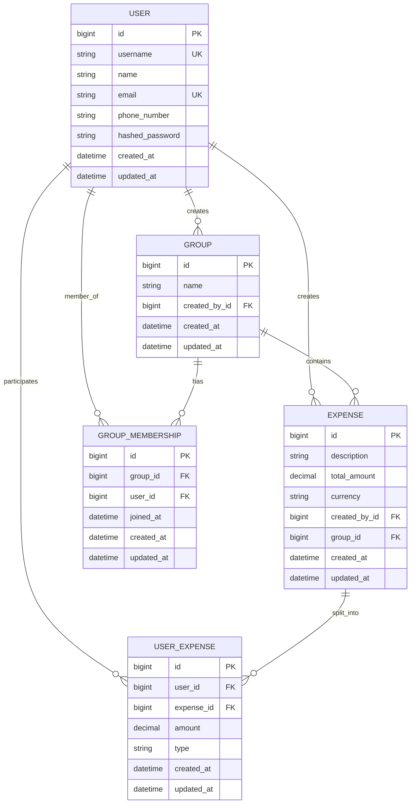

# Splitwise Django CLI Application

A command-line expense management system built with Django, implementing the Command Design Pattern for handling user operations and a greedy algorithm for debt minimization.

## 📋 Table of Contents

- [Features](#features)
- [Project Structure](#project-structure)
- [Setup Instructions](#setup-instructions)
- [Usage Guide](#usage-guide)
- [Command Reference](#command-reference)
- [Architecture](#architecture)
- [Design Patterns](#design-patterns)
- [Documentation](#documentation)
- [Examples](#examples)

---

## ✨ Features

### Core Features
- ✅ User registration and profile management
- ✅ Group creation and member management
- ✅ Expense tracking with flexible split options
- ✅ Balance calculation and history
- ✅ Smart debt settlement with transaction minimization
- ✅ Group-based expense organization

### Technical Features
- 🎯 Command Design Pattern for CLI operations
- 🧮 Greedy algorithm for debt minimization
- 🗄️ Django ORM with SQLite database
- 📝 Comprehensive audit logging (BaseModel)
- 🔐 Password hashing for security
- 🏗️ Clean architecture with separation of concerns

---

## 📁 Project Structure

```
class-16-code-splitwise/
│
├── splitwise_project/          # Django project settings
│   ├── __init__.py
│   ├── settings.py            # Project configuration
│   ├── urls.py                # URL routing (admin only)
│   ├── wsgi.py
│   └── asgi.py
│
├── splitwise_app/             # Main application
│   ├── models/                # Data models
│   │   ├── __init__.py
│   │   ├── base.py           # BaseModel with audit fields
│   │   ├── user.py           # User model
│   │   ├── group.py          # Group & GroupMembership models
│   │   └── expense.py        # Expense & UserExpense models
│   │
│   ├── commands/              # Command Pattern implementation
│   │   ├── __init__.py
│   │   ├── base.py           # Abstract Command class
│   │   ├── command_invoker.py    # Command executor
│   │   ├── command_parser.py     # Input parser
│   │   ├── user_commands.py      # User-related commands
│   │   ├── group_commands.py     # Group-related commands
│   │   ├── expense_commands.py   # Expense-related commands
│   │   └── settle_commands.py    # Settlement algorithms
│   │
│   ├── management/
│   │   └── commands/
│   │       └── seed_data.py      # Database seeding
│   │
│   ├── admin.py              # Django admin configuration
│   └── apps.py
│
├── docs/                      # Documentation
│   ├── COMMAND_PATTERN.md    # Command pattern explanation
│   └── DEBT_SIMPLIFICATION.md # Algorithm documentation
│
├── cli.py                     # CLI entry point
├── manage.py                  # Django management script
├── requirements.txt           # Python dependencies
├── .gitignore
└── README.md                  # This file
```

---

## 🚀 Setup Instructions

### Prerequisites

- Python 3.8 or higher
- pip (Python package manager)
- Virtual environment (recommended)

### Step 1: Clone/Navigate to Project

```bash
cd class-16-code-splitwise
```

### Step 2: Create Virtual Environment

```bash
# Create virtual environment
python -m venv venv

# Activate virtual environment
# On macOS/Linux:
source venv/bin/activate

# On Windows:
venv\Scripts\activate
```

### Step 3: Install Dependencies

```bash
pip install -r requirements.txt
```

### Step 4: Run Migrations

```bash
python manage.py makemigrations
python manage.py migrate
```

### Step 5: Seed Database (Optional but Recommended)

```bash
python manage.py seed_data
```

This creates 5 sample users and sample expenses:

| ID | Name           | Username      | Password | Phone       |
|----|----------------|---------------|----------|-------------|
| 1  | Rajesh Sharma  | rajesh_sharma | pass123  | 9876543210  |
| 2  | Priya Patel    | priya_patel   | pass123  | 9876543211  |
| 3  | Amit Kumar     | amit_kumar    | pass123  | 9876543212  |
| 4  | Sneha Reddy    | sneha_reddy   | pass123  | 9876543213  |
| 5  | Vikram Singh   | vikram_singh  | pass123  | 9876543214  |

### Step 6: Run the CLI Application

```bash
python cli.py
```

You should see the Splitwise banner and prompt:

```
╔══════════════════════════════════════════════════════════════════════════════╗
║                                                                               ║
║   ███████╗██████╗ ██╗     ██╗████████╗██╗    ██╗██╗███████╗███████╗         ║
║   ...                                                                         ║
╚══════════════════════════════════════════════════════════════════════════════╝

Welcome to Splitwise CLI!
Type 'HELP' to see available commands or 'EXIT' to quit.

splitwise>
```

---

## 📖 Usage Guide

### Starting the Application

```bash
python cli.py
```

### Getting Help

```bash
splitwise> HELP
```

This displays all available commands with examples.

### Exiting the Application

```bash
splitwise> EXIT
```

Or press `Ctrl+C` at any time.

---

## 🎮 Command Reference

### User Commands

#### Register a New User
```bash
REGISTER <username> <name> <email> <phone> <password>
```
**Example:**
```bash
splitwise> REGISTER arjun_mehta "Arjun Mehta" arjun@email.com 9876543220 mypass123

✓ User registered successfully! ID: 6, Username: arjun_mehta
```

#### Update User Profile
```bash
UPDATE_USER <user_id> <field> <value>
```
**Allowed fields:** name, email, phone_number

**Example:**
```bash
splitwise> UPDATE_USER 1 phone_number 9876543299

✓ User rajesh_sharma's phone_number updated to '9876543299'
```

#### Show User Balance
```bash
SHOW_BALANCE <user_id>
```
**Example:**
```bash
splitwise> SHOW_BALANCE 1

============================================================
BALANCE FOR: Rajesh Sharma (@rajesh_sharma)
============================================================

  Priya Patel owes you: ₹600.00
  You owe Amit Kumar: ₹200.00

============================================================
TOTAL: You are owed ₹400.00
============================================================
```

#### Show User Expenses
```bash
SHOW_USER_EXPENSES <user_id>
```
**Example:**
```bash
splitwise> SHOW_USER_EXPENSES 1

============================================================
EXPENSES FOR: Rajesh Sharma (@rajesh_sharma)
============================================================

[2025-01-15 14:30]
  Description: Hotel Booking - Goa
  Total Amount: ₹12000
  Group: Goa Trip 2025
  Paid by:
    - Rajesh Sharma: ₹12000
  Owed by:
    - Rajesh Sharma: ₹3000
    - Priya Patel: ₹3000
    - Amit Kumar: ₹3000
    - Sneha Reddy: ₹3000
------------------------------------------------------------
```

---

### Group Commands

#### Create a Group
```bash
CREATE_GROUP <group_name> <creator_user_id>
```
**Example:**
```bash
splitwise> CREATE_GROUP "Weekend Trip" 1

✓ Group 'Weekend Trip' created successfully! ID: 4
```

#### Add Member to Group
```bash
ADD_MEMBER <group_id> <user_id> <added_by_user_id>
```
**Note:** Only the group creator can add members.

**Example:**
```bash
splitwise> ADD_MEMBER 4 2 1

✓ Priya Patel added to group 'Weekend Trip'
```

#### Remove Member from Group
```bash
REMOVE_MEMBER <group_id> <user_id> <removed_by_user_id>
```
**Note:** Only the group creator can remove members. Cannot remove the creator.

**Example:**
```bash
splitwise> REMOVE_MEMBER 4 2 1

✓ Priya Patel removed from group 'Weekend Trip'
```

#### Show Group Expenses
```bash
SHOW_GROUP_EXPENSES <group_id> <user_id>
```
**Note:** User must be a member of the group.

**Example:**
```bash
splitwise> SHOW_GROUP_EXPENSES 1 1

============================================================
EXPENSES FOR GROUP: Goa Trip 2025
============================================================

[2025-01-15 14:30]
  Description: Hotel Booking - Goa
  Total Amount: ₹12000
  Created by: Rajesh Sharma
  Paid by:
    - Rajesh Sharma: ₹12000
  Owed by:
    - Rajesh Sharma: ₹3000
    - Priya Patel: ₹3000
    - Amit Kumar: ₹3000
    - Sneha Reddy: ₹3000
------------------------------------------------------------
```

---

### Expense Commands

#### Add an Expense
```bash
ADD_EXPENSE <description> <amount> <created_by_id> <group_id_or_0> <paid_by> <owed_by>
```

**Format:**
- `paid_by`: `user_id:amount,user_id:amount` (who paid)
- `owed_by`: `user_id:amount,user_id:amount` (who owes)
- Use `0` for group_id if it's a personal expense (not in a group)

**Example 1: Group Expense (Split Equally)**
```bash
# Dinner for 3 people: Rajesh paid ₹1500, split equally
splitwise> ADD_EXPENSE "Dinner" 1500 1 1 1:1500 1:500,2:500,3:500

✓ Expense 'Dinner' (₹1500) added successfully in group 'Goa Trip 2025'! ID: 10
```

**Example 2: Personal Expense (Unequal Split)**
```bash
# Movie tickets: Priya paid ₹600, she and Amit split
splitwise> ADD_EXPENSE "Movie Tickets" 600 2 0 2:600 2:300,3:300

✓ Expense 'Movie Tickets' (₹600) added successfully! ID: 11
```

**Example 3: Multiple People Paid**
```bash
# Cab: Both Rajesh and Priya paid, all 3 owe equally
splitwise> ADD_EXPENSE "Cab Fare" 900 1 1 1:500,2:400 1:300,2:300,3:300

✓ Expense 'Cab Fare' (₹900) added successfully in group 'Goa Trip 2025'! ID: 12
```

---

### Settlement Commands

#### Settle Up a User
```bash
SETTLE_USER <user_id>
```
Shows minimal transactions needed to settle all of a user's debts across all expenses.

**Example:**
```bash
splitwise> SETTLE_USER 1

============================================================
SETTLE-UP FOR: Rajesh Sharma (@rajesh_sharma)
============================================================

Suggested transactions (3 total):

1. Rajesh Sharma pays ₹200.00 to Amit Kumar
2. Priya Patel pays ₹300.00 to Rajesh Sharma
3. Sneha Reddy pays ₹150.00 to Rajesh Sharma

============================================================
```

#### Settle Up a Group
```bash
SETTLE_GROUP <group_id> <user_id>
```
Shows minimal transactions needed to settle all members of a group.

**Example:**
```bash
splitwise> SETTLE_GROUP 1 1

============================================================
SETTLE-UP FOR GROUP: Goa Trip 2025
============================================================

Current Balances:
  Rajesh Sharma: +₹9000.00 (to receive)
  Priya Patel: -₹1200.00 (to pay)
  Amit Kumar: -₹3000.00 (to pay)
  Sneha Reddy: -₹3800.00 (to pay)

------------------------------------------------------------

Suggested transactions (3 total):

1. Sneha Reddy pays ₹3800.00 to Rajesh Sharma
2. Amit Kumar pays ₹3000.00 to Rajesh Sharma
3. Priya Patel pays ₹1200.00 to Rajesh Sharma

============================================================
```

---

## 🏛️ Architecture

### Database Schema



### BaseModel (Audit Fields)

All models inherit from `BaseModel` which provides:

```python
class BaseModel(models.Model):
    created_at = models.DateTimeField(auto_now_add=True, db_index=True)
    updated_at = models.DateTimeField(auto_now=True)

    class Meta:
        abstract = True
        ordering = ['-created_at']
```

**Benefits:**
- Automatic timestamp tracking
- Consistent ordering (newest first)
- Audit trail for all records

---

## 🎨 Design Patterns

### 1. Command Pattern

The application uses the Command Design Pattern for handling CLI operations.

**Components:**
- **Command (Interface)**: `base.py` - Abstract base class
- **Concrete Commands**: `user_commands.py`, `group_commands.py`, etc.
- **Invoker**: `CommandInvoker` - Executes commands and maintains history
- **Parser**: `CommandParser` - Converts user input to Command objects

**Benefits:**
- Separation of concerns (parsing, validation, execution)
- Easy to test individual commands
- Command history tracking
- Easy to extend with new commands

📚 **[Read detailed Command Pattern documentation →](docs/COMMAND_PATTERN.md)**

### 2. Greedy Algorithm for Debt Minimization

The settlement commands use a greedy algorithm with heaps to minimize the number of transactions.

**Algorithm:**
1. Calculate net balance for each user
2. Separate into creditors (receive money) and debtors (pay money)
3. Use max heaps to match largest debts with largest credits
4. Generate minimal transaction list

**Time Complexity:** O(n log n)
**Space Complexity:** O(n)

📚 **[Read detailed Algorithm documentation →](docs/DEBT_SIMPLIFICATION.md)**

---

## 📚 Documentation

- **[Command Design Pattern](docs/COMMAND_PATTERN.md)** - Detailed explanation with UML diagrams
- **[Debt Simplification Algorithm](docs/DEBT_SIMPLIFICATION.md)** - Algorithm walkthrough with examples
- **[Quiz Questions](docs/QUIZ.md)** - Test your understanding of the models and design

---

## 💡 Examples

### Example 1: Weekend Trip Scenario

```bash
# 1. Register users
REGISTER vikram_m "Vikram Malhotra" vikram@email.com 9988776655 pass123
REGISTER neha_g "Neha Gupta" neha@email.com 9988776656 pass123

# 2. Create group
CREATE_GROUP "Lonavala Weekend" 6

# 3. Add members
ADD_MEMBER 4 7 6

# 4. Add expenses
# Vikram paid for hotel
ADD_EXPENSE "Hotel Stay" 4000 6 4 6:4000 6:2000,7:2000

# Neha paid for food
ADD_EXPENSE "Lunch & Dinner" 1500 7 4 7:1500 6:750,7:750

# 5. Check balance
SHOW_BALANCE 6

# 6. Settle up the group
SETTLE_GROUP 4 6
```

### Example 2: Roommate Scenario

```bash
# 1. Create roommate group
CREATE_GROUP "3BHK Mumbai Flat" 3

# 2. Add roommates
ADD_MEMBER 5 4 3
ADD_MEMBER 5 5 3

# 3. Add monthly expenses
# Electricity
ADD_EXPENSE "Electricity Bill" 2100 3 5 3:2100 3:700,4:700,5:700

# Groceries
ADD_EXPENSE "Monthly Groceries" 4500 4 5 4:4500 3:1500,4:1500,5:1500

# WiFi
ADD_EXPENSE "WiFi Bill" 900 5 5 5:900 3:300,4:300,5:300

# 4. Check who owes what
SHOW_GROUP_EXPENSES 5 3

# 5. Settle the group
SETTLE_GROUP 5 3
```

---

## 🐛 Troubleshooting

### Issue: ModuleNotFoundError

```bash
# Make sure you're in the project directory
cd class-16-code-splitwise

# Activate virtual environment
source venv/bin/activate  # macOS/Linux
venv\Scripts\activate     # Windows

# Install dependencies
pip install -r requirements.txt
```

### Issue: Database errors

```bash
# Delete existing database and migrations
rm db.sqlite3
find . -path "*/migrations/*.py" -not -name "__init__.py" -delete
find . -path "*/migrations/*.pyc" -delete

# Re-run migrations
python manage.py makemigrations
python manage.py migrate
python manage.py seed_data
```

### Issue: Command not recognized

Make sure you're using the exact command format:
- Commands are CASE-SENSITIVE (use UPPERCASE)
- Use quotes for multi-word strings: `"Goa Trip"`
- Format for user:amount pairs: `1:500,2:500` (no spaces)

---

## 🤝 Contributing

This is an educational project. Feel free to:
- Add new commands
- Improve the algorithms
- Enhance error handling
- Add more features (e.g., currency conversion, recurring expenses)

---

## 📝 License

This project is for educational purposes.

---

## 👨‍💻 Author

Created as part of the Backend LLD Python course - August 2025 Batch

---

## 🎯 Learning Objectives

By studying this project, you will learn:

1. **Django ORM**
   - Model design and relationships
   - Many-to-many with through models
   - Query optimization

2. **Design Patterns**
   - Command Pattern implementation
   - When and why to use design patterns

3. **Algorithms**
   - Greedy algorithms
   - Heap data structures
   - Debt optimization

4. **Software Engineering**
   - Clean code principles
   - Separation of concerns
   - Testing strategies

5. **CLI Development**
   - Input parsing and validation
   - User-friendly command interfaces
   - Error handling

---

## 🚀 Next Steps

After completing this project, consider:

1. **Add REST API**
   - Use Django REST Framework
   - Convert commands to API endpoints

2. **Add Authentication**
   - JWT tokens
   - Session management

3. **Add More Features**
   - Recurring expenses
   - Expense categories
   - Multiple currencies
   - Email notifications
   - Export to CSV/PDF

4. **Improve Algorithm**
   - Consider transaction fees
   - Optimize for specific scenarios
   - Add undo/redo support

5. **Testing**
   - Unit tests for models
   - Integration tests for commands
   - Test debt minimization algorithm

Happy Coding! 🎉
