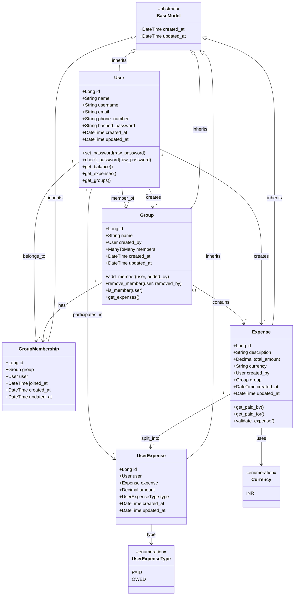
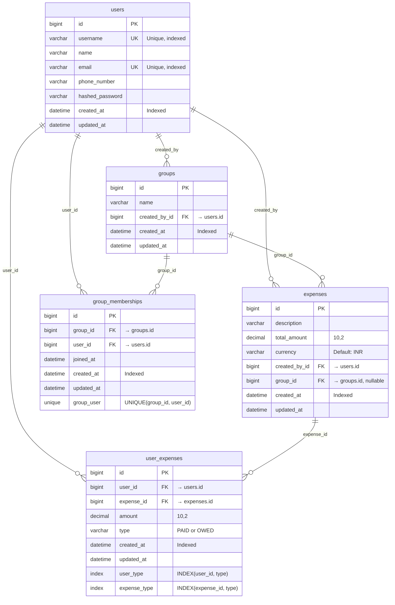

# Splitwise Architecture & Design

This document details the database schema, class diagram, and architectural decisions for the Splitwise application.

## Table of Contents
- [Class Diagram](#class-diagram)
- [Database Schema (ERD)](#database-schema-erd)
- [Model Descriptions](#model-descriptions)
- [Relationships Explained](#relationships-explained)
- [Design Decisions](#design-decisions)

---

## Class Diagram

This class diagram shows the Django models and their relationships.



---

## Database Schema (ERD)

This Entity-Relationship Diagram shows the actual database tables and foreign key relationships.



---

## Model Descriptions

### 1. BaseModel (Abstract)

**Purpose:** Provides audit fields for all models

**Fields:**
- `created_at`: Timestamp when record was created (auto-set, indexed)
- `updated_at`: Timestamp when record was last modified (auto-updated)

**Benefits:**
- DRY principle - define once, inherit everywhere
- Consistent timestamp tracking across all models
- Default ordering by newest first
- Easy to add more audit fields later (e.g., `deleted_at`, `created_by`)

---

### 2. User

**Purpose:** Stores user profile and authentication information

**Fields:**
- `id`: Primary key (auto-generated)
- `name`: Full name of the user
- `username`: Unique username for login (indexed)
- `email`: Unique email address (indexed)
- `phone_number`: Contact number
- `hashed_password`: Bcrypt hashed password (never store plain text)

**Key Methods:**
- `set_password()`: Hashes and stores password
- `check_password()`: Verifies password against hash
- `get_balance()`: Calculates net balance with all users
- `get_expenses()`: Returns all expenses user is involved in
- `get_groups()`: Returns all groups user belongs to

**Indexes:**
- `username` (unique index for fast lookup)
- `email` (unique index for fast lookup)
- `created_at` (inherited from BaseModel)

---

### 3. Group

**Purpose:** Organizes expenses among a set of users

**Fields:**
- `id`: Primary key
- `name`: Group name (e.g., "Goa Trip 2025")
- `created_by`: Foreign key to User (group creator/admin)
- `members`: Many-to-many relationship with User through GroupMembership

**Key Methods:**
- `add_member()`: Add user to group (only creator can do this)
- `remove_member()`: Remove user from group (only creator, can't remove creator)
- `is_member()`: Check if user belongs to group
- `get_expenses()`: Get all expenses in this group

**Business Rules:**
- Only the creator can add/remove members
- Creator cannot be removed from the group
- Used for permission checks on group operations

---

### 4. GroupMembership (Through Model)

**Purpose:** Tracks group membership with metadata

**Fields:**
- `id`: Primary key
- `group`: Foreign key to Group
- `user`: Foreign key to User
- `joined_at`: When user joined the group

**Why Through Model?**
- Allows storing additional data about the relationship
- Can track when users joined
- Can add more fields later (e.g., `role`, `added_by`, `is_active`)
- Maintains referential integrity with proper foreign keys

**Constraints:**
- Unique constraint on (group_id, user_id) - can't join same group twice

---

### 5. Expense

**Purpose:** Represents a shared expense transaction

**Fields:**
- `id`: Primary key
- `description`: What the expense was for
- `total_amount`: Total cost of the expense
- `currency`: Currency code (currently only INR supported)
- `created_by`: User who created the expense
- `group`: Optional group this expense belongs to (null for personal expenses)

**Key Methods:**
- `get_paid_by()`: Returns UserExpense records of type PAID
- `get_paid_for()`: Returns UserExpense records of type OWED
- `validate_expense()`: Ensures total_paid = total_owed = total_amount

**Types:**
- **Group Expense**: `group` field is set, expense is part of a group
- **Personal Expense**: `group` field is null, expense between specific users

---

### 6. UserExpense (Junction Table)

**Purpose:** Tracks individual user participation in an expense

**Fields:**
- `id`: Primary key
- `user`: Foreign key to User
- `expense`: Foreign key to Expense
- `amount`: How much this user paid or owes
- `type`: Either PAID or OWED

**Why This Design?**
- Supports multiple payers: User A paid ₹800, User B paid ₹700
- Supports unequal splits: User A owes ₹600, User B owes ₹900
- Flexible: Can handle any split configuration
- Queryable: Easy to find "all expenses User X paid for" or "all amounts User Y owes"

**Indexes:**
- Composite index on (user_id, type) for fast balance queries
- Composite index on (expense_id, type) for fast expense detail queries

**Validation:**
- Sum of PAID amounts must equal total_amount
- Sum of OWED amounts must equal total_amount
- Sum of PAID must equal sum of OWED

---

## Relationships Explained

### 1. User ↔ Expense (Many-to-Many through UserExpense)

```
User ──┐
       ├──→ UserExpense ←── Expense
User ──┘
```

**Why not direct Many-to-Many?**
- Need to store amount per user per expense
- Need to distinguish between PAID and OWED
- Need to support multiple payers and multiple debtors

**Example:**
```
Expense: "Dinner" ₹1500
├─ UserExpense(user=Rajesh, type=PAID, amount=1000)
├─ UserExpense(user=Priya, type=PAID, amount=500)
├─ UserExpense(user=Rajesh, type=OWED, amount=500)
├─ UserExpense(user=Priya, type=OWED, amount=500)
└─ UserExpense(user=Amit, type=OWED, amount=500)
```

### 2. User ↔ Group (Many-to-Many through GroupMembership)

```
User ──┐
       ├──→ GroupMembership ←── Group
User ──┘
```

**Why Through Model?**
- Track when users joined
- Can add role field later (admin, member, viewer)
- Can add who invited them
- Maintains proper foreign key constraints

**Example:**
```
Group: "Goa Trip"
├─ GroupMembership(user=Rajesh, joined_at=2025-01-01)
├─ GroupMembership(user=Priya, joined_at=2025-01-02)
└─ GroupMembership(user=Amit, joined_at=2025-01-02)
```

### 3. Group → Expense (One-to-Many, Optional)

```
Group ──→ Expense (nullable)
```

**Why Optional?**
- Not all expenses belong to groups (personal expenses)
- Personal expenses have `group=null`
- Group expenses have `group=Group instance`

**Example:**
```
# Group Expense
Expense(description="Hotel", group=GoaTrip)

# Personal Expense
Expense(description="Movie", group=None)
```

### 4. User → Expense (Created By)

```
User ──→ Expense (created_by)
```

**Purpose:**
- Track who created the expense
- Used for audit trail
- Can be used for permissions (who can edit/delete)

---

## Design Decisions

### 1. Why UserExpense Junction Table?

**Problem:** How to track who paid and who owes in an expense?

**Option A - Simple Many-to-Many (❌ Rejected)**
```python
class Expense:
    paid_by = models.ForeignKey(User)  # Only one payer
    split_among = models.ManyToManyField(User)  # Can't store amounts
```
**Issues:**
- Can't handle multiple payers
- Can't store individual amounts
- Assumes equal splits only

**Option B - Storing in User Model (❌ Rejected)**
```python
class User:
    total_paid = models.DecimalField()  # Aggregate data
    total_owed = models.DecimalField()  # Aggregate data
```
**Issues:**
- Violates normalization
- Can't track individual expenses
- No transaction history
- Data inconsistency risk

**Option C - Junction Table with Type ✅ (Chosen)**
```python
class UserExpense:
    user = models.ForeignKey(User)
    expense = models.ForeignKey(Expense)
    amount = models.DecimalField()
    type = models.CharField(choices=['PAID', 'OWED'])
```
**Benefits:**
- Flexible: Any split configuration
- Detailed: Track exact amounts
- Queryable: Easy to aggregate
- Scalable: Works for any scenario

---

### 2. Why Through Model for Group Membership?

**Without Through Model:**
```python
class Group:
    members = models.ManyToManyField(User)
```

**With Through Model:**
```python
class Group:
    members = models.ManyToManyField(User, through='GroupMembership')

class GroupMembership:
    group = models.ForeignKey(Group)
    user = models.ForeignKey(User)
    joined_at = models.DateTimeField()
    role = models.CharField()  # Can add later
```

**Benefits:**
- Can track metadata (joined_at, role, added_by)
- Extensible for future requirements
- Better audit trail
- Proper foreign key constraints

---

### 3. Why BaseModel Abstract Class?

**Without BaseModel (❌)**
```python
class User(models.Model):
    # ... fields
    created_at = models.DateTimeField(auto_now_add=True)
    updated_at = models.DateTimeField(auto_now=True)

class Group(models.Model):
    # ... fields
    created_at = models.DateTimeField(auto_now_add=True)
    updated_at = models.DateTimeField(auto_now=True)

# Repeat for every model...
```

**With BaseModel (✅)**
```python
class BaseModel(models.Model):
    created_at = models.DateTimeField(auto_now_add=True, db_index=True)
    updated_at = models.DateTimeField(auto_now=True)

    class Meta:
        abstract = True
        ordering = ['-created_at']

class User(BaseModel):
    # Automatically has created_at, updated_at, and ordering
```

**Benefits:**
- DRY: Define once, use everywhere
- Consistent: All models have same audit fields
- Maintainable: Add new audit field in one place
- Extensible: Easy to add soft-delete, versioning, etc.

---

### 4. Why Separate Currency Enum?

**Current Design:**
```python
class Currency(models.TextChoices):
    INR = 'INR', 'Indian Rupee'

class Expense:
    currency = models.CharField(choices=Currency.choices)
```

**Benefits:**
- Easy to add more currencies later
- Type-safe: Can't use invalid currency
- Self-documenting code
- Can add conversion logic per currency

**Future Extension:**
```python
class Currency(models.TextChoices):
    INR = 'INR', 'Indian Rupee'
    USD = 'USD', 'US Dollar'
    EUR = 'EUR', 'Euro'
```

---

### 5. Indexing Strategy

**Indexes Added:**

1. **users.username** (unique index)
   - Fast login queries
   - Prevents duplicate usernames

2. **users.email** (unique index)
   - Fast email lookup
   - Prevents duplicate emails

3. **created_at** (all models via BaseModel)
   - Fast sorting by newest
   - Date range queries

4. **user_expenses(user_id, type)**
   - Fast balance calculations
   - Query: "All PAID expenses for user X"

5. **user_expenses(expense_id, type)**
   - Fast expense detail queries
   - Query: "Who PAID for expense Y"

6. **group_memberships(group_id, user_id)** (unique)
   - Prevents duplicate memberships
   - Fast membership checks

---

### 6. Validation Strategy

**At Model Level:**
```python
class Expense:
    def validate_expense(self):
        # Business rule validation
        total_paid = sum(PAID amounts)
        total_owed = sum(OWED amounts)
        assert total_paid == total_owed == self.total_amount
```

**At Command Level:**
```python
class AddExpenseCommand:
    def validate(self):
        # Pre-execution validation
        - Check users exist
        - Check permissions
        - Validate amounts
```

**Multi-Layer Validation:**
- Database constraints (NOT NULL, UNIQUE)
- Django model validation
- Command validation (business rules)
- Pre-execution checks

---

## Query Patterns

### 1. Get User's Balance

```python
# Get all amounts user paid
paid = UserExpense.objects.filter(
    user=user,
    type=UserExpenseType.PAID
).aggregate(total=Sum('amount'))

# Get all amounts user owes
owed = UserExpense.objects.filter(
    user=user,
    type=UserExpenseType.OWED
).aggregate(total=Sum('amount'))

balance = paid - owed
```

### 2. Get User's Expenses

```python
expenses = Expense.objects.filter(
    userexpense__user=user
).distinct().order_by('-created_at')
```

### 3. Get Group Expenses

```python
expenses = Expense.objects.filter(
    group=group
).order_by('-created_at')
```

### 4. Check Group Membership

```python
is_member = GroupMembership.objects.filter(
    group=group,
    user=user
).exists()
```

---

## Performance Considerations

### 1. Indexes
- All foreign keys are automatically indexed by Django
- Additional indexes on frequently queried fields
- Composite indexes for multi-column queries

### 2. Select Related
```python
# Avoid N+1 queries
expenses = Expense.objects.select_related(
    'created_by', 'group'
).all()
```

### 3. Prefetch Related
```python
# For many-to-many
expenses = Expense.objects.prefetch_related(
    'userexpense_set__user'
).all()
```

### 4. Aggregations
```python
# Database-level aggregation
User.objects.annotate(
    total_paid=Sum('userexpense__amount', filter=Q(userexpense__type='PAID'))
)
```

---

## Data Integrity

### Constraints Enforced:

1. **Foreign Key Constraints**
   - CASCADE: Delete related records when parent is deleted
   - Maintains referential integrity

2. **Unique Constraints**
   - Username, Email (users table)
   - (group_id, user_id) in group_memberships

3. **NOT NULL Constraints**
   - All required fields enforce presence

4. **Check Constraints (Application Level)**
   - total_paid = total_owed = total_amount
   - amount > 0
   - Only creator can add/remove members

---

## Future Extensions

### 1. Soft Delete
```python
class BaseModel:
    deleted_at = models.DateTimeField(null=True)

    def soft_delete(self):
        self.deleted_at = timezone.now()
        self.save()
```

### 2. Audit Trail
```python
class BaseModel:
    created_by = models.ForeignKey(User, related_name='+')
    updated_by = models.ForeignKey(User, related_name='+')
```

### 3. Versioning
```python
class ExpenseHistory(models.Model):
    expense = models.ForeignKey(Expense)
    version = models.IntegerField()
    changed_at = models.DateTimeField()
    changes = models.JSONField()
```

### 4. Notifications
```python
class Notification(BaseModel):
    user = models.ForeignKey(User)
    expense = models.ForeignKey(Expense)
    type = models.CharField()
    is_read = models.BooleanField(default=False)
```

---

## Summary

**Key Design Principles:**
- ✅ Single Source of Truth (expenses → balances calculated)
- ✅ DRY (BaseModel for common fields)
- ✅ Flexibility (UserExpense supports any split)
- ✅ Extensibility (Through models, enums)
- ✅ Performance (Strategic indexing)
- ✅ Integrity (Constraints and validation)
- ✅ Maintainability (Clear separation, good naming)

This architecture supports all current requirements while remaining flexible for future enhancements!
