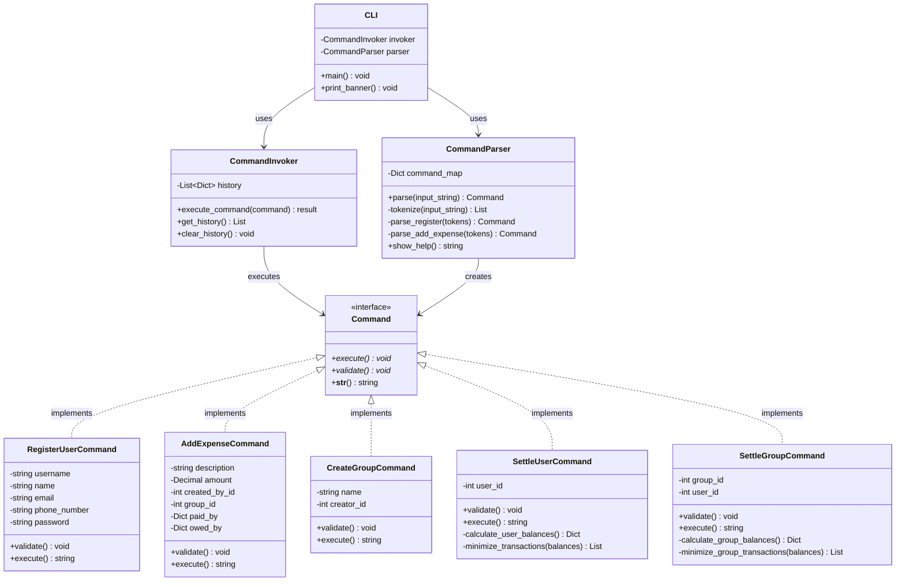

# Command Design Pattern in Splitwise

## Table of Contents
- [Overview](#overview)
- [Problem Statement](#problem-statement)
- [Command Pattern Solution](#command-pattern-solution)
- [Benefits in Splitwise Context](#benefits-in-splitwise-context)
- [UML Diagram](#uml-diagram)
- [Implementation Details](#implementation-details)
- [Examples](#examples)

---

## Overview

The **Command Design Pattern** is a behavioral design pattern that encapsulates a request as an object, thereby allowing you to parameterize clients with different requests, queue or log requests, and support undoable operations.

In the context of Splitwise, we use the Command pattern to handle various user operations through a CLI interface where each user action (like registering a user, creating a group, adding an expense) is represented as a command object.

---

## Problem Statement

### Without Command Pattern

In a traditional approach, you might handle CLI input like this:

```python
def handle_input(user_input):
    tokens = user_input.split()
    command = tokens[0]

    if command == "REGISTER":
        username = tokens[1]
        name = tokens[2]
        # Validation logic here...
        # Business logic here...
        user = User.objects.create(...)

    elif command == "ADD_EXPENSE":
        description = tokens[1]
        amount = tokens[2]
        # Validation logic here...
        # Business logic here...
        expense = Expense.objects.create(...)

    # 20 more elif blocks...
```

**Problems:**
1. ❌ **Violation of Single Responsibility Principle**: One function does parsing, validation, and execution
2. ❌ **Hard to Test**: Cannot test individual operations in isolation
3. ❌ **No History Tracking**: Cannot maintain command execution history
4. ❌ **Difficult to Extend**: Adding new commands requires modifying the main handler
5. ❌ **No Undo/Redo Support**: Cannot implement undo operations
6. ❌ **Poor Error Handling**: Error handling is scattered across multiple branches

---

## Command Pattern Solution

The Command pattern solves these problems by:

1. **Encapsulating Requests**: Each operation is a separate command class
2. **Separating Concerns**: Parsing, validation, and execution are separate
3. **Enabling History**: Commands can be stored and tracked
4. **Supporting Extensibility**: New commands can be added without modifying existing code

### Core Components

```
┌─────────────┐
│   Client    │  (CLI Runner)
│   (cli.py)  │
└──────┬──────┘
       │ creates
       ↓
┌─────────────────┐
│ CommandParser   │  Parses input → Creates Command objects
└──────┬──────────┘
       │ creates
       ↓
┌─────────────────┐
│ CommandInvoker  │  Executes commands & maintains history
└──────┬──────────┘
       │ executes
       ↓
┌─────────────────┐
│   Command       │  Base abstract class
│   (Interface)   │
└──────┬──────────┘
       │ implements
       ↓
┌──────────────────────────────────────┐
│  Concrete Commands                   │
│  - RegisterUserCommand               │
│  - AddExpenseCommand                 │
│  - CreateGroupCommand                │
│  - SettleUserCommand                 │
│  - etc.                              │
└──────────────────────────────────────┘
```

---

## Benefits in Splitwise Context

### 1. **Separation of Concerns**
```python
# Parser only parses
parser.parse("REGISTER rajesh Rajesh rajesh@email.com 9876543210 pass123")
# → Returns RegisterUserCommand object

# Invoker only executes
invoker.execute_command(command)
# → Validates and runs the command

# Command only contains business logic
command.execute()
# → Creates user in database
```

### 2. **Easy Testing**
```python
# Test command in isolation
def test_register_user_command():
    command = RegisterUserCommand(
        username="test_user",
        name="Test User",
        email="test@email.com",
        phone_number="1234567890",
        password="password"
    )
    command.validate()  # Test validation
    result = command.execute()  # Test execution
    assert "User registered successfully" in result
```

### 3. **Command History**
```python
# Track all executed commands
invoker.history
# → [
#     {'command': 'RegisterUserCommand', 'success': True, 'result': '...'},
#     {'command': 'AddExpenseCommand', 'success': True, 'result': '...'},
#   ]
```

### 4. **Extensibility**
Adding a new command is simple:
```python
# 1. Create new command class
class NewFeatureCommand(Command):
    def validate(self): ...
    def execute(self): ...

# 2. Add parser method
def _parse_new_feature(self, tokens):
    return NewFeatureCommand(...)

# 3. Register in command_map
self.command_map['NEW_FEATURE'] = self._parse_new_feature
```

---

## UML Diagram



---

## Implementation Details

### 1. Base Command Interface

```python
class Command(ABC):
    """Abstract base class for all commands."""

    @abstractmethod
    def execute(self):
        """Execute the command operation."""
        pass

    @abstractmethod
    def validate(self):
        """Validate command parameters."""
        pass
```

**Key Points:**
- Uses Python's ABC (Abstract Base Class) to enforce interface
- All concrete commands MUST implement `execute()` and `validate()`
- Validation happens before execution (fail fast principle)

### 2. Command Invoker

```python
class CommandInvoker:
    def execute_command(self, command):
        try:
            command.validate()  # Step 1: Validate
            result = command.execute()  # Step 2: Execute

            # Step 3: Log success
            self.history.append({
                'command': str(command),
                'success': True,
                'result': result
            })
            return result

        except Exception as e:
            # Step 3: Log failure
            self.history.append({
                'command': str(command),
                'success': False,
                'error': str(e)
            })
            raise
```

**Responsibilities:**
- Validates before executing (ensures data integrity)
- Maintains execution history (audit trail)
- Centralizes error handling
- Decouples command creation from execution

### 3. Command Parser

```python
class CommandParser:
    def parse(self, input_string):
        tokens = self._tokenize(input_string)
        command_name = tokens[0].upper()

        if command_name not in self.command_map:
            raise ValueError(f"Unknown command: {command_name}")

        return self.command_map[command_name](tokens[1:])
```

**Responsibilities:**
- Tokenizes input (handles quoted strings)
- Maps command names to parser methods
- Creates appropriate command objects
- Handles invalid input gracefully

---

## Examples

### Example 1: Registering a User

**User Input:**
```
splitwise> REGISTER rajesh_sharma Rajesh rajesh@email.com 9876543210 pass123
```

**Flow:**
```python
# 1. CLI receives input
user_input = "REGISTER rajesh_sharma Rajesh rajesh@email.com 9876543210 pass123"

# 2. Parser tokenizes and creates command
command = parser.parse(user_input)
# → RegisterUserCommand(
#     username="rajesh_sharma",
#     name="Rajesh",
#     email="rajesh@email.com",
#     phone_number="9876543210",
#     password="pass123"
#   )

# 3. Invoker validates
command.validate()
# → Checks: username length, email format, duplicate username/email

# 4. Invoker executes
result = command.execute()
# → Creates User object in database

# 5. Result displayed
print(result)
# → "✓ User registered successfully! ID: 1, Username: rajesh_sharma"
```

### Example 2: Adding an Expense

**User Input:**
```
splitwise> ADD_EXPENSE "Goa Hotel" 12000 1 1 1:12000 1:3000,2:3000,3:3000,4:3000
```

**Flow:**
```python
# 1. Parser creates command
command = AddExpenseCommand(
    description="Goa Hotel",
    amount=12000,
    created_by_id=1,
    group_id=1,
    paid_by={1: 12000},
    owed_by={1: 3000, 2: 3000, 3: 3000, 4: 3000}
)

# 2. Validation
command.validate()
# Checks:
# ✓ Description is not empty
# ✓ Amount is positive
# ✓ Users exist in database
# ✓ Total paid (12000) = Total owed (12000)
# ✓ Total paid = Expense amount
# ✓ Creator is member of group (if group expense)

# 3. Execution
command.execute()
# Creates:
# - 1 Expense record
# - 1 UserExpense record (PAID by user 1: ₹12000)
# - 4 UserExpense records (OWED by users 1,2,3,4: ₹3000 each)

# 4. Result
# → "✓ Expense 'Goa Hotel' (₹12000) added successfully in group 'Goa Trip'! ID: 1"
```

### Example 3: Settling Up

**User Input:**
```
splitwise> SETTLE_USER 1
```

**Algorithm Flow:**
```python
command = SettleUserCommand(user_id=1)

# 1. Calculate balances
balances = command._calculate_user_balances()
# → {
#     User(Priya): 300,    # Priya owes user 1: ₹300
#     User(Amit): -200,     # User 1 owes Amit: ₹200
#   }

# 2. Minimize transactions using heap algorithm
transactions = command._minimize_transactions(balances)
# → [
#     "Rajesh pays ₹200 to Amit",
#     "Priya pays ₹300 to Rajesh"
#   ]

# Result shows minimal transaction list
```

---

## Key Takeaways

1. **Command Pattern = Request as Object**
   - Each user action becomes a command object
   - Commands encapsulate all data needed for the operation

2. **Benefits for Splitwise CLI**
   - ✅ Clean separation of parsing, validation, and execution
   - ✅ Easy to add new commands without touching existing code
   - ✅ Testable in isolation
   - ✅ Maintainable command history
   - ✅ Centralized error handling

3. **When to Use Command Pattern**
   - Building CLI applications
   - Implementing undo/redo functionality
   - Need to queue or log operations
   - Want to decouple request senders from request handlers

4. **Real-World Applications**
   - Text editors (undo/redo)
   - Transaction systems (rollback)
   - Job scheduling systems
   - Multi-level undo in graphics applications
   - Macro recording in applications

---

## Further Reading

- **Gang of Four Design Patterns**: Original Command Pattern definition
- **Refactoring Guru**: [Command Pattern](https://refactoring.guru/design-patterns/command)
- **Martin Fowler**: Command Query Responsibility Segregation (CQRS)
