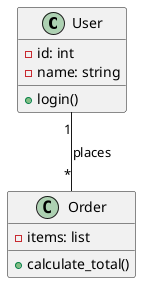

# UML Diagrams - Quick Reference Guide

> Unified Modeling Language for visualizing software design

---

## 🏢 Where UML is Actually Used in Software Companies

### Reality Check: UML in the Industry

**The Truth:** Most companies DON'T use formal UML extensively in day-to-day coding.

**However, UML is essential in these scenarios:**

#### 1. **Architecture & Design Phase** (Tech Leads, Architects)
```
Before writing code → Draw the design
├─ High-level component diagrams
├─ Database schema (class diagrams)
└─ API flow diagrams (sequence diagrams)
```

**Companies:** Google, Amazon, Microsoft (for large system design)

---

#### 2. **Technical Documentation** (All levels)
```
Documenting existing systems
├─ Architecture Decision Records (ADRs)
├─ API documentation
└─ Onboarding new engineers
```

**Tools:** Confluence + draw.io, Lucidchart

---

#### 3. **Interview Process** (Candidates)
```
System Design & LLD Rounds
├─ Must draw on whiteboard
├─ Communicate design clearly
└─ Show you think before coding
```

**Critical:** 80% of senior interviews require UML!

---

#### 4. **Code Reviews & RFCs** (Senior Engineers)
```
Proposing major changes
├─ "Here's the current design" (UML)
├─ "Here's my proposed design" (UML)
└─ Team discusses trade-offs
```

**Example:** Adding payment gateway → Draw class diagram first

---

#### 5. **Cross-team Communication** (Product, Backend, Frontend)
```
Getting everyone aligned
├─ Product: "What data do we need?"
├─ Backend: Shows class diagram
└─ Frontend: "Perfect, I can work with this"
```

**Benefit:** Non-technical stakeholders can understand boxes and arrows!

---

### 📊 Real Company Usage Survey

| Company Type | UML Usage | When |
|--------------|-----------|------|
| **FAANG** | Medium | Architecture reviews, Design docs |
| **Startups** | Low | Only when absolutely necessary |
| **Enterprise (Banks, Healthcare)** | High | Everything documented, compliance |
| **Mid-size** | Medium | Major features, complex systems |
| **Consulting** | Very High | Client deliverables, proposals |

---

### 🎯 What Companies Actually Use

**Most Common (90% of usage):**
1. **Class Diagrams** - Database schema, object models
2. **Sequence Diagrams** - API flows, authentication
3. **Component Diagrams** - Microservices architecture
4. **Simple boxes and arrows** - Informal sketches

**Rarely Used in Practice:**
- State diagrams (except embedded systems)
- Activity diagrams (use flowcharts instead)
- Use case diagrams (Product uses their own tools)

---

### 💡 The Real Skill

**It's not about formal UML syntax** → It's about **communicating design clearly**

```
Good engineer:
├─ Draws rough diagram on whiteboard
├─ Explains relationships
└─ Team understands immediately

Bad engineer:
├─ "Let me write code first"
└─ Team confused, many bugs later
```

**Bottom Line:** 
- ✅ Learn UML for **interviews** (essential!)
- ✅ Use **informal diagrams** at work (common)
- ✅ Master the **concepts**, not rigid rules

---

### 🚀 Modern Alternatives

**Companies are moving to:**
- **Mermaid.js** - Diagrams in markdown (GitHub, GitLab)
- **PlantUML** - Text-based UML
- **Excalidraw** - Hand-drawn style diagrams
- **Figma** - For UI/UX flows

**Why?** Version controlled, easy to update, collaborative

---

### 📝 When You'll Use UML at Work

**Week 1-3 (Learning codebase):**
- Draw class diagrams to understand existing code
- Trace sequence diagrams for bug fixes

**Month 3-6 (First major feature):**
- Propose design with UML
- Get feedback before coding

**Year 1+ (Tech lead track):**
- Design reviews require diagrams
- Architecture decisions documented

**The Pattern:** More senior = more diagramming!

---

## Why UML? When and Where to Use It?

### 🎯 For Interview Candidates

**UML is your communication superpower!** Use it to:

1. **Design Pattern Revision** 
   - Draw Strategy pattern → instant recall of structure
   - Visualize Observer pattern → see relationships clearly
   - Compare patterns side-by-side

2. **LLD Interview Problem Solving**
   - "Design a parking lot" → Draw classes first, code later
   - Communicate your design before implementing
   - Interviewer can spot issues early

3. **Case Study Analysis**
   - Breaking down Uber/Netflix architecture
   - Quickly map out: User → Ride → Driver → Payment
   - Identify which patterns fit where

4. **Understanding Open Source Packages**
   ```
   Example: Django ORM
   Model → Manager → QuerySet
   Draw it out → understand relationships → use it better
   
   Example: React
   Component → Props → State
   Visualize the flow → debug faster
   ```

5. **System Design Discussions**
   - Whiteboard/virtual whiteboard essential skill
   - "Here's my database schema" (UML class diagram)
   - "Here's the request flow" (Sequence diagram)

**Pro Tip:** In interviews, spend 30% of time on UML, 70% on code. Clear design = less debugging!

---

## Types of UML Diagrams

UML has **14 diagram types** in 2 categories:

### 📊 Structural Diagrams (Static View)
*Show WHAT the system contains*

| Diagram | Purpose | Who Uses It | When to Use |
|---------|---------|-------------|-------------|
| **Class Diagram** | Classes, attributes, relationships | Developers, Architects | LLD interviews, Design patterns |
| **Object Diagram** | Instances at specific time | Developers | Debugging, Examples |
| **Component Diagram** | High-level components | Architects | Microservices design |
| **Deployment Diagram** | Hardware/servers | DevOps, Architects | Infrastructure planning |
| **Package Diagram** | Code organization | Team Leads | Large codebases |

**For interviews, focus on: Class Diagrams (90% of the time)**

---

### 🔄 Behavioral Diagrams (Dynamic View)
*Show HOW the system behaves*

| Diagram | Purpose | Who Uses It | When to Use |
|---------|---------|-------------|-------------|
| **Sequence Diagram** | Message flow over time | Developers | API flows, User journeys |
| **Use Case Diagram** | User interactions | Product, Business | Requirements gathering |
| **Activity Diagram** | Workflow/process | Business Analysts | Complex algorithms |
| **State Diagram** | State transitions | Developers | Order status, FSM |
| **Timing Diagram** | Time constraints | Embedded Systems | Real-time systems |

**For interviews, focus on: Sequence Diagrams (important for system design)**

---

### 🎓 What You Need to Master

**For LLD Interviews:**
- ✅ **Class Diagrams** (Must know)
- ✅ **Sequence Diagrams** (Important)
- ⚠️ Use Case Diagrams (Nice to have)

**For System Design Interviews:**
- ✅ **Component Diagrams** (Architecture)
- ✅ **Sequence Diagrams** (Request flow)
- ⚠️ Deployment Diagrams (Infrastructure)

---

## 1. Class Diagram Basics

### Simple Class

```
┌─────────────────────┐
│     ClassName       │
├─────────────────────┤
│ - privateField      │
│ + publicField       │
│ # protectedField    │
├─────────────────────┤
│ + publicMethod()    │
│ - privateMethod()   │
└─────────────────────┘
```

**Visibility:**
- `+` Public
- `-` Private
- `#` Protected
- `~` Package

---

### Class with Properties

```
┌─────────────────────────┐
│        User             │
├─────────────────────────┤
│ - id: int               │
│ - name: string          │
│ - email: string         │
│ - created_at: datetime  │
├─────────────────────────┤
│ + __init__(name, email) │
│ + send_email()          │
│ + update_profile()      │
│ - validate_email()      │
└─────────────────────────┘
```

---

### Python-Specific Quick Reference

| Feature | UML Notation | Example |
|---------|--------------|---------|
| **@staticmethod** | Underline method | `add(a, b)` underlined |
| **@classmethod** | Underline + «classmethod» | `get_instance()` |
| **@property** | `{property}` stereotype | `name: str {property}` |
| **@abstractmethod** | Italicize or `{abstract}` | `area() {abstract}` |
| **@dataclass** | «dataclass» stereotype | Class level |
| **Mixin** | «mixin» or "Mixin" suffix | `LoggingMixin` |
| **Dunder methods** | Double underscores | `__init__`, `__str__` |
| **Type hints** | Standard type notation | `add(a: int): int` |
| **Private** | Single underscore | `_private_field` |
| **Name mangling** | Double underscore | `__private` |
| **Generator** | `Generator[Type]` return | `stream(): Generator[int]` |

---

## 2. Relationships

> **Critical for LLD!** Understanding these relationships separates good designs from great ones.

---

### 🔑 The Big Three: Association vs Aggregation vs Composition

**The Confusion:** These three are often used interchangeably, but they have important differences!

---

#### Quick Decision Tree

```
Does A need B to function?
│
├─ No → ASSOCIATION (uses/knows about)
│        Example: Teacher uses Projector
│
└─ Yes → Does B exist without A?
          │
          ├─ Yes → AGGREGATION (has, weak)
          │         Example: Team has Players
          │         (Players exist without Team)
          │
          └─ No → COMPOSITION (owns, strong)
                    Example: House has Rooms
                    (Rooms destroyed with House)
```

---

#### Association (USES / KNOWS ABOUT)

**Definition:** A knows about B, but doesn't own B

**Characteristics:**
- ✅ Loosest relationship
- ✅ Can exist independently
- ✅ No lifecycle dependency

```
┌─────────┐              ┌─────────┐
│  User   │──────────────│  Order  │
└─────────┘              └─────────┘
   uses/has
```

**Real Examples:**
```python
class Teacher:
    def teach(self, projector):
        projector.display()  # Uses, doesn't own

class Doctor:
    def treat(self, patient):
        patient.heal()  # Knows about, doesn't own
```

**Key Questions:**
- Can Teacher exist without Projector? YES
- Can Projector exist without Teacher? YES
- Does Teacher create/destroy Projector? NO

→ **Association**

---

#### Aggregation (HAS-A, WEAK)

**Definition:** A has B, but B can survive without A

**Characteristics:**
- ✅ "Has-a" relationship
- ✅ B can exist independently
- ✅ Shared ownership possible
- ❌ No lifecycle dependency

```
┌───────────┐  ◇──────────┐──────────┐
│Department │             │ Employee │
└───────────┘             └──────────┘
   has                    (can exist independently)

Diamond: unfilled = aggregation
```

**Real Examples:**
```python
class Team:
    def __init__(self):
        self.players = []  # Has players
    
    def add_player(self, player):
        self.players.append(player)

# Player exists before Team
player = Player("Alice")

# Team has player
team = Team()
team.add_player(player)

# Team deleted, player still exists!
del team
# player is still alive ✅
```

**Key Questions:**
- Can Team exist without Players? YES (empty team)
- Can Players exist without Team? YES
- Does Team create Players? NO (passed in)

→ **Aggregation**

**More Examples:**
- Library ◇─ Books (Books exist before library)
- Playlist ◇─ Songs (Songs exist independently)
- Course ◇─ Students (Students exist before course)

---

#### Composition (OWNS, STRONG)

**Definition:** A owns B, B cannot exist without A

**Characteristics:**
- ✅ Strong "has-a" relationship
- ❌ B cannot exist independently
- ✅ A creates and destroys B
- ✅ Exclusive ownership

```
┌───────┐  ◆──────────┐───────┐
│ House │             │ Room  │
└───────┘             └───────┘
   owns              (cannot exist independently)

Diamond: filled = composition
```

**Real Examples:**
```python
class House:
    def __init__(self):
        self.rooms = [
            Room("Living Room"),  # House creates rooms
            Room("Bedroom")
        ]
    
    def __del__(self):
        # House destroyed → Rooms destroyed!
        del self.rooms

# Room doesn't exist before House
house = House()  # Creates rooms

# House deleted → rooms also deleted!
del house
# rooms are GONE! ❌
```

**Key Questions:**
- Can House exist without Rooms? NO (what's a house without rooms?)
- Can Rooms exist without House? NO
- Does House create Rooms? YES

→ **Composition**

**More Examples:**
- Car ◆─ Engine (Engine is part of car)
- Book ◆─ Pages (Pages are part of book)
- Body ◆─ Heart (Heart is part of body)
- University ◆─ Departments (Departments created by university)

---

### 🎯 How to Identify in Case Studies

#### Case Study: "Design a Library System"

**Scenario 1:** Library and Books
```
Question: "Can books exist before library?"
Answer: YES → They're published first

Question: "If library closes, do books disappear?"
Answer: NO → Books still exist

Relationship: Library ◇─ Book (Aggregation)
```

---

**Scenario 2:** Book and Pages
```
Question: "Can pages exist without book?"
Answer: NO → Pages are part of book

Question: "Does book create pages?"
Answer: YES → Book owns its pages

Relationship: Book ◆─ Page (Composition)
```

---

**Scenario 3:** Library and Members
```
Question: "Do members exist independently?"
Answer: YES → Members exist before joining

Question: "Does library create members?"
Answer: NO → They register themselves

Relationship: Library ◇─ Member (Aggregation)
```

---

**Scenario 4:** Book and Author
```
Question: "Does book own author?"
Answer: NO → Author exists independently

Question: "Can author write multiple books?"
Answer: YES → Shared relationship

Relationship: Book ──→ Author (Association)
```

---

### 🤔 The Interchangeable Usage Problem

**In Practice:** Many developers use them interchangeably because:

1. **Programming languages don't distinguish**
   ```python
   # Python doesn't care if it's aggregation or composition
   class Team:
       def __init__(self, players):
           self.players = players  # Both look the same!
   ```

2. **Context matters more than strict rules**
   - In most codebases, the distinction is documentation
   - Focus on: "Does this object own that object?"

3. **When precision matters:**
   - Database design (CASCADE DELETE = composition)
   - Memory management (who cleans up?)
   - System architecture (lifecycle management)

---

### 📋 Quick Reference Table

| Aspect | Association | Aggregation | Composition |
|--------|-------------|-------------|-------------|
| **Strength** | Weakest | Weak | Strongest |
| **Lifetime** | Independent | B survives A | B dies with A |
| **Ownership** | None | Shared | Exclusive |
| **Symbol** | `────` | `◇────` | `◆────` |
| **Creation** | External | External | Internal |
| **Example** | Teacher-Projector | Team-Player | House-Room |
| **Code** | Reference | List/collection | Creates in __init__ |

---

### 💡 Interview Pro Tips

**When interviewer asks: "What relationship is this?"**

1. **Ask clarifying questions:**
   - "Does X create Y?"
   - "If X is deleted, is Y deleted?"
   - "Can Y exist before X?"

2. **Default to Association** if unsure
   - Safest choice
   - Shows you understand loose coupling

3. **Use Composition** when obvious
   - Parent-child in tree structure
   - Container-element relationships

4. **Explain your reasoning:**
   - "I chose aggregation because players can be traded between teams"
   - Better than blindly picking!

---

### Association (HAS-A / USES)
```
┌─────────┐              ┌─────────┐
│  User   │──────────────│  Order  │
└─────────┘              └─────────┘
   uses/has
```

**With Multiplicity:**
```
┌─────────┐  1       *   ┌─────────┐
│Customer │──────────────│  Order  │
└─────────┘  places      └─────────┘

1 customer → many orders
```

---

### Aggregation (Weak HAS-A)
```
┌───────────┐  ◇──────────┐──────────┐
│Department │             │ Employee │
└───────────┘             └──────────┘
   has                    (can exist independently)

Diamond: unfilled = aggregation
```

**Example:** Department has Employees, but Employees can exist without Department

---

### Composition (Strong HAS-A)
```
┌───────┐  ◆──────────┐───────┐
│ House │             │ Room  │
└───────┘             └───────┘
   owns              (cannot exist independently)

Diamond: filled = composition
```

**Example:** House has Rooms, Rooms cannot exist without House

---

### Inheritance (IS-A)
```
        ┌─────────┐
        │ Animal  │
        └────△────┘
             │
      ┌──────┴──────┐
      ▼             ▼
┌─────────┐   ┌─────────┐
│   Dog   │   │   Cat   │
└─────────┘   └─────────┘

Triangle: points to parent
```

---

### Interface Implementation
```
        ┌───────────────┐
        │ <<interface>> │
        │   Flyable     │
        └───────△───────┘
                │ implements
                │ (dashed line)
      ┌─────────┴─────────┐
      ▼                   ▼
┌─────────┐         ┌─────────┐
│  Bird   │         │ Airplane│
└─────────┘         └─────────┘
```

---

### Dependency (USES temporarily)
```
┌─────────┐       ┌─────────┐
│  Class1 │- - - -│  Class2 │
└─────────┘       └─────────┘
   uses (dashed arrow)
```

**Example:** Method parameter or local variable

---

## 3. Abstract Classes & Interfaces

### Abstract Class
```
┌────────────────────────┐
│   <<abstract>>         │
│      Shape             │
├────────────────────────┤
│ - color: string        │
├────────────────────────┤
│ + getColor()           │
│ + area() {abstract}    │
└────────────────────────┘
```

### Interface
```
┌────────────────────────┐
│   <<interface>>        │
│      Drawable          │
├────────────────────────┤
│ + draw()               │
│ + resize()             │
└────────────────────────┘
```

---

## 4. Design Pattern UML Templates

### Singleton
```
┌──────────────────────────┐
│      Singleton           │
├──────────────────────────┤
│ - instance: Singleton    │ ← static
├──────────────────────────┤
│ - __init__()             │ ← private
│ + get_instance()         │ ← static
└──────────────────────────┘
```

---

### Factory Method
```
        ┌─────────────────┐
        │   Creator       │
        ├─────────────────┤
        │ + factory()     │ ← abstract
        │ + operation()   │ ← template
        └────────△────────┘
                 │
        ┌────────┴────────┐
        ▼                 ▼
┌──────────────┐  ┌──────────────┐
│ ConcreteA    │  │ ConcreteB    │
├──────────────┤  ├──────────────┤
│ + factory()  │  │ + factory()  │
└──────────────┘  └──────────────┘
```

---

### Strategy
```
┌─────────────┐         ┌──────────────────┐
│   Context   │────────►│   <<interface>>  │
│             │         │    Strategy      │
│ - strategy  │         ├──────────────────┤
│             │         │ + execute()      │
└─────────────┘         └────────△─────────┘
                                 │
                        ┌────────┴────────┐
                        ▼                 ▼
                 ┌─────────────┐   ┌─────────────┐
                 │ StrategyA   │   │ StrategyB   │
                 └─────────────┘   └─────────────┘
```

---

### Observer
```
┌─────────────┐         ┌──────────────────┐
│  Subject    │◄────────│   <<interface>>  │
│             │         │    Observer      │
│ - observers │         ├──────────────────┤
│             │         │ + update()       │
│ + attach()  │         └────────△─────────┘
│ + detach()  │                  │
│ + notify()  │         ┌────────┴────────┐
└─────────────┘         ▼                 ▼
                 ┌─────────────┐   ┌─────────────┐
                 │ ObserverA   │   │ ObserverB   │
                 └─────────────┘   └─────────────┘
```

---

### Adapter
```
┌─────────┐         ┌─────────────┐
│ Client  │────────►│   Target    │
└─────────┘         ├─────────────┤
                    │ + request() │
                    └──────△──────┘
                           │ implements
                    ┌──────┴──────────┐
                    │    Adapter      │
                    ├─────────────────┤
                    │ - adaptee       │───┐
                    │ + request()     │   │
                    └─────────────────┘   │
                                          │ wraps
                                          ▼
                                    ┌─────────────┐
                                    │   Adaptee   │
                                    ├─────────────┤
                                    │ + method()  │
                                    └─────────────┘
```

---

## 5. Multiplicity (Cardinality)

```
0..1    Zero or one
1       Exactly one
0..*    Zero or more
*       Zero or more (same as 0..*)
1..*    One or more
3..5    Between 3 and 5
```

**Examples:**
```
┌─────────┐  1     0..*  ┌─────────┐
│ Company │──────────────│Employee │
└─────────┘              └─────────┘
One company, many employees

┌─────────┐  *     *  ┌─────────┐
│ Student │──────────│ Course  │
└─────────┘           └─────────┘
Many-to-many relationship
```

---

## 6. Sequence Diagrams - The Flow Visualizer

> **Show HOW things work over TIME** - Perfect for APIs, user flows, and system interactions

---

### Why Sequence Diagrams?

**Class Diagrams show WHAT** (structure)
**Sequence Diagrams show HOW** (behavior)

**Use them to:**
1. **Design API flows** - Request → Auth → DB → Response
2. **Debug complex interactions** - Where does it fail?
3. **Document workflows** - Onboarding, checkout, payment
4. **Interview communication** - "Here's how login works"

---

### When to Use Sequence Diagrams

| Scenario | Use It? | Why |
|----------|---------|-----|
| **Designing a new API endpoint** | ✅ Yes | Clarify request/response flow |
| **Debugging production issue** | ✅ Yes | Trace where failure occurs |
| **System Design interview** | ✅ Yes | Show component interactions |
| **Understanding authentication flow** | ✅ Yes | See token exchanges |
| **Simple CRUD operation** | ❌ Overkill | Too trivial |
| **Showing database schema** | ❌ Wrong tool | Use Class Diagram |

---

### Basic Sequence Diagram

```
Client      Service      Database
  │            │             │
  │  request   │             │
  │───────────►│             │
  │            │   query     │
  │            │────────────►│
  │            │             │
  │            │   result    │
  │            │◄────────────│
  │  response  │             │
  │◄───────────│             │
  │            │             │
```

**Elements:**
- `│` Lifeline (object exists during this time)
- `───►` Synchronous call (waits for response)
- `- - ►` Asynchronous call (doesn't wait)
- `◄───` Return (response)
- `─ ─` Activation (processing time)

---

### Real Example 1: User Login Flow

```
User    WebApp    AuthService    Database    EmailService
 │         │           │            │              │
 │ login   │           │            │              │
 │────────►│           │            │              │
 │         │ validate  │            │              │
 │         │──────────►│            │              │
 │         │           │ check pwd  │              │
 │         │           │───────────►│              │
 │         │           │            │              │
 │         │           │   user     │              │
 │         │           │◄───────────│              │
 │         │           │            │              │
 │         │           │ generate   │              │
 │         │           │  token     │              │
 │         │           │            │              │
 │         │  token    │            │              │
 │         │◄──────────│            │              │
 │         │           │            │              │
 │         │           │  send email│              │
 │         │           │ ─ ─ ─ ─ ─ ─ ─ ─ ─ ─ ─ ─ ►│
 │         │           │            │              │
 │  token  │           │            │              │
 │◄────────│           │            │              │
 │         │           │            │              │

Notes:
- Solid arrows = synchronous (waits)
- Dashed arrows = asynchronous (doesn't wait for email)
```

**What this shows:**
1. User submits login
2. WebApp validates with AuthService
3. AuthService checks password in Database
4. Token generated and returned
5. Email sent asynchronously (user doesn't wait)

---

### Real Example 2: Payment Processing

```
User    Frontend    Backend    PaymentGateway    Database
 │          │          │              │             │
 │ checkout │          │              │             │
 │─────────►│          │              │             │
 │          │ process  │              │             │
 │          │─────────►│              │             │
 │          │          │ create order │             │
 │          │          │─────────────────────────►  │
 │          │          │              │          │  │
 │          │          │          order_id       │  │
 │          │          │◄─────────────────────────  │
 │          │          │              │             │
 │          │          │ charge($100) │             │
 │          │          │─────────────►│             │
 │          │          │              │             │
 │          │          │   success    │             │
 │          │          │◄─────────────│             │
 │          │          │              │             │
 │          │          │ update status│             │
 │          │          │─────────────────────────►  │
 │          │          │              │          │  │
 │          │  done    │              │          │  │
 │          │◄─────────│              │             │
 │  success │          │              │             │
 │◄─────────│          │              │             │
 │          │          │              │             │
```

**What this shows:**
1. Order created BEFORE payment (important!)
2. Payment gateway called
3. Database updated only AFTER payment success
4. Clear failure points (what if payment fails?)

---

### Real Example 3: Microservices - Place Order

```
User  OrderService  InventoryService  PaymentService  NotificationService
 │         │              │                 │                 │
 │ order   │              │                 │                 │
 │────────►│              │                 │                 │
 │         │ check stock  │                 │                 │
 │         │─────────────►│                 │                 │
 │         │              │                 │                 │
 │         │  available   │                 │                 │
 │         │◄─────────────│                 │                 │
 │         │              │                 │                 │
 │         │ process payment                │                 │
 │         │────────────────────────────────►                 │
 │         │              │                 │                 │
 │         │         success                │                 │
 │         │◄────────────────────────────────                 │
 │         │              │                 │                 │
 │         │ reserve      │                 │                 │
 │         │─────────────►│                 │                 │
 │         │              │                 │                 │
 │         │ send confirmation              │                 │
 │         │ ─ ─ ─ ─ ─ ─ ─ ─ ─ ─ ─ ─ ─ ─ ─ ─ ─ ─ ─ ─ ─ ─ ─►│
 │         │              │                 │                 │
 │ confirm │              │                 │                 │
 │◄────────│              │                 │                 │
 │         │              │                 │                 │
```

**What this shows:**
1. Check inventory first (fail fast)
2. Payment before inventory reservation (no holding stock)
3. Notification async (don't block response)
4. Clear service boundaries

---

### 🎯 For Interview Candidates

#### When Interviewer Asks: "How would you implement this?"

**Don't just code - DRAW FIRST!**

**Example: "Design a ride booking system"**

```
Step 1: Draw sequence diagram
User → App → Backend → MatchingService → Driver
                                          ↓
                                      Accept/Reject

Step 2: Explain the flow
"When user requests ride, backend calls matching service..."

Step 3: Code the interactions
class Backend:
    def request_ride(self, user, location):
        driver = self.matching.find_driver(location)
        ...
```

**Why this works:**
- ✅ Shows you think before coding
- ✅ Catches design issues early
- ✅ Easier for interviewer to follow
- ✅ Demonstrates communication skills

---

#### Understanding Open Source with Sequence Diagrams

**Example: Django Request/Response**

```
Browser    Middleware    View    Model    Database
   │           │          │       │          │
   │  GET /users          │       │          │
   │──────────►│          │       │          │
   │           │ auth     │       │          │
   │           │─────────►│       │          │
   │           │          │ query │          │
   │           │          │──────►│          │
   │           │          │       │  SELECT  │
   │           │          │       │─────────►│
   │           │          │       │          │
   │           │          │       │  users   │
   │           │          │       │◄─────────│
   │           │          │ users │          │
   │           │          │◄──────│          │
   │           │ render   │       │          │
   │           │◄─────────│       │          │
   │  HTML     │          │       │          │
   │◄──────────│          │       │          │
```

**Now you understand Django's flow!**

---

### Advanced: Alternative Flows (Error Handling)

```
Client    API       Database
  │        │           │
  │ create │           │
  │───────►│           │
  │        │  insert   │
  │        │──────────►│
  │        │           │
  │        │   ERROR   │
  │        │◄──────────│
  │        │           │
  │ error  │           │
  │◄───────│           │
  │        │           │

OR (success path)

Client    API       Database
  │        │           │
  │ create │           │
  │───────►│           │
  │        │  insert   │
  │        │──────────►│
  │        │           │
  │        │  success  │
  │        │◄──────────│
  │        │           │
  │  201   │           │
  │◄───────│           │
```

**Use "alt" blocks to show both paths**

---

### Loops and Conditions

```
Client    Server
  │         │
  │ fetch   │
  │────────►│
  │         │
  │         │ [loop for each item]
  │         │   process_item()
  │         │
  │ items   │
  │◄────────│
```

---

### 📝 Quick Tips

**Do's:**
- ✅ Show most important flows
- ✅ Include error paths
- ✅ Label arrows clearly
- ✅ Keep it simple (5-7 objects max)
- ✅ Show async vs sync

**Don'ts:**
- ❌ Don't show every detail
- ❌ Don't include too many objects
- ❌ Don't forget to show returns
- ❌ Don't ignore error cases

---

### 🎓 Practice Exercise

**Try drawing sequence diagram for:**
1. "Forgot Password" flow
2. "Add item to cart" in e-commerce
3. "Post a tweet" with mentions

**Solution for "Forgot Password":**
```
User  Frontend  Backend  Database  EmailService
 │       │        │         │           │
 │ email │        │         │           │
 │──────►│        │         │           │
 │       │ request│         │           │
 │       │───────►│         │           │
 │       │        │ find    │           │
 │       │        │────────►│           │
 │       │        │         │           │
 │       │        │  user   │           │
 │       │        │◄────────│           │
 │       │        │         │           │
 │       │        │ generate│           │
 │       │        │  token  │           │
 │       │        │         │           │
 │       │        │ send email with token│
 │       │        │ ─ ─ ─ ─ ─ ─ ─ ─ ─ ►│
 │       │  ok    │         │           │
 │       │◄───────│         │           │
 │ check │        │         │           │
 │ email │        │         │           │
 │◄──────│        │         │           │
```

---

## 7. Common Stereotypes

```
<<interface>>    Interface
<<abstract>>     Abstract class
<<enum>>         Enumeration
<<entity>>       Database entity
<<service>>      Service layer
<<controller>>   Web controller
<<repository>>   Data access
<<singleton>>    Singleton pattern
<<factory>>      Factory pattern
```

---

## 8. Notes & Comments

```
┌─────────────┐
│   Class     │
└─────────────┘
       │
       │ ╔════════════════════╗
       └─║  This is a note   ║
         ║  explaining class  ║
         ╚════════════════════╝
```

---

## 9. Package Diagram

```
┌──────────────────────────────┐
│      Package Name            │
├──────────────────────────────┤
│  ┌──────────┐  ┌──────────┐ │
│  │ Class1   │  │ Class2   │ │
│  └──────────┘  └──────────┘ │
└──────────────────────────────┘
```

---

## 10. Real Example - E-commerce System

```
┌──────────────────┐  1      *  ┌──────────────┐
│     Customer     │────────────│    Order     │
├──────────────────┤            ├──────────────┤
│ - id: int        │            │ - id: int    │
│ - name: string   │            │ - date: date │
│ - email: string  │            │ - total: $   │
├──────────────────┤            ├──────────────┤
│ + placeOrder()   │            │ + calculate()│
│ + getOrders()    │            └──────┬───────┘
└──────────────────┘                   │ *
                                       │ contains
                                       ▼ *
                                ┌──────────────┐
                                │  OrderItem   │
                                ├──────────────┤
                                │ - product    │───┐
                                │ - quantity   │   │ references
                                │ - price      │   │
                                └──────────────┘   │
                                                   ▼
                                            ┌──────────────┐
                                            │   Product    │
                                            ├──────────────┤
                                            │ - id: int    │
                                            │ - name       │
                                            │ - price      │
                                            └──────────────┘
```

---

## 11. Quick Tips

### When to Use Each Relationship

| Relationship | When to Use | Example |
|--------------|-------------|---------|
| Association | Uses/knows about | Customer → Order |
| Aggregation | Has (weak) | Department ◇─ Employee |
| Composition | Owns (strong) | Car ◆─ Engine |
| Inheritance | Is-a | Dog △─ Animal |
| Implementation | Implements | Bird △··· Flyable |
| Dependency | Uses temporarily | Method parameter |

---

### Composition vs Aggregation

**Composition (◆):**
- Part cannot exist without whole
- Example: House ◆─ Room
- Lifecycle dependency

**Aggregation (◇):**
- Part can exist independently
- Example: Team ◇─ Player
- No lifecycle dependency

---

## 12. Drawing Tools

**Online:**
- draw.io (diagrams.net)
- Lucidchart
- PlantUML (text-based)
- Mermaid (markdown)

**Desktop:**
- StarUML
- Visual Paradigm
- ArgoUML

**IDE Plugins:**
- IntelliJ IDEA (built-in)
- VS Code (PlantUML extension)

---

## 13. PlantUML Quick Syntax



---

## Summary

**Key Relationships to Master:**
1. ▲ Inheritance (solid line, triangle)
2. ◆ Composition (solid line, filled diamond)
3. ◇ Aggregation (solid line, empty diamond)
4. → Association (solid line, arrow)
5. ··▶ Implementation (dashed line, triangle)
6. ··→ Dependency (dashed line, arrow)

**Remember:** UML is a communication tool - clarity over complexity!

---

## 🎯 Final Interview Checklist

### Before Your Interview

- [ ] Can draw Class Diagram in 2 minutes
- [ ] Know all 6 relationships by heart
- [ ] Can explain Association vs Aggregation vs Composition
- [ ] Can draw Sequence Diagram for common flows
- [ ] Practiced UML for all design patterns
- [ ] Drew UML for 3+ LLD problems

---

### During Interview

**When given a problem:**

1. **Clarify first** (2 min)
   - "So we need User, Order, Payment?"
   - "Can order exist without user?"

2. **Draw UML** (3-5 min)
   - Start with main classes
   - Add relationships
   - Label multiplicities

3. **Explain** (2 min)
   - "User places many Orders (1 to many)"
   - "Order owns OrderItems (composition)"

4. **Then code** (remaining time)
   - UML is your blueprint
   - Refer back to it while coding

---

### Common Interview Scenarios

**"Design a parking lot"**
```
ParkingLot ◆──► ParkingSpot
           ◇──► Vehicle
           1──► PaymentSystem

Why?
- Composition: Spots ARE PART of parking lot
- Aggregation: Vehicles come and go
- Association: Payment is external service
```

**"Design a library system"**
```
Library ◇──► Book
        ◇──► Member
Book ◆──► Page
Member ──► BorrowRecord ◆──► Book

Why?
- Aggregation: Books/Members exist independently
- Composition: Pages are part of book
- Association: BorrowRecord links them
```

**"Design Uber"**
```
User ──► Ride ◇──► Driver
     ──► Payment
Ride ◆──► Route

Sequence:
User → App → MatchingService → Driver → Accept
                                       ↓
                               Start Ride → GPS → End → Payment
```

---

### 🚀 Pro Tips from Industry

1. **Think in objects first, code second**
   - 5 min UML saves 30 min debugging

2. **Don't over-design**
   - Start simple, add complexity only if needed
   - "Let's start with basic User-Order relationship"

3. **Use UML to spot problems**
   - Circular dependencies visible immediately
   - Missing relationships obvious

4. **Communicate clearly**
   - "This is composition because..."
   - Better than silent drawing

5. **Practice common patterns**
   - E-commerce (User-Order-Product)
   - Social media (User-Post-Comment)
   - Booking systems (User-Booking-Resource)

---

### ⚡ Quick Reference Card


```
┌─────────────────────────────────────────┐
│         UML QUICK REFERENCE             │
├─────────────────────────────────────────┤
│ Association   ────►   Uses/Knows        │
│ Aggregation   ◇───►   Has (weak)        │
│ Composition   ◆───►   Owns (strong)     │
│ Inheritance   ──▲─    Is-a              │
│ Interface     ··▲·    Implements        │
│ Dependency    ··►·    Uses temporarily  │
├─────────────────────────────────────────┤
│ Decision: Does A create/destroy B?      │
│   YES → Composition ◆                   │
│   NO → Can B exist without A?           │
│     YES → Aggregation ◇                 │
│     NO → Association ──                 │
├─────────────────────────────────────────┤
│ Class Diagram = WHAT (structure)        │
│ Sequence Diagram = HOW (behavior)       │
└─────────────────────────────────────────┘
```
---

## 🔧 How to Generate UML for a Python Project

### 1. PyCharm (Auto UML)
- Right-click any folder or file → **Diagrams → Show Diagram → Python Class Diagram**
- PyCharm auto-detects: classes, inheritance, attributes, methods, associations.
- No setup required (Pro version).

---

### 2. Pyreverse (CLI – pylint)
- Install inside a virtualenv:
  ```bash
  pip install pylint
  brew install graphviz
   ```
- Generate UML from your project:
    ```bash
    pyreverse -o png -p MyProjectName path/to/your/python/files
    ```
  
- Outputs `classes_MyProjectName.png` and `packages_MyProjectName.png`.

### 3. GitUML (Web-based – no install)
- Open: https://gitu.ml or https://gitdiagram.com
- Connect your GitHub repo.
- It auto-generates UML diagrams from your codebase.