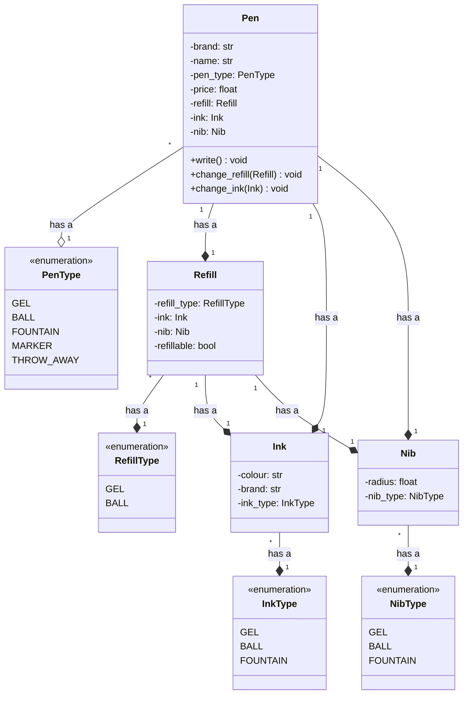
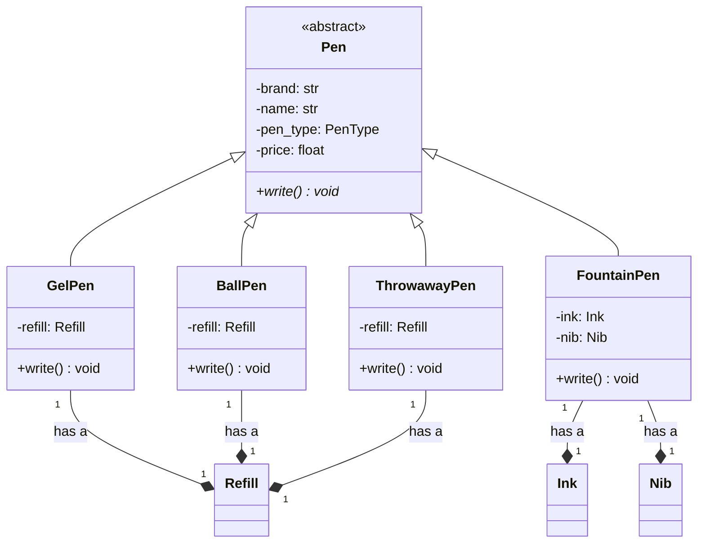
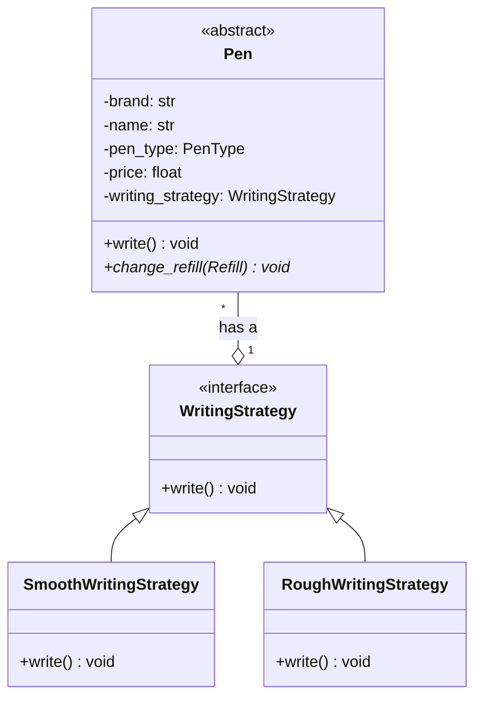
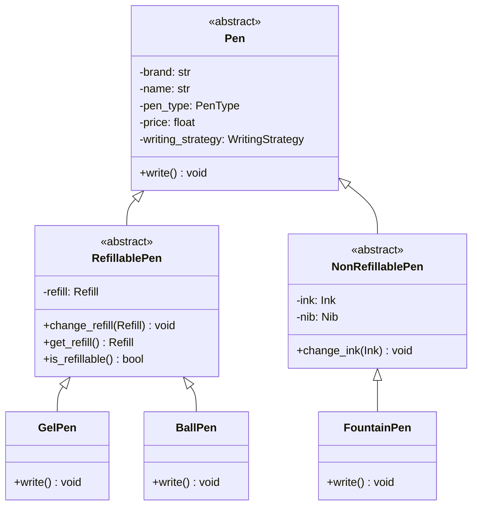
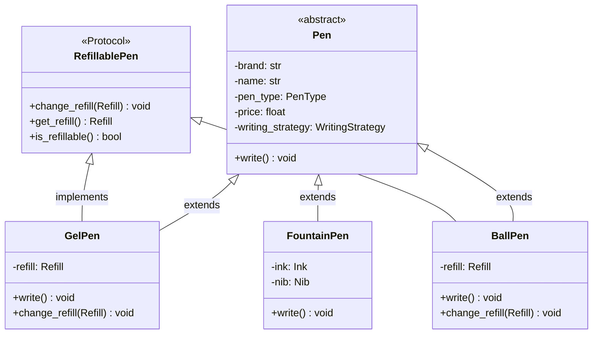

# Design a Pen - Python Implementation

## Requirements

* A pen is anything that can write.
* Pen can be Gel, Ball, Fountain, Marker.
* Ball Pen and Gel Pen have a Ball Pen Refill and a Gel Pen Refill respectively to write.
* A refill has a tip and an ink.
* Ink can be of different colour
* A fountain pen has an Ink.
* Refill has a radius. 
* For fountain pen, its tip has a radius.
* Each pen can write in a different way.
* Some pens write in the same way.
* Every pen has a brand and a name.
* Some pens may allow refilling while others might not.

## Entities and Attributes

* Pen
  * Brand
  * Name
  * Type (Gel, Ball, Fountain, Marker)
  * Price
*  Refill
  * Type (Ball, Gel)
  * Ink
  * Nib
* Ink
  * Colour
  * Brand
  * Type (Gel, Ball, Fountain)
* Nib
  * Radius
  * Type (Fountain, Ball, Gel)  

### Different types of pens
* Gel Pen
  * Type - `Gel`
  * Refill
    * Type - `Gel`
    * Nib - `Gel`
    * Ink
      * Type - `Gel`
    * Refillable - `Yes`

* Ball Pen
  * Type - `Ball`
  * Refill
    * Type - `Ball`
    * Nib - `Ball`
    * Ink
      * Type - `Ball`
    * Refillable - `Yes`

* Throwaway Pen
  * Type - `Throwaway`
  * Refill
    * Type - `Ball`
    * Nib - `Ball`
    * Ink
      * Type - `Ball`
    * Refillable - `No`

* Fountain Pen
  * Type - `Fountain`
  * Ink
    * Type - `Fountain`
  * Nib
    * Type - `Fountain`

---

## Single Class Implementation



### Python Code

```python
from enum import Enum

class PenType(Enum):
    GEL = "GEL"
    BALL = "BALL"
    FOUNTAIN = "FOUNTAIN"
    MARKER = "MARKER"
    THROW_AWAY = "THROW_AWAY"

class RefillType(Enum):
    GEL = "GEL"
    BALL = "BALL"

class InkType(Enum):
    GEL = "GEL"
    BALL = "BALL"
    FOUNTAIN = "FOUNTAIN"

class NibType(Enum):
    GEL = "GEL"
    BALL = "BALL"
    FOUNTAIN = "FOUNTAIN"

class Nib:
    def __init__(self, radius: float, nib_type: NibType):
        self.radius = radius
        self.nib_type = nib_type

class Ink:
    def __init__(self, colour: str, brand: str, ink_type: InkType):
        self.colour = colour
        self.brand = brand
        self.ink_type = ink_type

class Refill:
    def __init__(self, refill_type: RefillType, ink: Ink, nib: Nib, refillable: bool):
        self.refill_type = refill_type
        self.ink = ink
        self.nib = nib
        self.refillable = refillable

class Pen:
    def __init__(self, brand: str, name: str, pen_type: PenType, price: float):
        self.brand = brand
        self.name = name
        self.pen_type = pen_type
        self.price = price
        self.refill = None
        self.ink = None
        self.nib = None
    
    def write(self):
        if self.pen_type == PenType.GEL:
            print("Gel Pen writes")
        elif self.pen_type == PenType.BALL:
            print("Ball Pen writes")
        elif self.pen_type == PenType.FOUNTAIN:
            print("Fountain Pen writes")
        elif self.pen_type == PenType.MARKER:
            print("Marker Pen writes")
        elif self.pen_type == PenType.THROW_AWAY:
            print("Throwaway Pen writes")
        else:
            raise ValueError("Invalid Pen Type")
    
    def change_refill(self, refill: Refill):
        if self.refill and self.refill.refillable:
            self.refill = refill
    
    def change_ink(self, ink: Ink):
        self.ink = ink
```

### Problems
* **Single Responsibility Principle** violated - multiple reasons to change (modifying any pen type)
* **Open/Closed Principle** violated - adding new pen type requires modifying class
* **Null checks** required for refill/ink (fountain pens don't have refills)
* **Object creation** is complex

---

## Multiple Classes (Inheritance)



### Python Code

```python
from abc import ABC, abstractmethod
from enum import Enum

class PenType(Enum):
    GEL = "GEL"
    BALL = "BALL"
    FOUNTAIN = "FOUNTAIN"
    THROW_AWAY = "THROW_AWAY"

# Base classes (same as before)
class Nib:
    def __init__(self, radius: float, nib_type: str):
        self.radius = radius
        self.nib_type = nib_type

class Ink:
    def __init__(self, colour: str, brand: str, ink_type: str):
        self.colour = colour
        self.brand = brand
        self.ink_type = ink_type

class Refill:
    def __init__(self, refill_type: str, ink: Ink, nib: Nib, refillable: bool):
        self.refill_type = refill_type
        self.ink = ink
        self.nib = nib
        self.refillable = refillable

# Abstract base class
class Pen(ABC):
    def __init__(self, brand: str, name: str, pen_type: PenType, price: float):
        self.brand = brand
        self.name = name
        self.pen_type = pen_type
        self.price = price
    
    @abstractmethod
    def write(self):
        pass

# Concrete implementations
class GelPen(Pen):
    def __init__(self, brand: str, name: str, price: float, refill: Refill):
        super().__init__(brand, name, PenType.GEL, price)
        self.refill = refill
    
    def write(self):
        print("Gel Pen writes smoothly")
    
    def change_refill(self, refill: Refill):
        if self.refill.refillable:
            self.refill = refill

class BallPen(Pen):
    def __init__(self, brand: str, name: str, price: float, refill: Refill):
        super().__init__(brand, name, PenType.BALL, price)
        self.refill = refill
    
    def write(self):
        print("Ball Pen writes")
    
    def change_refill(self, refill: Refill):
        if self.refill.refillable:
            self.refill = refill

class FountainPen(Pen):
    def __init__(self, brand: str, name: str, price: float, ink: Ink, nib: Nib):
        super().__init__(brand, name, PenType.FOUNTAIN, price)
        self.ink = ink
        self.nib = nib
    
    def write(self):
        print("Fountain Pen writes elegantly")
    
    def change_ink(self, ink: Ink):
        self.ink = ink

class ThrowawayPen(Pen):
    def __init__(self, brand: str, name: str, price: float, refill: Refill):
        super().__init__(brand, name, PenType.THROW_AWAY, price)
        self.refill = refill
    
    def write(self):
        print("Throwaway Pen writes")
```

### Improvements
* ✅ **Single Responsibility Principle** followed - each class has one responsibility
* ✅ **Open/Closed Principle** followed - adding new pen type doesn't modify existing classes
* ✅ **No null checks** required

### Problems
* ❌ **Object creation** still complex
* ❌ **Liskov Substitution Principle** violated - `FountainPen` doesn't have `change_refill()`, throws exception
* ❌ **Code duplication** in similar pens
* ❌ Using **subclasses** for object creation

---

## Reducing Code Duplication using Strategy Pattern



### Python Code

```python
from abc import ABC, abstractmethod

# Strategy Interface
class WritingStrategy(ABC):
    @abstractmethod
    def write(self):
        pass

# Concrete Strategies
class SmoothWritingStrategy(WritingStrategy):
    def write(self):
        print("Writing smoothly...")

class RoughWritingStrategy(WritingStrategy):
    def write(self):
        print("Writing roughly...")

# Updated Pen with Strategy
class Pen(ABC):
    def __init__(self, brand: str, name: str, pen_type: PenType, 
                 price: float, writing_strategy: WritingStrategy):
        self.brand = brand
        self.name = name
        self.pen_type = pen_type
        self.price = price
        self._writing_strategy = writing_strategy
    
    def write(self):
        self._writing_strategy.write()
    
    def set_writing_strategy(self, strategy: WritingStrategy):
        self._writing_strategy = strategy

class GelPen(Pen):
    def __init__(self, brand: str, name: str, price: float, refill: Refill):
        super().__init__(brand, name, PenType.GEL, price, SmoothWritingStrategy())
        self.refill = refill
    
    def change_refill(self, refill: Refill):
        if self.refill.refillable:
            self.refill = refill

class BallPen(Pen):
    def __init__(self, brand: str, name: str, price: float, refill: Refill):
        super().__init__(brand, name, PenType.BALL, price, RoughWritingStrategy())
        self.refill = refill
    
    def change_refill(self, refill: Refill):
        if self.refill.refillable:
            self.refill = refill
```

---

## Avoiding LSP Violation using Abstract Classes



### Python Code

```python
from abc import ABC, abstractmethod

class Pen(ABC):
    def __init__(self, brand: str, name: str, pen_type: PenType, 
                 price: float, writing_strategy: WritingStrategy):
        self.brand = brand
        self.name = name
        self.pen_type = pen_type
        self.price = price
        self._writing_strategy = writing_strategy
    
    def write(self):
        self._writing_strategy.write()

# Abstract intermediate class for refillable pens
class RefillablePen(Pen):
    def __init__(self, brand: str, name: str, pen_type: PenType, 
                 price: float, writing_strategy: WritingStrategy, refill: Refill):
        super().__init__(brand, name, pen_type, price, writing_strategy)
        self._refill = refill
    
    def change_refill(self, refill: Refill):
        if self._refill.refillable:
            self._refill = refill
    
    def get_refill(self) -> Refill:
        return self._refill
    
    def is_refillable(self) -> bool:
        return self._refill.refillable

# Abstract intermediate class for non-refillable pens
class NonRefillablePen(Pen):
    def __init__(self, brand: str, name: str, pen_type: PenType, 
                 price: float, writing_strategy: WritingStrategy, 
                 ink: Ink, nib: Nib):
        super().__init__(brand, name, pen_type, price, writing_strategy)
        self._ink = ink
        self._nib = nib
    
    def change_ink(self, ink: Ink):
        self._ink = ink

# Concrete implementations
class GelPen(RefillablePen):
    def __init__(self, brand: str, name: str, price: float, refill: Refill):
        super().__init__(brand, name, PenType.GEL, price, 
                        SmoothWritingStrategy(), refill)

class BallPen(RefillablePen):
    def __init__(self, brand: str, name: str, price: float, refill: Refill):
        super().__init__(brand, name, PenType.BALL, price, 
                        RoughWritingStrategy(), refill)

class FountainPen(NonRefillablePen):
    def __init__(self, brand: str, name: str, price: float, ink: Ink, nib: Nib):
        super().__init__(brand, name, PenType.FOUNTAIN, price, 
                        SmoothWritingStrategy(), ink, nib)
```

### Improvements
* ✅ **Liskov Substitution Principle** followed - no invalid methods on wrong pen types
* ✅ No field duplication in child classes

### Problems
* ❌ Behavior tied to class hierarchy - adding new pen type affects hierarchy

---

## Avoiding LSP Violation using Interfaces (Protocols)



### Python Code

```python
from abc import ABC, abstractmethod
from typing import Protocol

# Protocol (Interface) for refillable behavior
class RefillablePen(Protocol):
    def change_refill(self, refill: Refill) -> None:
        ...
    
    def get_refill(self) -> Refill:
        ...
    
    def is_refillable(self) -> bool:
        ...

# Base Pen class
class Pen(ABC):
    def __init__(self, brand: str, name: str, pen_type: PenType, 
                 price: float, writing_strategy: WritingStrategy):
        self.brand = brand
        self.name = name
        self.pen_type = pen_type
        self.price = price
        self._writing_strategy = writing_strategy
    
    def write(self):
        self._writing_strategy.write()

# GelPen implements both Pen and RefillablePen protocol
class GelPen(Pen):
    def __init__(self, brand: str, name: str, price: float, refill: Refill):
        super().__init__(brand, name, PenType.GEL, price, SmoothWritingStrategy())
        self._refill = refill
    
    def change_refill(self, refill: Refill) -> None:
        if self._refill.refillable:
            self._refill = refill
    
    def get_refill(self) -> Refill:
        return self._refill
    
    def is_refillable(self) -> bool:
        return self._refill.refillable

# BallPen implements both Pen and RefillablePen protocol
class BallPen(Pen):
    def __init__(self, brand: str, name: str, price: float, refill: Refill):
        super().__init__(brand, name, PenType.BALL, price, RoughWritingStrategy())
        self._refill = refill
    
    def change_refill(self, refill: Refill) -> None:
        if self._refill.refillable:
            self._refill = refill
    
    def get_refill(self) -> Refill:
        return self._refill
    
    def is_refillable(self) -> bool:
        return self._refill.refillable

# FountainPen only extends Pen (no refill capability)
class FountainPen(Pen):
    def __init__(self, brand: str, name: str, price: float, ink: Ink, nib: Nib):
        super().__init__(brand, name, PenType.FOUNTAIN, price, SmoothWritingStrategy())
        self._ink = ink
        self._nib = nib
    
    def change_ink(self, ink: Ink) -> None:
        self._ink = ink

# Usage example with type checking
def refill_pen(pen: RefillablePen, new_refill: Refill):
    """This function only accepts pens that implement RefillablePen protocol"""
    if pen.is_refillable():
        pen.change_refill(new_refill)

# Works with GelPen and BallPen
gel = GelPen("Parker", "Jotter Gel", 15.99, gel_refill)
refill_pen(gel, new_refill)  # ✅ Works

# Won't work with FountainPen (type checker catches this)
fountain = FountainPen("Montblanc", "149", 899.99, fountain_ink, fountain_nib)
# refill_pen(fountain, new_refill)  # ❌ Type error - FountainPen doesn't implement RefillablePen
```

### Improvements
* ✅ **Liskov Substitution Principle** followed perfectly
* ✅ Behavior not tied to inheritance hierarchy
* ✅ Type-safe with Python's type checking
* ✅ More flexible - can implement multiple protocols

### Problems
* ❌ Field duplication in child classes (each refillable pen has `_refill` field)

---

## Summary: Evolution of Design

| Approach | SRP | OCP | LSP | Code Duplication | Flexibility |
|----------|-----|-----|-----|------------------|-------------|
| Single Class | ❌ | ❌ | ❌ | Low | Low |
| Multiple Classes | ✅ | ✅ | ❌ | High | Medium |
| With Strategy | ✅ | ✅ | ❌ | Low | High |
| Abstract Classes | ✅ | ✅ | ✅ | Low | Medium |
| Protocols/Interfaces | ✅ | ✅ | ✅ | Medium | High |

**Best Approach:** Protocols (Interfaces) with Strategy Pattern - combines flexibility with SOLID compliance.