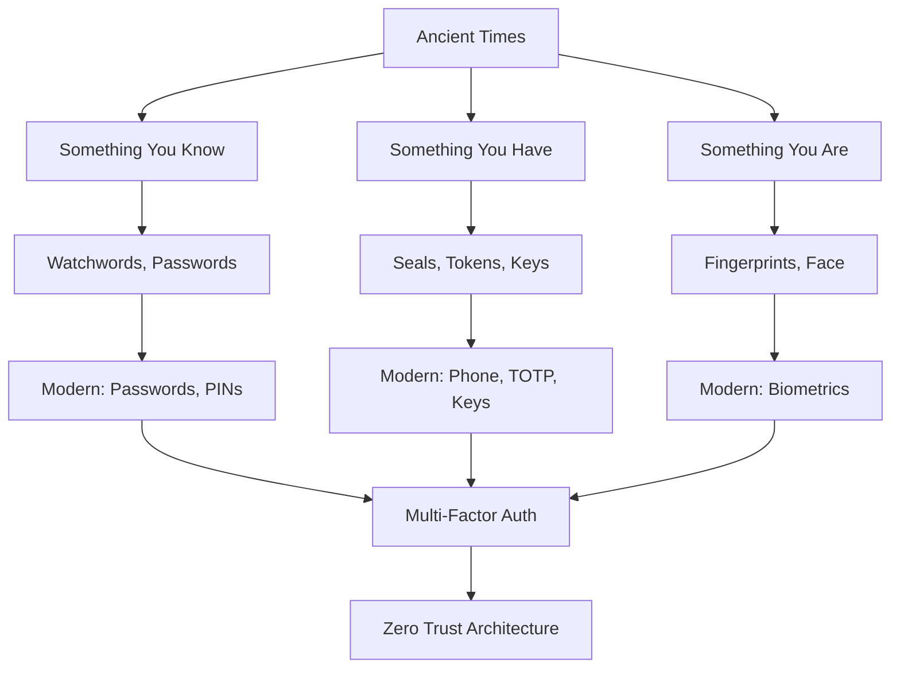

# The Fascinating History of Authentication

> *"Trust, but verify."* — Ancient proverb (and modern security principle)

---

## Why Study History?

Understanding how humans solved the identity problem across millennia helps us appreciate why modern authentication works the way it does. Every solution we use today has roots in ancient problems.

---

## Timeline of Authentication

```
┌─────────────────────────────────────────────────────────────────────────────┐
│                    AUTHENTICATION THROUGH THE AGES                           │
├─────────────────────────────────────────────────────────────────────────────┤
│                                                                              │
│ 3500 BCE ──── Cylinder Seals (Mesopotamia)                                   │
│     │                                                                        │
│ 1000 BCE ──── Signet Rings (Egypt, Rome)                                     │
│     │                                                                        │
│  500 BCE ──── Tessera Hospitalis (Roman "Friend Tokens")                     │
│     │                                                                        │
│  200 BCE ──── First Passwords (Roman Military)                               │
│     │                                                                        │
│ 1800s   ──── Signatures & Notary Seals                                       │
│     │                                                                        │
│ 1960s   ──── Computer Passwords (MIT CTSS)                                   │
│     │                                                                        │
│ 1970s   ──── Password Hashing (Unix crypt)                                   │
│     │                                                                        │
│ 1990s   ──── Digital Certificates, SSL                                       │
│     │                                                                        │
│ 2000s   ──── Two-Factor Authentication                                       │
│     │                                                                        │
│ 2010s   ──── Biometrics, OAuth, Passwordless                                 │
│     │                                                                        │
│ TODAY   ──── Zero Trust, Passkeys, FIDO2                                     │
│                                                                              │
└─────────────────────────────────────────────────────────────────────────────┘
```

---

## Historical Nuggets

### 1. The World's First "Passwords" (200 BCE)

**The Roman Watchword System**

The Roman military used a sophisticated password system called *"tessera"* or *"watchword"*:

- Each night, a new password was inscribed on a wooden tablet
- The tablet was passed from the general to tribunes to centurions
- Soldiers returning to camp had to speak the password
- Wrong password = potential execution as a spy

> **Fun Fact**: The word "parole" (used in military) comes from the French word for "word" — the spoken password.

**Why It Matters Today**: This is the origin of "something you know" — the first factor of authentication.

---

### 2. Signet Rings: The Original Digital Signature (1000 BCE - 1800s)

Kings, nobles, and merchants used **signet rings** pressed into wax to authenticate documents:

```
┌────────────────────────────────────────────┐
│                                            │
│    ┌──────┐                                │
│    │ SEAL │  ──► Pressed into hot wax      │
│    │ RING │                                │
│    └──────┘                                │
│        │                                   │
│        ▼                                   │
│    ┌──────────┐                            │
│    │ WAX SEAL │  ──► Unique pattern        │
│    │  🔴      │      proves identity        │
│    └──────────┘                            │
│                                            │
│  Properties:                               │
│  • Unique to owner (like a private key)    │
│  • Tamper-evident (broken seal = altered)  │
│  • Non-repudiation (can't deny you sent it)│
│                                            │
└────────────────────────────────────────────┘
```

> **Historical Fact**: In ancient Egypt, the Pharaoh's seal ring was so important that when he died, it was immediately broken to prevent forgery.

**Why It Matters Today**: This is "something you have" — possession-based authentication, like hardware tokens.

---

### 3. Tessera Hospitalis: Ancient Friend-or-Foe Tokens (500 BCE)

Romans had a brilliant system for recognizing friends across generations:

```
┌─────────────────────────────────────────────────────────────────┐
│                    TESSERA HOSPITALIS                            │
├─────────────────────────────────────────────────────────────────┤
│                                                                  │
│    Host Family A          Guest Family B                         │
│    ┌─────────┐            ┌─────────┐                           │
│    │  ████   │            │   ████  │                           │
│    │  ████   │            │   ████  │                           │
│    └─────────┘            └─────────┘                           │
│         └──────────┬───────────┘                                │
│                    │                                            │
│              ┌─────────────┐                                    │
│              │   ████████  │  ← Original token split in two     │
│              │   ████████  │    Pieces fit together perfectly   │
│              └─────────────┘                                    │
│                                                                  │
│    Generations later, descendants could prove the alliance       │
│    by matching the two halves!                                   │
│                                                                  │
└─────────────────────────────────────────────────────────────────┘
```

> **Fun Fact**: This is where we get the word "symbol" — from Greek *symbolon* meaning "token" or "sign" (literally "thrown together").

**Why It Matters Today**: This is the concept behind **split-key cryptography** and **secret sharing**.

---

### 4. The First Computer Password Hack (1962)

**MIT's CTSS System — Where It All Began**

The Compatible Time-Sharing System (CTSS) at MIT was one of the first systems to use passwords. In 1962, PhD student Allan Scherr became frustrated with his 4-hour weekly computing allowance:

```
The "Hack":
┌─────────────────────────────────────────────────────────────────┐
│                                                                  │
│  1. Scherr discovered passwords were stored in a file            │
│                                                                  │
│  2. He requested a printout of the "password file"               │
│     (it was stored in PLAINTEXT!)                                │
│                                                                  │
│  3. He distributed passwords to friends                          │
│                                                                  │
│  4. They used other people's time allocations                    │
│                                                                  │
│  Result: THE FIRST PASSWORD BREACH IN HISTORY                    │
│                                                                  │
└─────────────────────────────────────────────────────────────────┘
```

> **Fun Fact**: Scherr confessed to this 25 years later at a computer history conference. MIT was amused, not angry.

**Why It Matters Today**: This is why we NEVER store passwords in plaintext. Lesson learned in 1962, still being re-learned today!

---

### 5. The Birth of Password Hashing (1976)

**Unix crypt() — The First Hash Function for Passwords**

Robert Morris Sr. (NSA cryptographer) and Ken Thompson (Unix creator) realized storing plaintext was dangerous:

```python
# The Problem (before 1976)
password_file = {
    "root": "secret123",      # Anyone who reads file knows password!
    "alice": "password1",
    "bob": "qwerty"
}

# The Solution (Unix crypt)
password_file = {
    "root": "ab1njaOQRsk..",  # Hashed! Can't reverse to original
    "alice": "cd2okpPRTul..",
    "bob": "ef3plqQSUvm.."
}
```

**How Unix crypt() worked:**
1. Take the password
2. Use it as a key to encrypt a block of zeros using modified DES
3. Repeat 25 times (intentional slowdown!)
4. Store the result

> **Historical Note**: The 25 iterations were chosen because it took ~1 second on 1976 hardware. This was the birth of "slow by design" password hashing!

---

### 6. The Enigma Machine: Authentication in Warfare (1930s-1940s)

The German Enigma wasn't just encryption — it was authentication:

```
┌─────────────────────────────────────────────────────────────────┐
│                       ENIGMA AUTHENTICATION                      │
├─────────────────────────────────────────────────────────────────┤
│                                                                  │
│  Daily Settings (shared secret):                                 │
│  • Rotor order: III, I, II                                       │
│  • Ring settings: 06, 22, 14                                     │
│  • Plugboard: AM, FI, NV, PS, TU, WZ                            │
│                                                                  │
│  If your machine produces readable German → message is authentic │
│  If gibberish → either wrong settings or FAKE MESSAGE            │
│                                                                  │
│  This is AUTHENTICATION + ENCRYPTION combined!                   │
│                                                                  │
└─────────────────────────────────────────────────────────────────┘
```

> **Fun Fact**: Alan Turing's team at Bletchley Park broke Enigma partly because German operators were lazy with authentication — they used predictable patterns like girlfriend names or "HEIL HITLER" as message keys.

---

### 7. Biometrics: Ancient to Modern (2000 BCE - Today)

**Fingerprints in Ancient Babylon**

Babylonian merchants pressed fingerprints into clay tablets to authenticate business transactions as early as 2000 BCE!

```
Historical Biometrics Timeline:
┌─────────────────────────────────────────────────────────────────┐
│                                                                  │
│  2000 BCE ── Babylonian fingerprints on clay contracts           │
│                                                                  │
│  1858 CE ─── British India: fingerprints for pension payments    │
│              (Sir William Herschel)                              │
│                                                                  │
│  1892 CE ─── First criminal caught by fingerprints               │
│              (Francisca Rojas murder case, Argentina)            │
│                                                                  │
│  1999 CE ─── First laptop fingerprint scanner                    │
│                                                                  │
│  2013 CE ─── iPhone Touch ID                                     │
│                                                                  │
│  2017 CE ─── iPhone Face ID                                      │
│                                                                  │
│  TODAY ───── Behavioral biometrics (typing patterns, gait)       │
│                                                                  │
└─────────────────────────────────────────────────────────────────┘
```

**Why It Matters Today**: This is "something you are" — the third factor of authentication.

---

## The Three Factors Through History

| Factor | Historical Example | Modern Example |
|--------|-------------------|----------------|
| **Something You Know** | Roman watchword | Password, PIN |
| **Something You Have** | Signet ring, Tessera | Phone, Hardware token |
| **Something You Are** | Babylonian fingerprint | Face ID, Touch ID |

---

## Lessons From History

```
┌─────────────────────────────────────────────────────────────────┐
│              TIMELESS AUTHENTICATION PRINCIPLES                  │
├─────────────────────────────────────────────────────────────────┤
│                                                                  │
│  1. SECRETS MUST STAY SECRET                                     │
│     Roman watchwords changed daily for a reason                  │
│                                                                  │
│  2. PHYSICAL POSSESSION ADDS SECURITY                            │
│     Signet rings couldn't be "guessed"                           │
│                                                                  │
│  3. UNIQUENESS MATTERS                                           │
│     Tessera tokens were one-of-a-kind                            │
│                                                                  │
│  4. HUMAN ERROR IS THE WEAKEST LINK                              │
│     Enigma was broken due to operator mistakes                   │
│                                                                  │
│  5. CONVENIENCE vs SECURITY IS ETERNAL                           │
│     From lazy Roman guards to password reuse today               │
│                                                                  │
└─────────────────────────────────────────────────────────────────┘
```

---

## Interesting Facts to Impress Your Friends

1. **The word "authenticate"** comes from Greek *authentikos* meaning "original" or "genuine"

2. **Bank of England (1694)** used handwritten signatures + personal knowledge questions — an early form of 2FA!

3. **The first ATM PIN (1967)** was invented because the inventor's wife could only remember 4 digits

4. **"Open Sesame"** from Ali Baba (1704) is literature's most famous password — and it was stolen by eavesdropping (the original shoulder surfing!)

5. **The most common password in 2023** is still "123456" — proving we've learned nothing since 1962

---

## The Evolution of Authentication Factors



---

## Summary

Authentication is as old as human civilization. The fundamental problems — proving identity, preventing imposters, balancing convenience with security — have remained constant for 5,000 years. Only the technology has changed.

> *"Those who cannot remember the past are condemned to repeat it."*
> — George Santayana
>
> (See: Every company that stored passwords in plaintext in 2023)

---

**Next**: [02_AUTH_VS_AUTH.md](./02_AUTH_VS_AUTH.md) — Authentication vs Authorization

