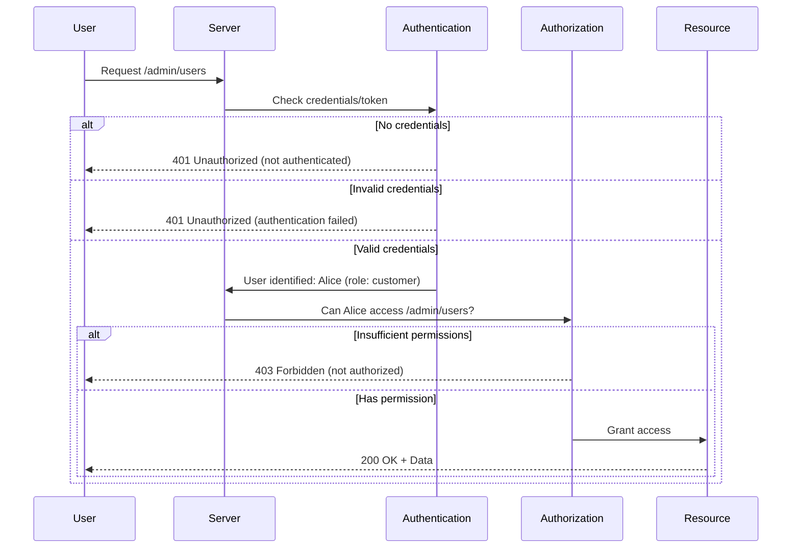

# Authentication vs Authorization

> *"The bouncer checks your ID (Authentication). The wristband color determines which areas you can enter (Authorization)."*

---

## The Two Questions

```
┌─────────────────────────────────────────────────────────────────┐
│                                                                  │
│   AUTHENTICATION (AuthN)          AUTHORIZATION (AuthZ)          │
│   ════════════════════           ═══════════════════════        │
│                                                                  │
│   "WHO are you?"                 "WHAT can you do?"              │
│                                                                  │
│   Verifies IDENTITY              Verifies PERMISSIONS            │
│                                                                  │
│   Happens FIRST                  Happens AFTER authentication    │
│                                                                  │
│   ┌─────────┐                    ┌─────────┐                    │
│   │  🔐     │                    │  🎫     │                    │
│   │  LOGIN  │                    │  ACCESS │                    │
│   └─────────┘                    └─────────┘                    │
│                                                                  │
└─────────────────────────────────────────────────────────────────┘
```

---

## Real-World Analogy: The Airport

```
┌─────────────────────────────────────────────────────────────────┐
│                        AIRPORT SECURITY                          │
├─────────────────────────────────────────────────────────────────┤
│                                                                  │
│  STEP 1: CHECK-IN COUNTER (Authentication)                       │
│  ┌────────────────────────────────────────┐                     │
│  │  "May I see your passport and ID?"     │                     │
│  │                                        │                     │
│  │  ✓ Verifies you are who you claim     │                     │
│  │  ✓ Checks photo matches your face     │                     │
│  │  ✓ Issues boarding pass               │                     │
│  └────────────────────────────────────────┘                     │
│                    │                                            │
│                    ▼                                            │
│  STEP 2: BOARDING GATE (Authorization)                          │
│  ┌────────────────────────────────────────┐                     │
│  │  "May I see your boarding pass?"       │                     │
│  │                                        │                     │
│  │  ✓ Economy → Back of plane            │                     │
│  │  ✓ Business → Middle section          │                     │
│  │  ✓ First Class → Front + Lounge       │                     │
│  │  ✗ Wrong flight? → ACCESS DENIED      │                     │
│  └────────────────────────────────────────┘                     │
│                                                                  │
│  Your IDENTITY (passport) ≠ Your PERMISSIONS (ticket class)     │
│                                                                  │
└─────────────────────────────────────────────────────────────────┘
```

---

## Comparison Table

| Aspect | Authentication | Authorization |
|--------|----------------|---------------|
| **Question** | Who are you? | What can you do? |
| **Purpose** | Verify identity | Grant/deny access |
| **When** | First (before authorization) | Second (after authentication) |
| **Data used** | Credentials (password, biometrics) | Roles, permissions, policies |
| **HTTP Status** | 401 Unauthorized* | 403 Forbidden |
| **Example** | Login page | Admin panel access |
| **Failure message** | "Invalid username or password" | "You don't have permission" |

> *Note: HTTP 401 is confusingly named "Unauthorized" but actually means "Unauthenticated"

---

## Software Example: E-Commerce Platform

```
┌─────────────────────────────────────────────────────────────────┐
│                    E-COMMERCE PLATFORM                           │
├─────────────────────────────────────────────────────────────────┤
│                                                                  │
│  USERS:                                                          │
│  ┌──────────────────────────────────────────────────────────┐   │
│  │  Guest      │  Customer   │  Seller     │  Admin         │   │
│  └──────────────────────────────────────────────────────────┘   │
│                                                                  │
│  AUTHENTICATION (Same for all):                                  │
│  ┌──────────────────────────────────────────────────────────┐   │
│  │  • Username/Email                                         │   │
│  │  • Password                                               │   │
│  │  • Optional: 2FA code                                     │   │
│  └──────────────────────────────────────────────────────────┘   │
│                                                                  │
│  AUTHORIZATION (Different per role):                             │
│  ┌──────────────────────────────────────────────────────────┐   │
│  │                                                           │   │
│  │  Guest:    Browse products, Add to cart (session-based)   │   │
│  │                                                           │   │
│  │  Customer: + Place orders, View order history,            │   │
│  │              Write reviews, Save payment methods          │   │
│  │                                                           │   │
│  │  Seller:   + List products, View sales, Manage inventory, │   │
│  │              Access seller dashboard                      │   │
│  │                                                           │   │
│  │  Admin:    + Manage all users, Delete any content,        │   │
│  │              Access admin panel, View analytics           │   │
│  │                                                           │   │
│  └──────────────────────────────────────────────────────────┘   │
│                                                                  │
└─────────────────────────────────────────────────────────────────┘
```

---

## Code Example: Flask Application

```python
from functools import wraps
from flask import Flask, request, jsonify, g

app = Flask(__name__)

# ══════════════════════════════════════════════════════════════════
# AUTHENTICATION: Verify WHO the user is
# ══════════════════════════════════════════════════════════════════

def authenticate(f):
    """Decorator to verify user identity"""
    @wraps(f)
    def decorated(*args, **kwargs):
        token = request.headers.get('Authorization')

        if not token:
            return jsonify({
                'error': 'Authentication required',
                'code': 'AUTH_REQUIRED'
            }), 401  # 401 = Not authenticated

        # Verify token and get user
        user = verify_token(token)
        if not user:
            return jsonify({
                'error': 'Invalid or expired token',
                'code': 'INVALID_TOKEN'
            }), 401

        # Store user in request context
        g.current_user = user
        return f(*args, **kwargs)

    return decorated


# ══════════════════════════════════════════════════════════════════
# AUTHORIZATION: Verify WHAT the user can do
# ══════════════════════════════════════════════════════════════════

def authorize(*required_roles):
    """Decorator to verify user permissions"""
    def decorator(f):
        @wraps(f)
        def decorated(*args, **kwargs):
            # User must be authenticated first!
            user = g.get('current_user')
            if not user:
                return jsonify({
                    'error': 'Authentication required first'
                }), 401

            # Check if user has required role
            if user.role not in required_roles:
                return jsonify({
                    'error': 'Insufficient permissions',
                    'required': required_roles,
                    'your_role': user.role
                }), 403  # 403 = Authenticated but not authorized

            return f(*args, **kwargs)
        return decorated
    return decorator


# ══════════════════════════════════════════════════════════════════
# ROUTES: Applying AuthN and AuthZ
# ══════════════════════════════════════════════════════════════════

# Public route - No authentication needed
@app.route('/products')
def list_products():
    return jsonify({'products': get_all_products()})


# Authenticated route - Any logged-in user
@app.route('/orders')
@authenticate  # Must be logged in
def my_orders():
    return jsonify({'orders': get_user_orders(g.current_user.id)})


# Authorized route - Only sellers
@app.route('/seller/dashboard')
@authenticate           # First: verify identity
@authorize('seller', 'admin')  # Then: verify permission
def seller_dashboard():
    return jsonify({'sales': get_seller_stats(g.current_user.id)})


# Authorized route - Only admins
@app.route('/admin/users')
@authenticate
@authorize('admin')     # Only admin role allowed
def admin_users():
    return jsonify({'users': get_all_users()})
```

---

## The Flow Diagram



---

## Common Patterns

### 1. Role-Based Access Control (RBAC)

```
┌─────────────────────────────────────────────────────────────────┐
│                    ROLE-BASED ACCESS CONTROL                     │
├─────────────────────────────────────────────────────────────────┤
│                                                                  │
│  User ──► Role ──► Permissions                                   │
│                                                                  │
│  ┌─────────┐      ┌─────────┐      ┌─────────────────────┐      │
│  │  Alice  │ ───► │  Admin  │ ───► │ create, read,       │      │
│  └─────────┘      └─────────┘      │ update, delete      │      │
│                                    └─────────────────────┘      │
│  ┌─────────┐      ┌─────────┐      ┌─────────────────────┐      │
│  │   Bob   │ ───► │  Editor │ ───► │ create, read,       │      │
│  └─────────┘      └─────────┘      │ update              │      │
│                                    └─────────────────────┘      │
│  ┌─────────┐      ┌─────────┐      ┌─────────────────────┐      │
│  │ Charlie │ ───► │  Viewer │ ───► │ read                │      │
│  └─────────┘      └─────────┘      └─────────────────────┘      │
│                                                                  │
└─────────────────────────────────────────────────────────────────┘
```

### 2. Attribute-Based Access Control (ABAC)

```python
# ABAC: More flexible than roles
def can_access_document(user, document):
    """
    Access based on multiple attributes, not just role
    """
    rules = [
        # Rule 1: Authors can always access their documents
        user.id == document.author_id,

        # Rule 2: Same department can view
        user.department == document.department and 'view' in requested_action,

        # Rule 3: Managers can access subordinates' documents
        user.id in document.author.manager_chain,

        # Rule 4: Document is public
        document.visibility == 'public',

        # Rule 5: Time-based access (only during business hours)
        document.requires_business_hours and is_business_hours(),
    ]

    return any(rules)
```

---

## HTTP Status Codes Explained

```
┌─────────────────────────────────────────────────────────────────┐
│                    STATUS CODES FOR AUTH                         │
├─────────────────────────────────────────────────────────────────┤
│                                                                  │
│  401 UNAUTHORIZED                                                │
│  ═══════════════                                                │
│  Meaning: "I don't know who you are"                            │
│  Cause:   Missing or invalid credentials                        │
│  Action:  Show login page                                        │
│                                                                  │
│  Example: No token, expired token, invalid token                 │
│                                                                  │
│  Response header: WWW-Authenticate: Bearer                       │
│                                                                  │
├─────────────────────────────────────────────────────────────────┤
│                                                                  │
│  403 FORBIDDEN                                                   │
│  ═════════════                                                  │
│  Meaning: "I know who you are, but you can't do this"           │
│  Cause:   Authenticated but lacks permission                     │
│  Action:  Show "access denied" page                              │
│                                                                  │
│  Example: Regular user trying to access admin panel              │
│                                                                  │
│  Note: Re-authenticating won't help!                            │
│                                                                  │
└─────────────────────────────────────────────────────────────────┘
```

---

## Real-World Examples

| Service | Authentication | Authorization |
|---------|----------------|---------------|
| **Google** | Google Account login | Gmail vs Drive vs Admin Console access |
| **GitHub** | Username + Password + 2FA | Read/Write/Admin per repository |
| **Netflix** | Email + Password | Profile restrictions, download limits |
| **Uber** | Phone + OTP | Rider vs Driver vs Admin features |
| **AWS** | Access Key + Secret Key | IAM policies per resource |

---

## The Three A's of Security (AAA)

```
┌─────────────────────────────────────────────────────────────────┐
│                    THE AAA FRAMEWORK                             │
├─────────────────────────────────────────────────────────────────┤
│                                                                  │
│  ┌─────────────────┐                                            │
│  │ AUTHENTICATION  │  "Who are you?"                            │
│  │      🔐         │   Verify identity                          │
│  └────────┬────────┘                                            │
│           │                                                      │
│           ▼                                                      │
│  ┌─────────────────┐                                            │
│  │ AUTHORIZATION   │  "What can you do?"                        │
│  │      🎫         │   Check permissions                        │
│  └────────┬────────┘                                            │
│           │                                                      │
│           ▼                                                      │
│  ┌─────────────────┐                                            │
│  │  ACCOUNTING     │  "What did you do?"                        │
│  │      📝         │   Audit trail, logging                     │
│  └─────────────────┘                                            │
│                                                                  │
│  All three are needed for complete security!                     │
│                                                                  │
└─────────────────────────────────────────────────────────────────┘
```

---

## Common Mistakes

### 1. Confusing 401 and 403

```python
# ❌ WRONG
if not user.is_admin:
    return Response(status=401)  # Wrong! User IS authenticated

# ✅ CORRECT
if not user.is_admin:
    return Response(status=403)  # User is authenticated but not authorized
```

### 2. Checking Authorization Before Authentication

```python
# ❌ WRONG
@app.route('/admin')
@authorize('admin')  # Checking permissions first
@authenticate        # Then checking identity - BACKWARDS!
def admin_panel():
    pass

# ✅ CORRECT
@app.route('/admin')
@authenticate        # First: Who are you?
@authorize('admin')  # Then: Can you do this?
def admin_panel():
    pass
```

### 3. Relying Only on Frontend Checks

```javascript
// ❌ WRONG - Frontend only (easily bypassed)
if (user.role !== 'admin') {
    hideAdminButton();  // Attacker can still call API directly!
}

// ✅ CORRECT - Backend MUST verify
// Frontend hides button for UX
// Backend rejects unauthorized requests
```

---

## Quick Reference

```
┌─────────────────────────────────────────────────────────────────┐
│                    CHEAT SHEET                                   │
├─────────────────────────────────────────────────────────────────┤
│                                                                  │
│  Authentication:                                                 │
│  • Comes FIRST                                                   │
│  • Uses credentials (password, token, biometrics)                │
│  • Returns 401 on failure                                        │
│  • Answer: "Who are you?"                                        │
│                                                                  │
│  Authorization:                                                  │
│  • Comes AFTER authentication                                    │
│  • Uses roles, permissions, policies                             │
│  • Returns 403 on failure                                        │
│  • Answer: "What can you do?"                                    │
│                                                                  │
│  Remember:                                                       │
│  • 401 = "Login first" (show login page)                        │
│  • 403 = "Nice try, but no" (show access denied)                │
│  • Always verify on backend, never trust frontend alone          │
│                                                                  │
└─────────────────────────────────────────────────────────────────┘
```

---

**Next**: [03_PASSWORD_STORAGE_EVOLUTION.md](./03_PASSWORD_STORAGE_EVOLUTION.md) — Why proper password storage matters

