# Authentication Diagrams

> View these diagrams on GitHub, VS Code with Mermaid extension, or paste at https://mermaid.live

---

## 1. Authentication vs Authorization Flow

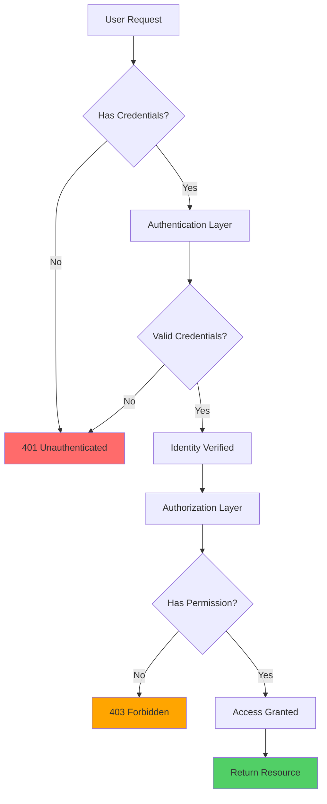

---

## 2. Password Hashing Evolution

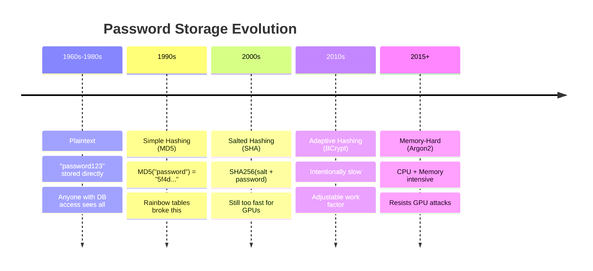

---

## 3. BCrypt Hashing Process

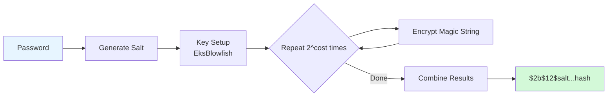

---

## 4. JWT Token Structure

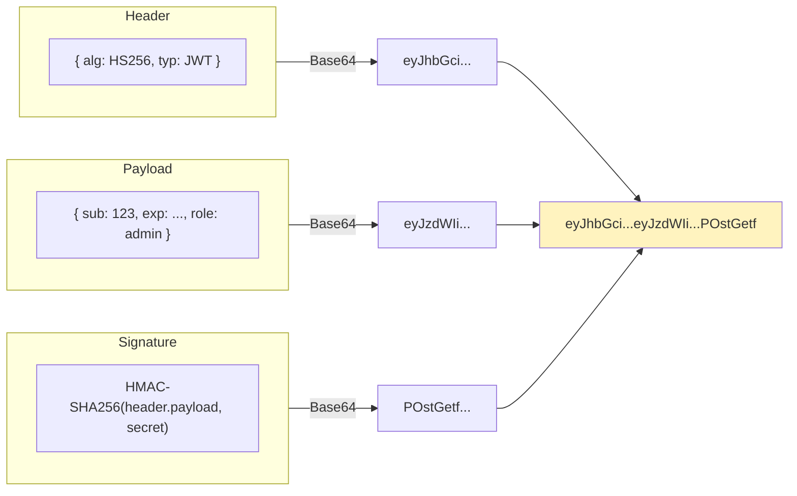

---

## 5. Session vs Token Authentication

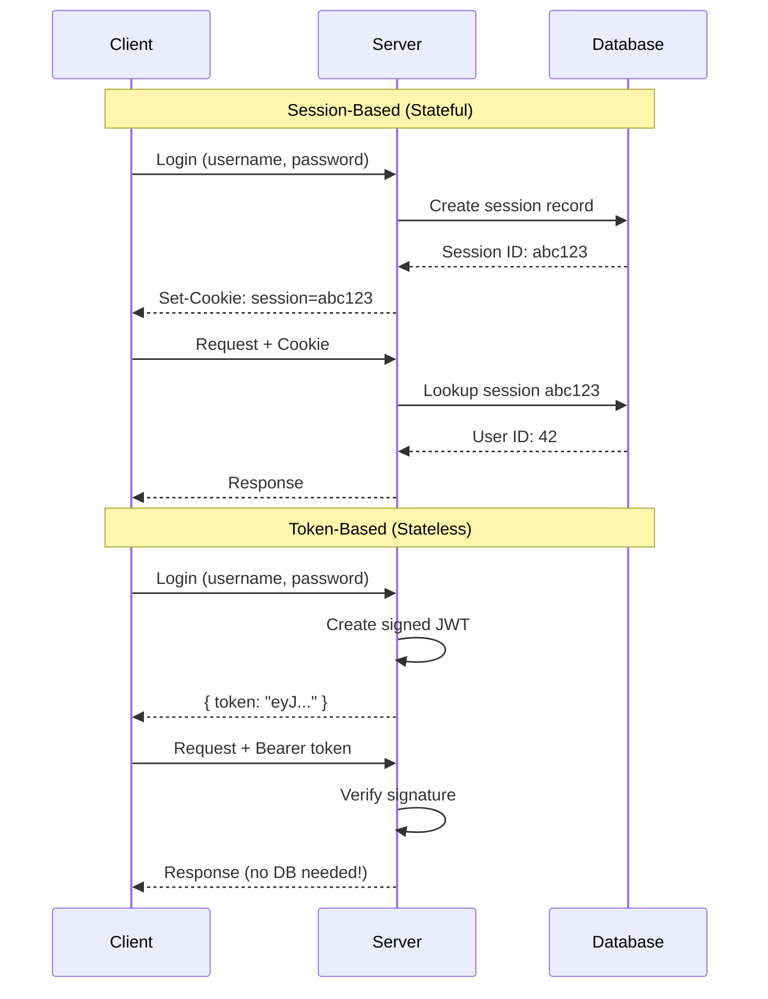

---

## 6. Refresh Token Flow

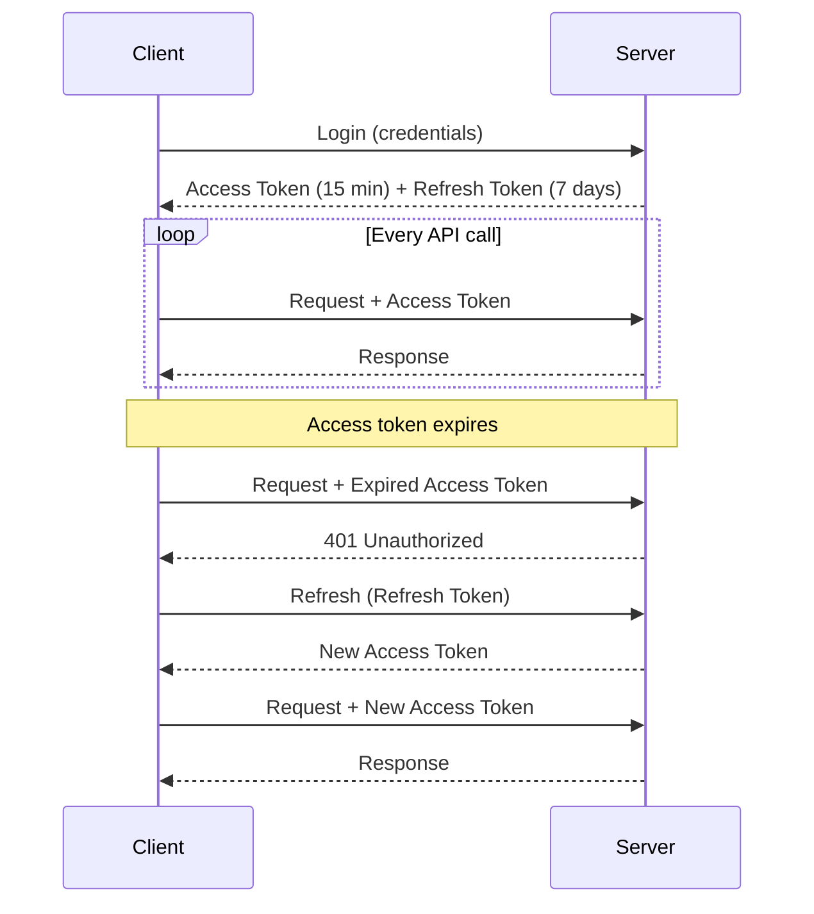

---

## 7. Password Cracking Speed Comparison

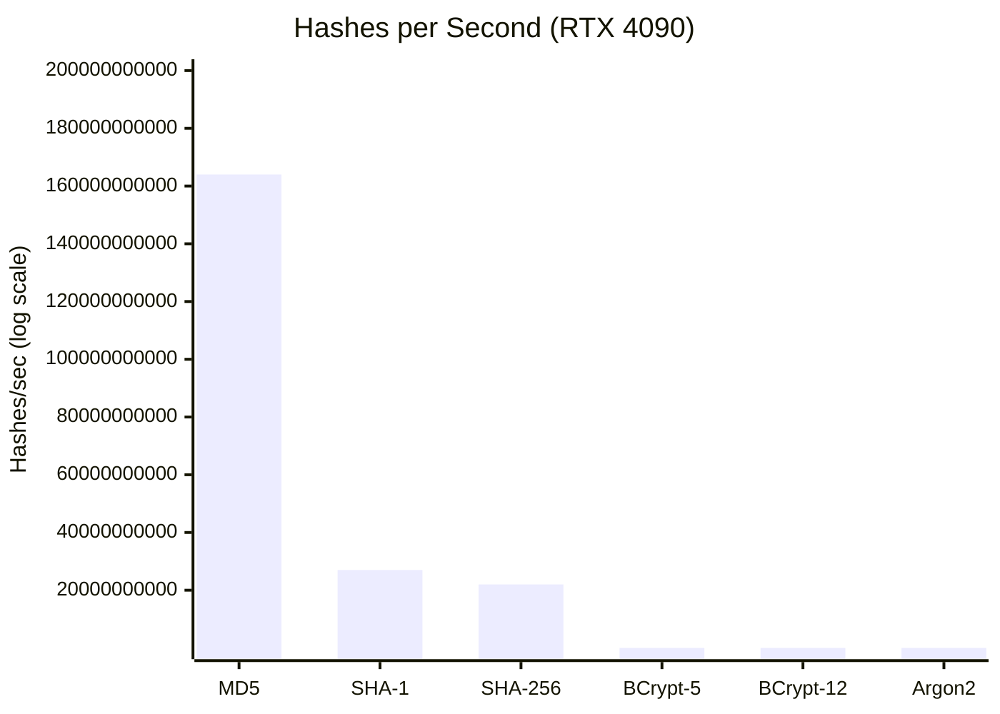

---

## 8. Three Factors of Authentication

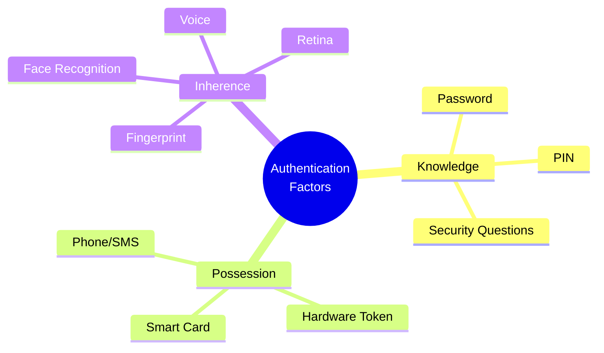

---

## 9. Authentication Flow with MFA

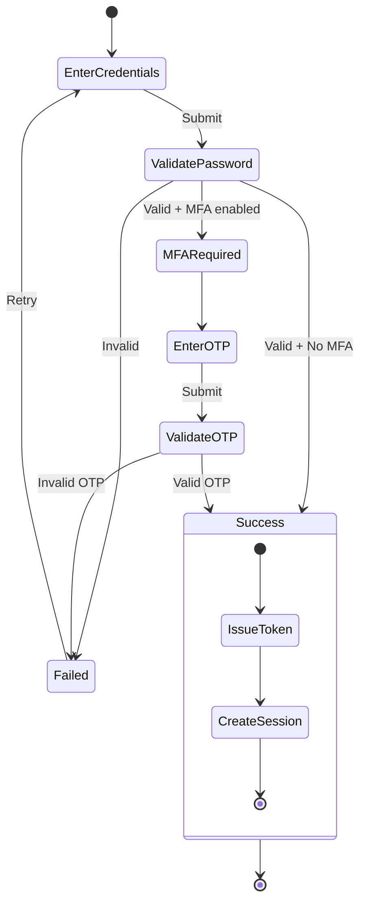

---

## 10. OAuth 2.0 Authorization Code Flow (Preview)

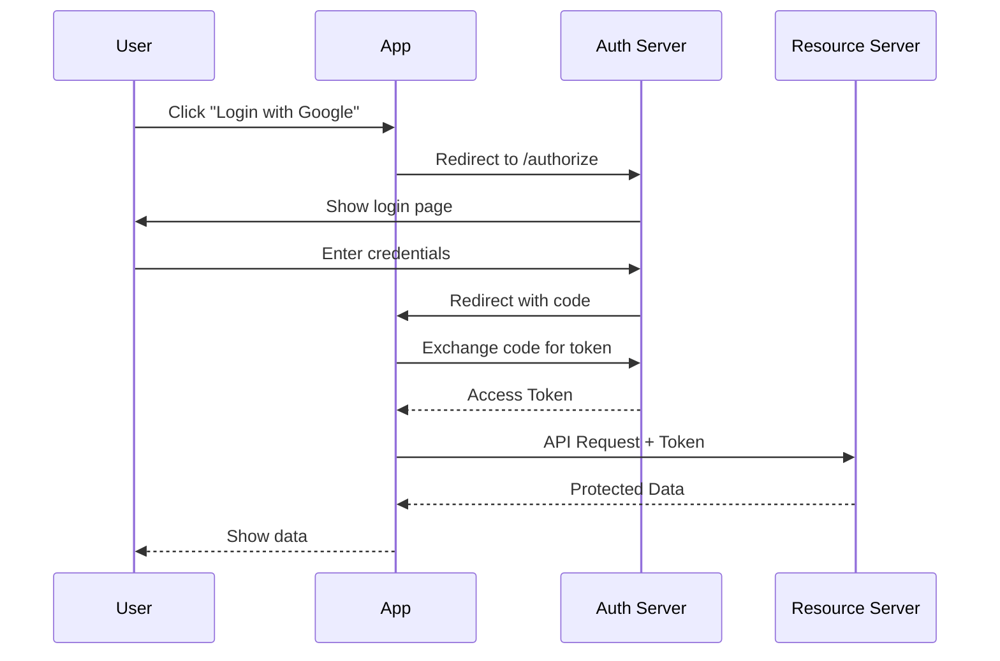

---

## 11. Security Attack Comparison

```mermaid
quadrantChart
    title Password Attack Effectiveness
    x-axis Low Effort --> High Effort
    y-axis Low Success --> High Success
    quadrant-1 Dangerous
    quadrant-2 Impractical
    quadrant-3 Minor Threat
    quadrant-4 Moderate Risk
    Rainbow Table (MD5): [0.2, 0.9]
    Brute Force (SHA): [0.5, 0.7]
    Dictionary Attack: [0.3, 0.6]
    Brute Force (BCrypt): [0.9, 0.2]
    Phishing: [0.3, 0.8]
```

---

## 12. Token Storage Options

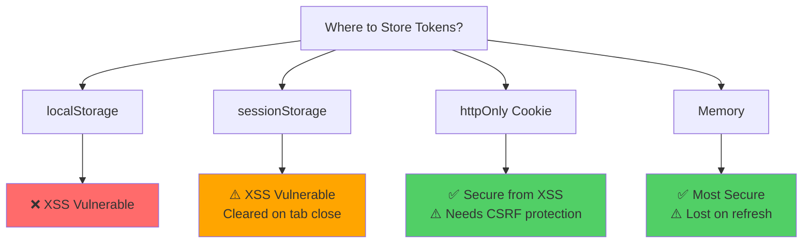

---

## Usage

To render these diagrams:

1. **GitHub**: Diagrams render automatically in `.md` files
2. **VS Code**: Install "Markdown Preview Mermaid Support" extension
3. **Online**: Copy code to https://mermaid.live
4. **Export**: Use Mermaid CLI: `mmdc -i diagrams.md -o output.png`

